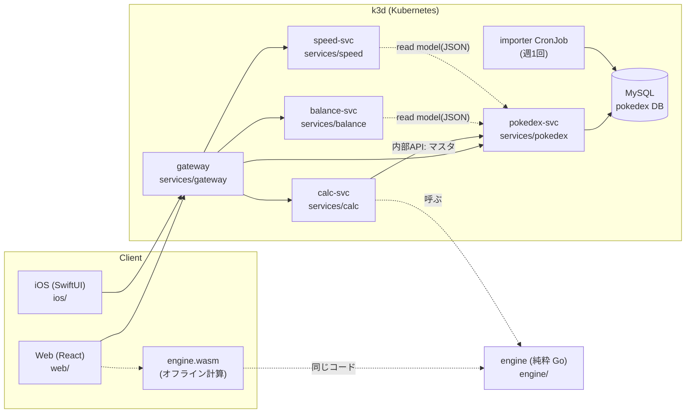
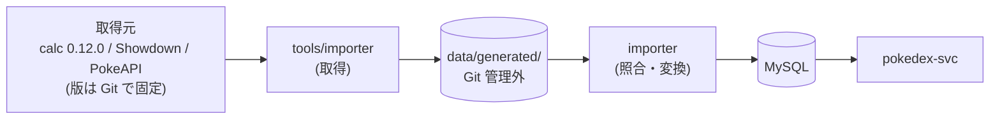

# アーキテクチャ(全体図)

ポケモンチャンピオンズ向けのダメージ計算・タイプバランス・素早さ比較。計算の中心は純粋な Go の `engine` で、
サーバー(calc-svc)とブラウザ(WASM)の両方から同じコードを使う。細部は各 README、決定の理由は `docs/adr/`。

## コンポーネント

| コンポーネント | 役割 | レーン | README |
|---|---|---|---|
| engine | ダメージ・確定数・一括計算・逆算・実数値(I/O なし) | データ | [engine/](../engine/README.md) |
| pokedex-svc / importer | マスタの DB・取込(calc・Showdown・PokeAPI)・マスタ API | データ | [services/pokedex/](../services/pokedex/README.md) |
| calc-svc | 計算 API(engine を呼ぶだけ) | API | [services/calc/](../services/calc/README.md) |
| gateway | 唯一の入口(ルーティング・端末ID・/assets) | API | [services/gateway/](../services/gateway/README.md) |
| balance-svc | 構築のタイプバランス | タイプバランス | [services/balance/](../services/balance/README.md) |
| speed-svc | 素早さ比較 | 素早さ | [services/speed/](../services/speed/README.md) |
| Web | 画面(API とオフライン WASM を切り替え) | Web | [web/](../web/README.md) |
| iOS | iPhone アプリ | iOS | [ios/](../ios/README.md) |

## データの流れ(マスタ)

- 実マスタ・スナップショットは Git に入れない(ADR-0002)。Git にあるのはコード・schema・架空データ・版の記録だけ。
- 動作確認の手順は `docs/runbooks/`、進捗は `docs/plan.md`、AI の運用は `docs/ai-shared/COORDINATION.md`。
