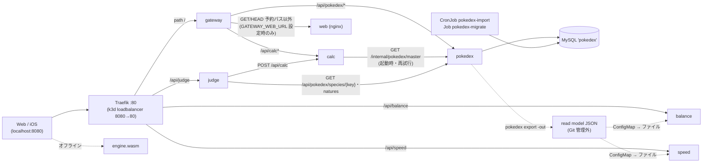

# 実装構成

- 基準: `origin/main` 3379b03(2026-09-24)。根拠は `path:行` か関数名。推測は書かず、未確認は「カバレッジ」節に列挙。
- 全体図・コンポーネント一覧は [../architecture.md](../architecture.md)(judge-svc が未掲載)。本書はその実装側。
- 関連: [request-flows.md](request-flows.md)(処理フロー)・[api-endpoints.md](api-endpoints.md)(全ルート)・[config-env.md](config-env.md)(環境変数・ConfigMap・Secret)。

## 1. ディレクトリ一覧(git 追跡の全ディレクトリ)

`git ls-files` の全ディレクトリ(155。`docs/impl` を含めて 156)。

| パス | files | 責務 |
|---|---:|---|
| `.` | 11 | ルート: Makefile(includes: balance/speed/judge/gateway/web/ios)・go.work・CLAUDE.md/AGENTS.md・README・KICKOFF 系・.env.example(MYSQL_ROOT_PASSWORD のみ) |
| `.claude` | 1 | Claude Code のプロジェクト設定(settings.json: 権限・フック) |
| `.claude/agents` | 4 | サブエージェント定義(critic・implementer・quick-scanner・spec-writer) |
| `.claude/skills/improve` | 1 | スキル /improve |
| `.claude/skills/phase` | 1 | スキル /phase(scanner→spec→implement→critic) |
| `.claude/skills/verify` | 1 | スキル /verify |
| `.codex` | 1 | Codex 設定(config.toml) |
| `.codex/agents` | 5 | Codex のエージェント定義(implementer・reviewer・scanner・spec_writer・verifier) |
| `api` | 2 | API 契約 openapi.yaml(唯一の正。gateway/calc/pokedex と /internal)+ .gitkeep |
| `data/importer` | 3 | importer の設定(config.json 取得元と版・effects.json 効果定義・regulations.json レギュレーション)。実マスタは置かない |
| `data/importer/examples` | 1 | 架空の日本語名 override 例 |
| `deploy` | 1 | k3d クラスタ定義(k3d.yaml: ホスト 8080 → loadbalancer 80) |
| `deploy/k8s/base` | 3 | 共通 Kustomize base(namespace・kustomization。resources: pokedex/calc/gateway/web) |
| `deploy/k8s/base/calc` | 3 | calc の Deployment・Service |
| `deploy/k8s/base/gateway` | 4 | gateway の Deployment・Service・Ingress(path / → gateway) |
| `deploy/k8s/base/pokedex` | 6 | pokedex の Deployment・Service・migrate Job・import CronJob・import キャッシュ PVC |
| `deploy/k8s/base/web` | 3 | web(nginx)の Deployment・Service |
| `deploy/k8s/overlays/cloud` | 4 | cloud overlay(import CronJob を suspend・gateway Ingress を削除。MySQL なし) |
| `deploy/k8s/overlays/local` | 2 | local overlay(base + mysql + Component api/web)。make up が apply |
| `deploy/k8s/overlays/local-api` | 1 | calc・gateway だけを apply する overlay(make api-k3d-deploy) |
| `deploy/k8s/overlays/local-web` | 1 | web だけを apply する overlay(make web-k3d-deploy) |
| `deploy/k8s/overlays/local/api` | 2 | Component: calc/gateway の image を :local、gateway に CORS・GATEWAY_WEB_URL を注入 |
| `deploy/k8s/overlays/local/mysql` | 4 | ローカル専用 MySQL(StatefulSet・headless Service・charset ConfigMap) |
| `deploy/k8s/overlays/local/web` | 1 | Component: web の image を :local |
| `docs` | 14 | 設計・要件・計画・規約(plan/requirements/design/test-strategy/architecture/coding-rules 等) |
| `docs/adr` | 61 | ADR(設計判断。レーンごとの番号帯) |
| `docs/ai-shared` | 8 | Claude Code/Codex 共有状態(CURRENT_STATE・DECISIONS・COORDINATION 等) |
| `docs/runbooks` | 6 | 動作確認手順(api・balance・data・ios・ios-device-install・speed) |
| `engine` | 36 | 計算エンジン(純粋 Go: ダメージ・確定数・一括・逆算・実数値・相性表)。module example.com/pokecalc/engine |
| `engine/cmd/wasm` | 2 | WASM エントリ(syscall/js で globalThis.pokecalc を登録)。native ビルド用スタブ付き |
| `engine/cmd/wasmexpect` | 1 | Go/WASM 一致テストの期待値生成(native の開発用ツール) |
| `engine/wasmapi` | 8 | WASM/JS 境界(JSON 文字列 ⇄ JSON 文字列。DTO・検証・エラー封筒。ネイティブでテスト可) |
| `engine/wasmapi/testdata` | 1 | wasmapi の共有ベクタ(vectors.json) |
| `ios` | 4 | iOS アプリ一式(README・Makefile・Info.plist) |
| `ios/PokeCalc` | 17 | アプリ本体(SwiftUI の View のみ) |
| `ios/PokeCalc.xcodeproj` | 1 | Xcode プロジェクト |
| `ios/PokeCalc.xcodeproj/project.xcworkspace/xcshareddata/swiftpm` | 1 | SwiftPM の解決結果(Xcode 共有データ) |
| `ios/PokeCalc.xcodeproj/xcshareddata/xcschemes` | 1 | 共有スキーム |
| `ios/PokeCalc/Assets.xcassets` | 1 | アセットカタログ |
| `ios/PokeCalc/Assets.xcassets/AccentColor.colorset` | 1 | アクセントカラー定義 |
| `ios/PokeCalc/Config` | 1 | xcconfig(API 接続先 POKECALC_API_BASE_URL。空ならモック) |
| `ios/PokeCalcKit` | 2 | Swift Package(Package.swift・Package.resolved) |
| `ios/PokeCalcKit/Sources/PokeCalcAPI/Generated` | 9 | api/openapi.yaml からの生成クライアント(手編集しない) |
| `ios/PokeCalcKit/Sources/PokeCalcCore` | 28 | ドメイン型・PokeCalcService(API 実装とモック)・ViewModel・端末 ID |
| `ios/PokeCalcKit/Sources/PokeCalcCore/Resources` | 5 | モックの架空データ(JSON) |
| `ios/PokeCalcKit/Sources/PokeCalcDesign` | 1 | デザイントークン |
| `ios/PokeCalcKit/Tests/PokeCalcCoreTests` | 24 | PokeCalcCore の XCTest |
| `ios/PokeCalcKit/Tests/PokeCalcCoreTests/Support` | 4 | テスト用サポート |
| `ios/PokeCalcKit/Tests/PokeCalcDesignTests` | 1 | PokeCalcDesign の XCTest |
| `ios/PokeCalcUITests` | 4 | XCUITest(モック強制) |
| `ios/scripts` | 5 | テスト判定・生成・Info.plist 検査・シミュレータ起動 |
| `ios/tools/openapi-gen` | 3 | swift-openapi-generator の版を固定する生成専用パッケージ |
| `scripts` | 11 | 環境チェック・起動・e2e・WASM ビルド・公開前検査・Argo CD 導入等のシェル |
| `services` | 3 | Go module example.com/pokecalc/services(calc・gateway・pokedex・internal を含む)。go.mod・DEPENDENCIES.md |
| `services/balance` | 7 | balance-svc(タイプバランス。別 module)。Dockerfile・Makefile・README |
| `services/balance/api` | 1 | balance の openapi.yaml |
| `services/balance/cmd/api` | 5 | balance の main・環境変数の読み込み(config.go) |
| `services/balance/cmd/checkreadmodel` | 3 | read model ディレクトリの検証コマンド |
| `services/balance/deploy/argocd` | 2 | Argo CD Application(pokecalc-balance) |
| `services/balance/deploy/k8s/base` | 4 | balance の Deployment・Service・Ingress(/api/balance) |
| `services/balance/deploy/k8s/overlays/gitops` | 2 | GitOps 用 overlay(レジストリ image・digest 固定) |
| `services/balance/deploy/k8s/overlays/local` | 7 | ローカル overlay(架空 read model を ConfigMap で注入) |
| `services/balance/deploy/k8s/overlays/local-readmodel` | 2 | pokedex export の read model(Git 管理外)を ConfigMap で注入する overlay |
| `services/balance/deploy/local-registry` | 3 | ローカルレジストリ(namespace balance-registry)のマニフェスト |
| `services/balance/internal/api` | 2 | oapi-codegen 生成物と設定 |
| `services/balance/internal/balance` | 24 | タイプバランスのドメインロジック(防御・攻撃範囲・脅威・おすすめ・技範囲)と Provider インターフェース |
| `services/balance/internal/httpapi` | 13 | HTTP アダプタ(生成 ServerInterface 実装・ヘッダ検証・エラー整形) |
| `services/balance/internal/master` | 9 | read model ローダ(pokemon-types・moves・abilities)と埋め込み相性表 |
| `services/balance/internal/master/data` | 1 | 埋め込み相性表 typechart.json(testdata/golden の複製) |
| `services/balance/schema` | 5 | read model の JSON Schema(4種) |
| `services/balance/scripts` | 7 | smoke・read model デプロイ・ローカルレジストリ・イメージ公開・Argo CD 補助 |
| `services/balance/testdata` | 3 | 架空の read model 例(3種) |
| `services/calc` | 3 | calc-svc(計算 API。services module 内)。Dockerfile・README |
| `services/calc/calctest` | 1 | テスト専用の共通部品(例マスタ) |
| `services/calc/cmd/calc` | 3 | calc の main・設定・マスタ取得ループ |
| `services/calc/internal/httpapi` | 16 | HTTP 境界(3操作・エラー写像・件数上限・readiness) |
| `services/calc/internal/master` | 6 | マスタ一式(MasterExport)の取得・検証・Store |
| `services/calc/testdata` | 1 | 架空のマスタ一式(master.example.json) |
| `services/gateway` | 4 | gateway(唯一の入口。Echo リバースプロキシ)。Dockerfile・Makefile・README |
| `services/gateway/cmd/gateway` | 3 | gateway の main・環境変数の読み込み |
| `services/gateway/deploytest` | 8 | k8s マニフェストの静的検査テスト共通部品と検査群 |
| `services/gateway/internal/httpapi` | 15 | ルーティング・ヘッダ検証・CORS・プロキシ・エラー |
| `services/gateway/scripts` | 1 | api-smoke の本体(smoke.sh) |
| `services/internal/api` | 4 | ルート openapi.yaml の生成物(サーバ/型)と設定・契約の門番テスト |
| `services/internal/master` | 9 | DB 行 → engine 型の写像と効果定義の厳格デコード(calc・pokedex 共用) |
| `services/internal/version` | 1 | ビルド情報(ldflags で Version) |
| `services/judge` | 5 | judge-svc(素早さ×確定数判定。別 module)。Dockerfile・Makefile・README |
| `services/judge/api` | 1 | judge の openapi.yaml |
| `services/judge/cmd/api` | 3 | judge の main・環境変数の読み込み |
| `services/judge/deploy/k8s/base` | 4 | judge の Deployment・Service・Ingress(/api/judge) |
| `services/judge/deploy/k8s/overlays/local` | 1 | ローカル overlay(image :local) |
| `services/judge/internal/api` | 2 | oapi-codegen 生成物と設定 |
| `services/judge/internal/client` | 6 | pokedex-svc・calc-svc への HTTP クライアント |
| `services/judge/internal/httpapi` | 4 | HTTP アダプタ(outspeed-and-ko) |
| `services/judge/internal/judge` | 4 | 素早さ計算・性格解決のドメイン |
| `services/judge/scripts` | 1 | smoke |
| `services/pokedex` | 3 | pokedex-svc(マスタ API・DB・importer。services module 内)。Dockerfile・README |
| `services/pokedex/cmd/import` | 3 | pokedex-import(照合・投入 CLI) |
| `services/pokedex/cmd/migrate` | 1 | pokedex-migrate(golang-migrate 実行) |
| `services/pokedex/cmd/pokedex` | 3 | pokedex(serve / export) |
| `services/pokedex/db` | 7 | migration 実行(migrate.go)・sqlc 設定・DB テスト |
| `services/pokedex/db/migrations` | 14 | SQL マイグレーション 000001〜000007(up/down) |
| `services/pokedex/db/query` | 1 | sqlc クエリ(pokedex.sql) |
| `services/pokedex/db/testdata` | 1 | DB テスト用の架空 seed(example_seed.sql) |
| `services/pokedex/importer` | 38 | 取り込みロジック(読込・変換・照合・投入・報告) |
| `services/pokedex/importer/testdata/fictional/generated/calc/test-calc-1` | 1 | importer テスト用の架空 calc 取得物 |
| `services/pokedex/importer/testdata/fictional/generated/pokeapi/cafef00dcafef00dcafef00dcafef00dcafef00d` | 1 | 同 架空 PokeAPI 取得物 |
| `services/pokedex/importer/testdata/fictional/generated/showdown/abad1deaabad1deaabad1deaabad1deaabad1dea` | 1 | 同 架空 Showdown 取得物 |
| `services/pokedex/importer/testdata/fictional/importer` | 3 | 同 架空の importer 設定 |
| `services/pokedex/importer/testdata/fictional/local` | 1 | 同 架空の local override |
| `services/pokedex/internal/httpapi` | 9 | HTTP 境界(検索6操作 + /internal/pokedex/master) |
| `services/pokedex/internal/readmodel` | 5 | pokedex export(balance・speed 向け read model 出力) |
| `services/pokedex/internal/store` | 4 | sqlc 生成(Querier・モデル) |
| `services/pokedex/internal/storetest` | 2 | store のテスト用 fake |
| `services/record` | 1 | 未実装(.gitkeep のみ。計算イベント・お気に入り予定) |
| `services/speed` | 7 | speed-svc(素早さ比較。別 module)。Dockerfile・Makefile・README |
| `services/speed/api` | 1 | speed の openapi.yaml |
| `services/speed/cmd/api` | 3 | speed の main・環境変数の読み込み |
| `services/speed/cmd/checkreadmodel` | 3 | read model 検証コマンド |
| `services/speed/deploy/argocd` | 2 | Argo CD Application(pokecalc-speed) |
| `services/speed/deploy/k8s/base` | 4 | speed の Deployment・Service・Ingress(/api/speed) |
| `services/speed/deploy/k8s/overlays/gitops` | 1 | GitOps 用 overlay |
| `services/speed/deploy/k8s/overlays/local` | 3 | ローカル overlay(架空 read model を ConfigMap で注入) |
| `services/speed/deploy/k8s/overlays/local-readmodel` | 2 | pokedex export の read model を注入する overlay |
| `services/speed/internal/api` | 2 | oapi-codegen 生成物と設定 |
| `services/speed/internal/httpapi` | 5 | HTTP アダプタ(pokemon・table・position) |
| `services/speed/internal/master` | 2 | read model ローダ(pokemon) |
| `services/speed/internal/speed` | 7 | 素早さ計算・一覧・位置のドメイン |
| `services/speed/scripts` | 7 | smoke・read model デプロイ・ローカルレジストリ・イメージ公開・Argo CD 補助 |
| `services/speed/testdata` | 1 | 架空の read model 例 |
| `services/team` | 1 | 未実装(.gitkeep のみ。構築保存予定) |
| `testdata/golden` | 10 | @smogon/calc 由来のゴールデンベクタ(gz)・相性表・effects・metadata |
| `tools` | 4 | Go module example.com/pokecalc/tools(doc.go のみ)・DEPENDENCIES.md |
| `tools/assets` | 1 | 未実装(.gitkeep のみ。画像変換予定) |
| `tools/golden` | 5 | ゴールデン生成(Node。@smogon/calc 0.12.0 固定) |
| `tools/importer` | 9 | マスタ取得(Node: fetch-*.mjs・check-upstream.mjs)と CronJob エントリ cronjob.sh |
| `web` | 21 | Web(Vite + React + TS)。Dockerfile・nginx.conf・Makefile・playwright 設定 |
| `web/e2e` | 8 | Playwright E2E(offline/online/container/balance 等) |
| `web/e2e/support` | 2 | E2E 共通部品(サーバ設定・ページ操作) |
| `web/scripts` | 3 | 配信サイズ検査・例マスタ出力・k3d スモーク |
| `web/src` | 8 | エントリ(main.tsx・App.tsx)・グローバル型 |
| `web/src/api` | 10 | API 実装(apiEngine・balanceClient・clientIds・config)と生成型 |
| `web/src/app` | 6 | ルート表・画面対応・計算モード保存・storage |
| `web/src/deploy` | 2 | Dockerfile・nginx・k8s・Vite proxy の静的検査テスト |
| `web/src/domain` | 19 | リクエスト組み立て・プリセット・表示整形(純粋関数) |
| `web/src/engine` | 7 | CalcEngine 差し替え口・WASM 実装・ローダ |
| `web/src/i18n` | 2 | 画面文言(ja.ts) |
| `web/src/master` | 13 | マスタの型・取得口(架空例 / online)・相性表・スナップショット出力 |
| `web/src/master/example` | 5 | 架空の例マスタ(種族・技・持ち物・特性・性格) |
| `web/src/screens` | 19 | 計算・逆算・タイプバランス画面 |
| `web/src/speed` | 6 | 素早さ画面と speedClient |
| `web/src/judge` | 6 | 判定画面(JudgeScreen)と judgeClient(judge-svc の生成型 `judge.gen.ts`)。main 取り込み後に追加(JD5) |
| `web/src/styles` | 6 | デザイントークン CSS |
| `web/src/test` | 12 | テスト共通部品 |
| `web/src/ui` | 2 | UI 補助(motion) |
| `docs/impl` | 4 | 本書を含む実装理解ドキュメント |

## 2. レイヤーとモジュール

| レイヤー | 構成要素 | 依存してよい先 |
|---|---|---|
| クライアント | `web/`(React)・`ios/`(SwiftUI)・engine.wasm(ブラウザ内) | 入口(Traefik → gateway / 各 Ingress)。WASM は engine のみ |
| 入口 | k3d loadbalancer → Traefik(`Ingress`)→ `services/gateway` | calc・pokedex・web(gateway 経由)。balance・speed・judge は Traefik が直接振り分け |
| ドメインサービス | `services/calc`・`pokedex`・`balance`・`speed`・`judge` | 自分のデータ(MySQL / read model ファイル)。他サービスは HTTP のみ |
| 計算コア | `engine/`(純粋 Go) | 標準ライブラリのみ(DB・HTTP・時刻・乱数なし。CLAUDE.md 絶対ルール2) |

Go module(`go.work:3-10`): `./engine`・`./services`(calc・gateway・pokedex・internal)・`./services/balance`・`./services/judge`・`./services/speed`・`./tools`。すべて `go 1.27.1`、Web フレームワークは Echo v5(`github.com/labstack/echo/v5`)。

モジュール間の import(非テスト `.go` ファイル数。`grep -rl`):

| 利用元 | engine を import | 共通生成物 `services/internal/api` | `services/internal/master` |
|---|---|---|---|
| calc | 5 ファイル | 6 ファイル | 1 ファイル(`calc/internal/master`) |
| gateway | なし | 4 ファイル(エラー型のみ) | なし |
| pokedex | 4 | 4 | 7(importer・readmodel・cmd/import) |
| balance | **なし**(独自の相性表を埋め込む) | なし(自前の `internal/api`) | なし |
| speed | 3 | なし(自前) | なし |
| judge | 3 | なし(自前) | なし |

意図: engine を純粋に保つため、DB 行 → engine 型の写像は engine の外(`services/internal/master`)に置く(ADR-0100 §6)。balance は engine に依存せず相性表を `testdata/golden/typechart.json` の複製として埋め込む(`services/balance/internal/master/type_chart_data.go`、同期は `make balance-sync-typechart` と Go テスト。ADR-0015)。

## 3. サービス間依存

- Traefik は Ingress の最長一致で振り分ける(`/` → gateway、`/api/balance|speed|judge` → 各サービス)。gateway は `/api/balance` 等を持たず、そこに来ても 404 `not_found`(`services/gateway/internal/httpapi/routing.go:59` `matchRoute`)。
- judge は gateway を経由せず Service 名 `http://pokedex`・`http://calc` を直接呼ぶ(`services/judge/deploy/k8s/base/deployment.yaml` の env)。
- balance・speed は他サービスを HTTP で呼ばない。マスタは環境変数 `BALANCE_*_PATH`・`SPEED_POKEMON_PATH` が指す JSON ファイル(未設定なら 503 `master_unavailable` で起動は継続)。
- record・team・assets・NATS・TiDB・MinIO は未実装(§9)。gateway の `GATEWAY_ASSETS_URL` は未設定で、`/assets/*` は 404。

## 4. ワークロード一覧(image・エントリポイント・ポート)

| ワークロード | 種別 | image(base の値) | ENTRYPOINT / CMD | コンテナ port | Service | Ingress | データ | 定義 |
|---|---|---|---|---|---|---|---|---|
| gateway | Deployment | `pokecalc/gateway:0.1.0` | `/gateway` | 8080 | `gateway` 80→http | `gateway` path `/` | なし | `deploy/k8s/base/gateway/`、Dockerfile `services/gateway/Dockerfile:18` |
| calc | Deployment | `pokecalc/calc:0.1.0` | `/calc` | 8080 | `calc` 80 | なし | メモリ(MasterExport) | `deploy/k8s/base/calc/`、`services/calc/Dockerfile:18` |
| pokedex | Deployment | `pokecalc/pokedex:0.1.0` | `/pokedex` + `args: ["serve"]` | 8080 | `pokedex` 80 | なし | MySQL `pokedex` | `deploy/k8s/base/pokedex/deployment.yaml`、`services/pokedex/Dockerfile:27-31`(target `server`) |
| pokedex-migrate | Job | `pokecalc/pokedex-migrate:0.1.0` | `/pokedex-migrate` `up` | なし | なし | なし | MySQL(DDL) | `deploy/k8s/base/pokedex/job-migrate.yaml`、Dockerfile target `migrate`(`:18-22`)。initContainer `wait-for-mysql`(`mysql:9.7.2`) |
| pokedex-import | CronJob `0 12 * * 6` Asia/Tokyo | `pokecalc/pokedex-importer:0.1.0` | `/app/tools/importer/cronjob.sh` | なし | なし | なし | MySQL(投入)・PVC `pokedex-import-cache` 2Gi(`/app/data/generated`) | `deploy/k8s/base/pokedex/cronjob-import.yaml`、Dockerfile target `importer`(`:46-56`) |
| web | Deployment | `pokecalc/web:0.1.0` | 基底 `nginxinc/nginx-unprivileged:1.31.6-alpine`(USER 101) | 8080 | `web` 80 | なし | 静的ファイル | `deploy/k8s/base/web/`、`web/Dockerfile`・`web/nginx.conf` |
| mysql | StatefulSet(local のみ) | `mysql:9.7.2@sha256:…` | 基底の既定 | 3306 | `mysql` headless(clusterIP None) | なし | PVC `data` 1Gi | `deploy/k8s/overlays/local/mysql/` |
| balance | Deployment | `pokecalc/balance:0.1.0` | `/balance-api` | 8080 | `balance` 80 | `balance` `/api/balance` | read model ファイル | `services/balance/deploy/k8s/base/`、`services/balance/Dockerfile:13` |
| speed | Deployment | `pokecalc/speed:0.1.0` | `/speed-api` | 8080 | `speed` 80 | `speed` `/api/speed` | read model ファイル | `services/speed/deploy/k8s/base/`、`services/speed/Dockerfile:23` |
| judge | Deployment | `pokecalc/judge:0.1.0` | `/judge-api` | 8080 | `judge` 80 | `judge` `/api/judge` | なし | `services/judge/deploy/k8s/base/`、`services/judge/Dockerfile:23` |

- 共通(mysql を除く): `runAsNonRoot`・`readOnlyRootFilesystem`・requests 10m/16Mi・limits 100〜200m/64Mi・probe は `/healthz`(calc の readiness だけ `/readyz`)。mysql は `mysqladmin ping` の exec probe・256Mi/512Mi。calc・gateway は `GOMEMLIMIT=56MiB`。
- ローカル overlay は image を `pokecalc/{calc,gateway,web,balance,speed,judge}:local` に差し替える(`deploy/k8s/overlays/local/{api,web}/kustomization.yaml`、`services/*/deploy/k8s/overlays/local*/`)。pokedex 系(server・migrate・importer)は `up.sh` が `:0.1.0` で build → `k3d image import`(`scripts/up.sh:8-10,48-49,54-55,80-81`)。
- balance・speed・judge は `deploy/k8s/base` の resources に**含まれない**(`deploy/k8s/base/kustomization.yaml`)。各サービスの `Makefile` ターゲットが個別に apply する。
- 別 namespace の常駐物: `argocd`(Argo CD)・`balance-registry`(ローカルレジストリ。`services/balance/deploy/local-registry/`)→ C 章で扱う。

## 5. 主要な型・インターフェース

| 型 / IF | 場所 | 役割 |
|---|---|---|
| `engine.Species`・`Move`・`Item`・`Ability`・`Nature`・`Individual`・`Field`・`Ranks`・`Screens` | `engine/model.go:9,22,33,40,48,111,103,70,96` | マスタから解決済みの計算入力 |
| `engine.Stats`・`Format`・`StatKey`・`Type` ほか列挙 | `engine/types.go:114,25,33,45` | 6 ステータス・形式・タイプ |
| `engine.TypeChart` / `NewTypeChart` / `Effectiveness` | `engine/typechart.go:47,85,206` | 相性表(データ渡し。ADR-0013) |
| `engine.DamageInput`/`DamageResult` → `CalcDamage` | `engine/damage.go:61,84,192` | 1 対 1 の 16 乱数ダメージ |
| `engine.BulkInput`/`BulkResult` → `CalcBulk` | `engine/bulk.go:73,103,214` | 防御側プリセット一括 |
| `engine.ReverseInput`/`ReverseResult` → `CalcReverse` | `engine/reverse.go:160,207,301` | 逆算(総当たり) |
| `engine.KOChance` / `ComputeKO` | `engine/ko.go:10,17` | 確定数・確率 |
| `wasmapi.Calc`/`CalcBulk`/`CalcReverse`(JSON 文字列 ⇄ 文字列) | `engine/wasmapi/wasmapi.go:74,80,86` | WASM/JS 境界。DTO は `dto.go`、リクエスト `requests.go` |
| `httpapi.Config`・`gateway`(`ReverseProxy` ×4) | `services/gateway/internal/httpapi/server.go:29,49` | ルーティング・検証・CORS |
| `master.Store`(Species/Move/Item/Ability/Nature/NatureID/TypeChart) | `services/calc/internal/master/master.go:20` | calc が計算に使うマスタ参照口。実装 `MemoryStore`(`:41`) |
| `master.Source`(`FileSource`・`HTTPSource`) | `services/calc/internal/master/export.go:378,384,401` | MasterExport の入手元 |
| `calc httpapi.Server`(`api.ServerInterface` 実装)・`StoreFunc` | `services/calc/internal/httpapi/server.go:35`・`readiness.go:19` | 3 操作。マスタ未取得の間は 503 |
| `store.Querier`(sqlc 生成) | `services/pokedex/internal/store/querier.go:11` | pokedex の DB アクセス唯一の口 |
| `pokedex httpapi.Server` | `services/pokedex/internal/httpapi/server.go:16` | 検索 6 操作 + `/internal/pokedex/master` |
| `readmodel.Export` | `services/pokedex/internal/readmodel/readmodel.go` | balance・speed 用 JSON 出力 |
| `balance httpapi.Dependencies`(`TypeChart`・`PokemonTypes`・`Moves`・`Abilities`・`PokemonCatalog`) | `services/balance/internal/httpapi/server.go:50` | nil の依存は 503 `master_unavailable`。Provider IF は `services/balance/internal/balance/{defense,pokemon,move,ability,recommend}.go` |
| `speed httpapi.Dependencies`・`speed.PokemonProvider` | `services/speed/internal/httpapi/server.go:33`・`services/speed/internal/speed/pokemon.go:22` | 同上 |
| `judge httpapi.Dependencies`(`Pokedex`・`Calc`・`ChoiceScarfItemID`)・`client.Pokedex`/`client.Calc` | `services/judge/internal/httpapi/server.go:24`・`services/judge/internal/client/{pokedex,calc}.go` | 上流 HTTP クライアント。未設定なら 503 |
| `CalcEngine`・`EngineResult<T>` | `web/src/engine/types.ts:306,299` | 画面が使う計算の差し替え口(WASM / API) |
| `createWasmEngine`・`WasmLoader` | `web/src/engine/wasmEngine.ts:142` | WASM 実装。遅延ロード |
| `createApiEngine` | `web/src/api/apiEngine.ts:229` | API 実装(実体 → ID の写像して POST) |
| `MasterSource`・`MasterSources` | `web/src/master/types.ts:67,115` | 架空例(offline)/ pokedex API(online) |
| `createClientIds` | `web/src/api/clientIds.ts:58` | 端末 ID(localStorage `pokecalc.deviceId`)・セッション ID |

## 6. 認証ヘッダー(X-Device-Id / X-Session-Id)

認証ではない(端末 ID はデータの分割キー、セッション ID は分割キーにしない。ADR-0209 §2)。契約から認証語彙が無いことを `services/internal/api/no_authentication_test.go`、ID の意味が消えないことを `client_id_semantics_test.go` が固定している。

| 検証する側 | 対象 | 検証内容 | 失敗時 |
|---|---|---|---|
| gateway | `/api/calc*`・`/api/pokedex/*` のみ(`routing.go:107` `requiresHeaderCheck`) | 各ヘッダがちょうど1つ・非空・正準 UUID `8-4-4-4-12`(`headers.go:19,51`) | 欠落・空 → 400 `missing_header`(優先)/ 不正・重複 → 400 `invalid_header` |
| calc | 3 操作 | 欠落・空のみ(`server.go:164` `checkHeaders`)+ 生成ラッパの重複検出(`server.go:131` `errorBodyFor`) | 同上。UUID 形式は見ない |
| pokedex | 公開 6 操作(`/internal` は不要) | 生成ラッパ(`errors.go:80` `errorBodyFor`) | `missing_header` / `invalid_header` |
| balance・speed・judge | 業務エンドポイント | 非空のみ(各 `requireRequestContext`。balance `server.go:297`・speed `:210`・judge `server.go:79`) | 400。code は balance `missing_request_context`、speed・judge `invalid_request`(gateway 系と語彙が異なる) |

- balance・speed・judge は Traefik から直接届くため gateway の UUID 検証を通らない(§3)。
- Web/iOS は全リクエストに付与(`web/src/api/apiEngine.ts:240-241`)。

## 7. `/internal` API

- 契約: `api/openapi.yaml` の `GET /internal/pokedex/master`(operationId `getMasterExport`)。tag `internal`、ヘッダ不要。
- 実装: pokedex-svc のみ(`services/pokedex/internal/httpapi/server.go:54` 登録、`master.go:19` `GetMasterExport`)。DB 全行を使用可能集合で絞らず返す。データ未投入・DB 不通は 503 `master_unavailable`。
- 公開しない: gateway は先頭セグメント `internal` を予約語にして 404 `not_found`(`routing.go:32,48`)。空セグメント `//internal/...` も先に 404(`routing.go:95`、ADR-0205)。calc は担当外で 404(`readiness.go` `GetMasterExport`)。
- 利用者: calc-svc 起動時の `HTTPSource.Fetch`(`services/calc/internal/master/export.go:435`)。取得までは calc の 3 操作と `/readyz` が 503。取得後の再取得はしない(マスタ更新は calc の再起動で反映。ADR-0204 §3)。

## 8. マスタデータの扱い(pokedex)

| 段階 | 実体 | 場所 |
|---|---|---|
| 取得 | 固定版のスナップショットを Node で取得 → `data/generated/`(Git 管理外) | `tools/importer/fetch*.mjs`、設定 `data/importer/config.json` |
| 照合・変換・投入 | `Reconcile` → `RunStore`(MySQL) | `services/pokedex/importer/`、`services/pokedex/cmd/import/main.go`(`-dry-run`・`-force`・`-data`・`-upstream`) |
| 保存 | MySQL DB `pokedex`(migration 000001〜000007) | `services/pokedex/db/migrations/` |
| 公開 | 検索 6 操作(既定レギュレーションの使用可能集合)+ `/internal/pokedex/master`(全行) | `services/pokedex/internal/httpapi/` |
| 配布(別サービス向け) | `pokedex export -out <dir>` → read model JSON → ConfigMap → `BALANCE_*_PATH`・`SPEED_POKEMON_PATH` | `services/pokedex/cmd/pokedex/main.go`(`runExport`)、`services/pokedex/internal/readmodel/` |

- 実マスタは Git に入れない(ADR-0002)。Git にあるのは架空データ(`services/calc/testdata/master.example.json`、`services/*/testdata/*.example.json`、`web/src/master/example/`)とコードのみ。
- レギュレーション(v1 は M-C)は DB の `regulations`・`regulation_*` から引き、コードに直書きしない(検索は `GetDefaultRegulation` → `search.go:78-`)。
- 例外: `testdata/golden/*`(@smogon/calc 由来)は ADR-0002 §追加の回答でコミット対象。
- DB のテーブル・migration・接続の詳細は B 章(手順書コマンド解説)で扱う(本書ではテーブルを列挙しない)。

## 9. 未実装・スタブ

| 対象 | 状態 | 根拠 |
|---|---|---|
| `services/record`・`services/team` | `.gitkeep` のみ | `git ls-files services/record services/team` |
| `tools/assets` | `.gitkeep` のみ | 同上 |
| gateway `/assets/*` | `GATEWAY_ASSETS_URL` 未設定 → 404。配信元(MinIO)は未デプロイ | `services/gateway/cmd/gateway/main.go:8`、`deploy/k8s/base/gateway/deployment.yaml` の env |
| cloud overlay | MySQL・Secret・image 配布経路が無く import CronJob を suspend、gateway Ingress を削除 | `deploy/k8s/overlays/cloud/*` |
| `web/.gitkeep`・`api/.gitkeep`・`ios/.gitkeep` | 空のプレースホルダ | 追跡ファイル |

## 10. 設計判断の意図

| 判断 | 理由(1行) | ADR |
|---|---|---|
| 計算は engine に閉じ、サーバ(calc)とブラウザ(WASM)が同じコードを使う | 逆算を WASM でも動かし、オフラインで成立させる | [0011](../adr/0011-wasm-boundary.md)・[0200](../adr/0200-calc-svc-api-contract.md) |
| タイプ相性表はコードに置かずデータで渡す | 版・レギュレーションで変わる表と、変わらない式を分ける | [0013](../adr/0013-type-chart-as-data.md) |
| WASM 境界は HTTP を通らず OpenAPI の契約外(TS の型は手書き) | 境界の JSON は ADR が正。Go/WASM のバイト一致テストで検出 | [0011](../adr/0011-wasm-boundary.md)・[0300](../adr/0300-web-architecture.md) |
| gateway が唯一の入口でヘッダ検証・CORS・転送だけ行う | 計算もマスタ参照もしない(サービスは自分のデータだけ) | [0202](../adr/0202-gateway-routing-and-headers.md) |
| calc のマスタは pokedex の内部 API から起動時に取得し、未取得は 503 | DB 直結を避け、pokedex を唯一の DB 所有者にする | [0204](../adr/0204-calc-master-from-pokedex-internal-api.md)・[0206](../adr/0206-wire-to-pokedex-svc.md) |
| `/internal/*` は gateway で 404 | サービス間 API を外に出さない | [0204](../adr/0204-calc-master-from-pokedex-internal-api.md)・[0210](../adr/0210-private-service-boundary.md) |
| Web は gateway の後ろ(`/` 等を転送)、`/api` は nginx で 404 | API と画面を 1 オリジンにし、index.html で API を代用しない | [0205](../adr/0205-gateway-web-upstream.md)・[0302](../adr/0302-web-container.md) |
| balance・speed は read model ファイル、judge は上流 HTTP | pokedex DB へ直結せず、未設定でも起動して 503 | [0402](../adr/0402-balance-read-model-json-schema.md)・[0403](../adr/0403-balance-readmodel-wiring.md)・[0603](../adr/0603-speed-sp4-readmodel-wiring.md)・[0700](../adr/0700-judge-jd0-foundation.md) |
| overlay をレーンごとに分割(`local-api`・`local-web`) | 他レーンの Job・DB を巻き込まないため | [0203](../adr/0203-api-k3d-deploy-and-smoke.md) |
| 端末 ID は認証ではなく分割キー | 私設サービスを維持し、認証は別 ADR が先に要る | [0209](../adr/0209-record-team-data-retention.md)・[0210](../adr/0210-private-service-boundary.md) |

## 11. 既存文書との差分

| 既存 | 差分 |
|---|---|
| `docs/architecture.md` の図 | judge-svc(`/api/judge`、calc・pokedex を直接呼ぶ)が無い |
| `CLAUDE.md` リポジトリ構成 | `services/record`・`services/team`・`tools/assets` は空(§9)。`services/balance|speed|judge`・`data/importer`・`deploy/k3d.yaml` は記載なし |

## カバレッジ

- 読んだ: ルート `Makefile` の include 部・`go.work`・各 `go.mod` の module/go 行、`api/openapi.yaml` のパス・ErrorCode、`deploy/**`(全 YAML)、`services/gateway/{cmd,internal/httpapi}`(全ファイル)、`services/calc/{cmd,internal/httpapi/{server,readiness,errors,limits,convert}.go,internal/master/{master,export}.go}`、`services/pokedex/cmd/pokedex/main.go`・`internal/httpapi/{server,search,master,errors}.go`・migrations の CREATE 文・sqlc クエリ名、`services/{balance,speed,judge}/cmd/api/{main,config}.go`・`internal/httpapi/server.go`(各)、`services/{balance,speed,judge}/deploy/k8s/**`・全 `Dockerfile`(7)、`engine/{model,types,damage,ko,bulk,reverse}.go` の宣言、`engine/wasmapi/{wasmapi,requests}.go`・`engine/cmd/wasm/main_js.go`、`web/{vite.config.ts,nginx.conf}`・`web/src/{main,App(抜粋),api/*,engine/wasmEngine.ts,app/routes.ts,master/types.ts}`、`scripts/{up,dev}.sh`。
- 件数の突き合わせ: §1 は 154 ディレクトリ/866 ファイル(`git ls-files` を機械集計し、記述漏れがあれば生成が失敗する方式で確認)+ `docs/impl`。§4 は Dockerfile 7 件(`git ls-files` の `Dockerfile`)・§4 の 10 行 = base の Deployment 7・StatefulSet 1(local)・Job 1・CronJob 1。
- 読めていない・本書で内容を保証しない: `engine` の計算本体(`modifiers.go`・`stats.go` 等の式)・テスト、`services/balance/internal/balance/*`・`services/speed/internal/speed/*`・`services/judge/internal/judge/*` のドメイン実装、`services/pokedex/importer/*` の変換・照合ロジック、`web/src/{screens,domain}` の画面実装、`ios/` の Swift 実装(README のみ参照)、`docs/adr/*` の本文(リンクのみ)。
- 未実装・スタブ: §9。TODO の網羅検索は未実施。
