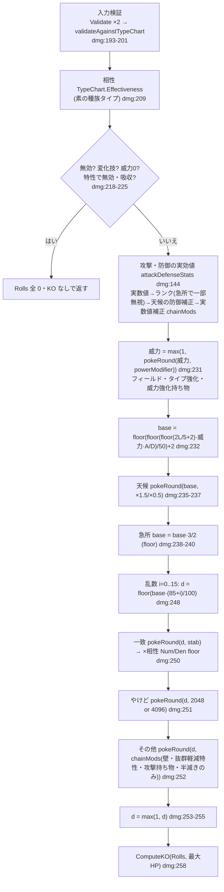

# ダメージ計算エンジン(engine/)

- 基準: `origin/main` 8368756(2026-09-25)。`path:行` はこの版の行番号(ずれたら関数名で探す)。推測は書かず、未確認は「カバレッジ」節に書く。
- 対象: `engine/` の実数値・ダメージ・確定数・一括計算・入力検証。逆算は [reverse-estimation.md](reverse-estimation.md)、balance / speed / judge は [other-calculations.md](other-calculations.md)。
- 呼び出し経路(calc-svc の HTTP・Web の WASM)は [request-flows.md](request-flows.md) の §1・§2・§6。ここでは engine に入った後だけを書く。
- 略記: `dmg` = `engine/damage.go`、`mod` = `engine/modifiers.go`、`st` = `engine/stats.go`、`tc` = `engine/typechart.go`。

## 1. 全体像

| 公開関数 | 場所 | 入力 → 出力 | 呼び出し元 |
|---|---|---|---|
| `RealStats` | `st:32` | `Individual` → `Stats`(実数値。ランクなし) | `CalcDamage`・speed・judge |
| `EffectiveStat` | `st:63` | `Individual`, `StatKey` → ランク適用後の値 | speed(`services/speed/internal/speed/speed.go:80`)・judge(`services/judge/internal/judge/speed.go:93`) |
| `CalcDamage` | `dmg:192` | `DamageInput` → `DamageResult`(16 ロール・相性・一致・KO) | calc-svc・wasmapi・`CalcBulk`・`CalcReverse` |
| `ComputeKO` | `engine/ko.go:17` | 16 ロール, HP → `KOChance` | `CalcDamage`(`dmg:258`) |
| `CalcBulk` | `engine/bulk.go:214` | `BulkInput` → `BulkResult`(プリセット × 持ち物の行) | calc-svc・wasmapi |
| `CalcReverse` | `engine/reverse.go:301` | `ReverseInput` → `ReverseResult` | calc-svc・wasmapi([reverse-estimation.md](reverse-estimation.md)) |
| `NewTypeChart` | `tc:85` | `TypeChartData` → 検証済み `TypeChart` | calc-svc のマスタ読込・wasmapi |

`CalcBulk` と `CalcReverse` は `CalcDamage` を呼ぶだけで、独自のダメージ式を持たない(`engine/bulk.go:12`、`engine/reverse.go:12` のコメント。ADR-0009・ADR-0010 §1)。

## 2. 固定値(ドメイン定数)

すべて `engine/types.go:4-22` の名前付き定数(CLAUDE.md ドメイン規約)。

| 定数 | 値 | 用途 |
|---|---:|---|
| `DefaultLevel` | 50 | `Individual.Level` の 0 はこの値(`engine/model.go:124` `EffectiveLevel`)。50 以外は検証エラー(`engine/model.go:134`) |
| `FixedIV` | 31 | 式には現れない(オフセットに畳み込み済み) |
| `HPStatOffset` | 75 | HP 式の定数項(Lv50・個体値31 の標準式を展開した値。導出はコメント `:9-12`) |
| `OtherStatOffset` | 20 | HP 以外の式の定数項(`:14-17`) |
| `MaxSPPerStat` / `MaxSPTotal` | 32 / 66 | SP の上限(`Individual.Validate`) |
| `Modifier4096` ほか | 4096 / 2048 / 6144 / 8192 | 補正の固定小数(`dmg:20-36`) |

## 3. 実数値(`engine/stats.go`)

| 段 | 式(コード上の実装) | 場所 |
|---|---|---|
| HP | `種族値 + 75 + SP`(性格補正なし) | `st:35`(`RealStats` 内) |
| HP 以外 | `applyNature(種族値 + 20 + SP)` | `st:12` `realOtherStat` |
| 性格補正 | 上昇 `v*11/10`、下降 `v*9/10`(整数 floor)。HP・無補正(`Plus == Minus`)は素通し | `st:17` `applyNature`、`engine/model.go:62` `IsNeutral` |
| ランク | `stat * rankNumerator[i] / rankDenominator[i]`(floor)。i = ランク+6。正は (2+n)/2、負は 2/(2+abs(n))。範囲外は ±6 に丸める | `st:46-47`(表)、`st:50` `applyStatStage` |
| 戦闘中の値 | `RealStats` → `applyStatStage`(HP はランクなし) | `st:63` `EffectiveStat` |

- 性格補正に float を使わない理由: `engine/model.go:59-61` のコメント(4096 基準・float 禁止の規約に反する経路を作らない)。
- SP は 0〜32 をそのまま式に入れる。努力値への換算 `max(0, 8×SP−4)` はゴールデンの gen9 照合(legacy-effects)でだけ使う(CLAUDE.md、`engine/golden_test.go:52-56` のコメント)。

## 4. ダメージ式のパイプライン(`CalcDamage` `dmg:192`)

### 4.1 丸めの部品

| 部品 | 定義 | 場所 | 使う段 |
|---|---|---|---|
| `pokeRound(v, mod)` | `v*mod/4096`。余りが 2048 **より大きい**ときだけ切り上げ(2048 ちょうどは切り捨て = 五捨五超入) | `dmg:39` | 威力・天候・一致・やけど・その他・天候の防御・実数値補正 |
| `chainMods(mods)` | 4096 から始めて `m = (m*mod + 2048) >> 12` を順に(4096 の項は飛ばす)。1 つの補正にまとめ、最後に `pokeRound` で 1 回だけ掛ける | `dmg:50` | 威力補正・攻撃/防御の実数値補正・その他補正 |
| 整数 floor | Go の整数除算 | 各所 | 基礎ダメージ・急所・乱数・相性 |

根拠: ADR-0004(丸めの種類・適用順)、ADR-0008(@smogon/calc との外部照合で段を訂正)。

### 4.2 段ごとの処理

| # | 段 | コード | 丸め | 何と関係するか |
|---|---|---|---|---|
| 1 | 入力検証 | `dmg:193-201` | — | §11。失敗は error(部分結果なし) |
| 2 | 相性 | `dmg:209` `in.TypeChart.Effectiveness(技タイプ, 防御側 Species.Types)` | 整数比 `Num/Den`(約分しない。`Den = 2^タイプ数`)`tc:58-63` | §5。**テラスタイプは使わない**(§13) |
| 3 | 一致判定 | `dmg:214` → `dmg:117` `stabModifier` | — | 攻撃側 `Species.Types` に技タイプがあれば 6144、特性 `StabMod` があればその値(例 8192)。技タイプなし(`""`)は不一致 |
| 4 | 特性による無効・吸収 | `dmg:218-220` → `dmg:96` `abilityNullification` | — | タイプ由来の無効が先。`DefImmuneTypes` が `DefAbsorbTypes` に勝つ(ADR-0106 §決定1)。結果は `DamageResult.Nullified` |
| 5 | 0 ダメージの早期終了 | `dmg:223-225` | — | 変化技・`Power <= 0`・相性 0・特性で無効/吸収。Rolls は全 0、`KO.Hits = 0` |
| 6 | 攻撃・防御の実効値 | `dmg:228` → `dmg:144` `attackDefenseStats` | 下表 | 物理 = A/B、特殊 = C/D(`dmg:146-150`) |
| 7 | 威力 | `dmg:231` `max(1, pokeRound(威力, powerModifier(in)))` | `pokeRound` 1 回(補正は `chainMods` 済み) | `mod:178` `powerModifier`: フィールド(`mod:99`。接地している側だけ)→ タイプ強化持ち物 → 分類限定の威力持ち物(ADR-0008 訂正2) |
| 8 | 基礎ダメージ | `dmg:232` `(((2*L/5+2)*威力*A)/D)/50 + 2` | 各段 floor | L は `EffectiveLevel`(常に 50) |
| 9 | 天候 | `dmg:235-237` `weatherDamageMod`(`mod:61`) | `pokeRound`(単独) | 晴れ: 炎 ×1.5・水 ×0.5 / 雨: 水 ×1.5・炎 ×0.5 |
| 10 | 急所 | `dmg:238-240` `base*3/2` | floor | ランクの一部無視(下表)・壁の貫通(#13) |
| 11 | 乱数 | `dmg:248` `base*(85+i)/100`、i = 0..15 | floor | 16 ロールを `Rolls[i]` に(非減少) |
| 12 | 一致 → 相性 | `dmg:250` `pokeRound(d, stab) * Num / Den` | 一致は `pokeRound`、相性は floor(統合しない。ADR-0008 訂正1) | 相性は `Effectiveness` の整数比 |
| 13 | やけど | `dmg:251` `pokeRound(d, burnModifier)`(`dmg:130`) | `pokeRound` | 物理 × 攻撃側 `Status == burn` × 特性 `IgnoresBurn` でない → 2048 |
| 14 | その他補正 | `dmg:245`・`dmg:252` `pokeRound(d, chainMods(otherModifiers))`(`mod:201`) | `chainMods` → `pokeRound` 1 回 | 連結順: 壁(急所なら除外)→ 抜群軽減特性 → 攻撃側持ち物の最終倍率 → 半減きのみ(ADR-0008 訂正5) |
| 15 | 最低 1 | `dmg:253-255` | — | ここに来るのは相性 ≠ 0 のときだけ |
| 16 | 確定数 | `dmg:258` `ComputeKO(Rolls, DefenderHP)` | float(表示用。ADR-0006) | §8 |

#6 攻撃・防御の実効値(`dmg:144` `attackDefenseStats`)の内訳:

| 順 | 処理 | コード | 丸め |
|---|---|---|---|
| a | 急所なら攻撃側の負ランクと防御側の正ランクを 0 にする | `dmg:153-160` | — |
| b | `RealStats` → `applyStatStage` | `dmg:161-162` | floor |
| c | 天候の防御補正(砂 × 岩タイプの特防、雪 × 氷タイプの防御 ×1.5)を**持ち物より先に単独で** | `dmg:164` → `mod:168` `weatherDefenseMod` | `pokeRound`(ADR-0008 訂正4) |
| d | 攻撃側の実数値補正: 攻撃側特性の `OffBoostType` → 防御側特性の `DefResistType` → 攻撃側持ち物の `StatMods[atk/spa]` | `dmg:165` → `mod:139` `offensiveStatMod` | `chainMods` → `pokeRound`、下限 1(ADR-0008 訂正3) |
| e | 防御側の実数値補正: 防御側持ち物の `StatMods[def/spd]` | `dmg:166` → `mod:158` `defensiveStatMod` | `chainMods` → `pokeRound`、下限 1 |

- ランク → 持ち物の順を固定するテスト: `engine/modifiers_test.go:200` `TestRankThenItemOrder`。天候 → 持ち物: `engine/rounding_regression_test.go:31` `TestWeatherBeforeItemRounding`。
- 32bit 折り返し(@smogon/calc の OF32)は未実装(ADR-0004「保留」)。

## 5. タイプ相性(データとして受け取る)

| 項目 | 内容 | 場所 |
|---|---|---|
| 素データ | `TypeChartData{Types, Effectiveness[攻撃][防御] = 倍率コード}`。コードは倍率 ×2 の整数(0/1/2/4)。等倍(2)は省略可 | `tc:37-43`、定数 `tc:25-34` |
| 検証 | 空・`TypeNone`・重複・未知キー・0/1/2/4 以外は `ErrInvalidTypeChart` | `tc:85` `NewTypeChart`、`tc:110` `fillCodes` |
| 保持 | 添字表 `codes[攻撃添字*n + 防御添字]`(int8)。作成後は不変(引数の map を後で書き換えても影響しない) | `tc:52-56` |
| 引き方(ルール) | 防御タイプごとに `num *= code`、`den *= 2`。`TypeNone` の防御タイプは飛ばす。技タイプなし・防御タイプなしは 1/1 | `tc:206` `Effectiveness` |
| 抜群・無効 | `Num > Den` が抜群、`Num == 0` が無効 | `tc:74,77` |
| 表示用 | `Multiplier()` は float(0/0.25/0.5/1/2/4)。ダメージ計算では使わない | `tc:66` |
| 表が無い | `DamageInput.TypeChart` がゼロ値 → `ErrTypeChartMissing`(既定の表で補わない) | `dmg:68-70`、`tc:234` `requireKnown` |
| 表に無い ID | 技・両側の種族・両側のテラスのタイプが表に無い → `ErrUnknownType`(黙って等倍にしない) | `dmg:173` `validateAgainstTypeChart` |

- 表の出どころ: calc-svc はマスタ(`types`/`type_chart` テーブル → `services/internal/master/typechart.go:47` `TypeChartData`)、Web の WASM と engine のテストは `testdata/golden/typechart.json`。
- engine のソースに相性表が無いことをテストで固定: `engine/typechart_test.go:311` `TestNoTypeChartTableInEngineSource`。
- 意図: 版で変わりうる「表」はデータ、引き方は「ルール」(ADR-0013 §2)。

## 6. 持ち物・特性の効果スキーマ(データ駆動)

engine は持ち物・特性の一覧を持たない。`Item.Effect` / `Ability.Effect` に解決済みの効果値(4096 基準)を受け取り、決まった段で適用する(ADR-0005)。`nil` は補正なし。

`ItemEffect`(`mod:17-26`):

| フィールド | 意味 | 適用箇所 | 段 |
|---|---|---|---|
| `StatMods[stat]` | 実数値倍率(攻撃側は atk/spa、防御側は def/spd を見る) | `mod:149-152`・`mod:160-164` | #6d・#6e |
| `PowerMod` + `PowerCategory` | 威力倍率(分類が空なら全分類) | `mod:184-186` | #7 |
| `BoostType` + `BoostTypeMod` | 技タイプが一致したときの威力倍率 | `mod:181-183` | #7 |
| `DamageMod` + `OnlySuperEffective` | 最終ダメージ倍率(抜群時のみにできる) | `mod:214-218` | #14 |
| `ResistBerryType` | 防御側。そのタイプの技が抜群のとき ×0.5。ノーマルタイプは等倍でも発動 | `mod:220-224` | #14 |

`AbilityEffect`(`mod:39-49`):

| フィールド | 意味 | 適用箇所 | 段 |
|---|---|---|---|
| `StabMod` | 攻撃側。一致補正を置き換える(0 は通常の 6144) | `dmg:122-124` | #12 |
| `OffBoostType` + `OffBoostTypeMod` | 攻撃側。技タイプ一致で攻撃実数値倍率 | `mod:141-143` | #6d |
| `DefResistType[type]` | 防御側。そのタイプの技の**攻撃側実数値**に掛ける | `mod:144-148` | #6d |
| `DefImmuneTypes` | 防御側。そのタイプを無効(ダメージ 0) | `dmg:100-104` | #4 |
| `DefAbsorbTypes[type]` | 防御側。そのタイプを吸収(ダメージ 0)。`AbsorbEffect`(回復・能力上昇)は**読まない** | `dmg:105-107`、`mod:28-36` | #4 |
| `ReduceSuperEffective` | 防御側。抜群のときの最終倍率 | `mod:210-212` | #14 |
| `IgnoresBurn` | 攻撃側。やけどの半減を無効 | `dmg:132-134` | #13 |
| `Airborne` | 両側。浮いている(ふゆう)。接地判定 `isGrounded`(`mod:86`)でフィールドの補正の対象外にする。地面技の無効は `DefImmuneTypes` で別に持つ(ADR-0116) | `mod:86-95` | #7 |

- 効果値の出どころ: calc-svc は DB の効果 JSON を `services/internal/master/effects.go:299` `DecodeItemEffect`・`:380` `DecodeAbilityEffect` で厳格デコード(本番の定義は `data/importer/effects.json`。ADR-0101)。WASM はリクエストの `item.effect` / `ability.effect` を `engine/wasmapi/dto.go:273`・`:398` で変換。
- 天候・フィールド・壁は「ゲーム機構」なので engine のルールとしてコードに持つ(`mod:1-14` のコメント、ADR-0005)。
- 技の追加効果 `Move.Effect`(`engine/move_effect.go:22` `MoveEffect`)は `CalcDamage` が読まない。判定側が使うメタデータ(ADR-0107 決定2。`engine/move_effect_test.go:83` `TestCalcDamageIgnoresMoveEffect`)。

## 7. 場・状態(ゲーム機構)

| 入力 | 効果 | 場所 | 段 |
|---|---|---|---|
| `Field.Weather` sun / rain | 技ダメージ ×1.5 / ×0.5 | `mod:61` | #9 |
| `Field.Weather` sand / snow | 岩の特防 / 氷の防御 ×1.5 | `mod:168` | #6c |
| `Field.Terrain` electric / grassy / psychic | 攻撃側が接地しているとき、同タイプの技の威力 ×1.3(5325) | `mod:99-112`(接地判定 `mod:86` `isGrounded`: ひこうタイプでない かつ特性が `Airborne` でない。ADR-0116) | #7 |
| `Field.Terrain` misty | 防御側が接地しているとき、ドラゴン技の威力 ×0.5 | `mod:113-116` | #7 |
| `Field.DefenderScreens` | 物理: リフレクター/オーロラベール、特殊: ひかりのかべ/オーロラベールで ×0.5。急所は貫通 | `mod:123`、`mod:205` | #14 |
| `Critical` | base ×1.5(floor)、ランクの一部無視、壁無視 | `dmg:238`・`dmg:153`・`mod:205` | #6a・#10・#14 |
| `Attacker.Status == burn` | 物理技 ×0.5 | `dmg:130` | #13 |
| `Ranks` | 実数値に倍率(floor) | `st:50` | #6b |

## 8. 確定数・表示%(`engine/ko.go`・`engine/display_percent.go`)

| 値 | 計算 | 場所 |
|---|---|---|
| `KO.Hits` | `ceil(HP / 最大ロール)`。最大ロール 0 または HP 0 以下は 0(倒せない) | `engine/ko.go:18-24` |
| `KO.Guaranteed` | `最小ロール × Hits >= HP` | `engine/ko.go:26` |
| `KO.ChancePercent` | 乱数のときだけ。16 ロール等確率・独立で `Hits` 回の和が HP 以上になる確率を畳み込み(DP)で厳密に計算 ×100。HP 以上は 1 バケットに吸収。確定のときは 0 | `engine/ko.go:38` `koProbability` |
| 表示用の確率 | 倒せない 0、確定 1000(100.0%)、乱数は四捨五入して 1〜999(0.1% 単位の整数) | `engine/display_percent.go:45` `DisplayChancePercentTenths` |
| ダメージ% | 最小側 `floor(dmg*1000/HP)`、最大側は四捨五入 `(dmg*2000+HP)/(2HP)`(0.1% 単位) | `engine/display_percent.go:15,24,34` |

- HP は常に**最大 HP**(`RealStats(Defender).HP`。`dmg:205`)。現在 HP・定数ダメージ・回復・急所率・命中率は KO に入らない(ADR-0006 却下・保留)。
- 小数への変換は境界だけが行う(wasmapi の `tenthPercent` `engine/wasmapi/dto.go:577`、calc-svc の `calcResultFrom`)。

## 9. 一括計算 bulk(1 攻撃 × 防御側プリセット × 持ち物)

| 段 | 内容 | 場所 |
|---|---|---|
| 件数上限 | `Presets`・`PresetKeys` は各 8 以下、`ItemVariants` は 64 以下(選別より前に見る) | `engine/bulk.go:217-225` |
| プリセットの選択 | `PresetKeys` あり → `Presets`(空ならカタログ)からキーで選ぶ(指定順が行順)/ `Presets` のみ → そのまま / どちらも空 → 技の分類の既定セット | `engine/bulk.go:170` `selectPresets` |
| 既定カタログ | 8 件(無振り・H・H+B補正・HB・HB特化・H+D補正・HD・HD特化)。物理は B 系、特殊は D 系、変化技は無振りと H だけ | `engine/bulk.go:112` `DefenderPresetCatalog`、`:127` `DefaultDefenderPresets` |
| 検証 | キー空・SP 範囲/合計・性格が HP を指す → `ErrInvalidPreset`。重複 `ErrDuplicatePreset`、未知 `ErrUnknownPreset` | `engine/bulk.go:151` |
| 防御側の組み立て | Lv50・`Status` なし・ランク 0・**特性なし(ゼロ値)**・テラスなし | `engine/bulk.go:139` `Defender` |
| 行 | プリセット優先でプリセット × 持ち物(持ち物なしは `nil` の 1 通り)。各行 = 同じ入力の `CalcDamage` | `engine/bulk.go:243-275` |

- プリセットは「入力の作り方の型」でマスタではないので engine が既定を持つ(ADR-0009 §1)。一致は `engine/bulk_test.go:277` `TestCalcBulkRowsMatchCalcDamage`。
- どれか 1 行でも失敗したら全体が error(部分結果なし。ADR-0009 §5)。

## 10. format(single / double)

- `Format` は `DamageInput`・`BulkInput`・`ReverseInput` に持ち、そのまま `CalcDamage` に渡るが、**`CalcDamage` は読まない**(`dmg:192-260` に参照なし)。壁は形式に関係なく ×0.5(`mod:122` のコメント「シングルは」)。
- double でも結果が single と同じことはテストで固定されている(`engine/bulk_test.go:639` `TestCalcBulkFormatDouble`)。
- 意図: ダブル固有の補正を後から足せるよう入力にだけ先に持たせた(`engine/types.go:24`、ADR-0005「M1 での対象外」)。

## 11. 入力検証と上限

| 検査 | 失敗 | 場所 |
|---|---|---|
| Level が 0 か 50 | error | `engine/model.go:134` |
| 種族値が負でない | error | `engine/model.go:138` |
| SP 各 0..32・合計 ≤ 66 | error | `engine/model.go:141-148` |
| ランク -6..6 | error | `engine/model.go:149-154` |
| 性格が HP を指さない | error | `engine/model.go:155` |
| 種族のタイプが 1〜2 個・重複なし | error | `engine/model.go` `Individual.Validate` |
| 種族値 `MinBaseStat..MaxBaseStat`(1..255。HP を含む) | error | `engine/model.go` `Individual.Validate`(#255。ADR-0117) |
| 持ち物・特性の効果の補正値 `MinEffectModifier..MaxEffectModifier`(1..×512。「0 は補正なし」の項目は 0 も可) | error | `engine/model.go` `ItemEffect.validate` / `AbilityEffect.validate`(#255。ADR-0117) |
| 相性表あり・入力のタイプ ID が表にある | `ErrTypeChartMissing` / `ErrUnknownType` | `dmg:173` |
| bulk の件数(8 / 8 / 64) | `ErrTooManyPresets` / `ErrTooManyItemVariants` | `engine/bulk.go:36-43,217-225` |
| reverse の件数(持ち物 64・観測 16・`MaxCandidates` 0..128) | `ErrTooManyItemCandidates` / `ErrTooManyObservations` / `ErrInvalidMaxCandidates` | `engine/reverse.go:49-56,307-315` |
| reverse の技がダメージを与えられる(変化技・威力 0・全候補で 0 を拒否) | `ErrMoveDealsNoDamage`(境界では `invalid_input`) | `engine/reverse.go` `CalcReverse`(#317。ADR-0117 §3) |

- 件数上限の値は calc-svc の契約(ADR-0208 §1)と同じ値を engine にも置く。HTTP を通らない直接呼び出し・WASM でも計算量を増幅させないため(ADR-0108 決定1〜3)。上限ちょうどの実測は bulk 約 3.0ms・reverse 約 25ms(ADR-0108 §6 が引く ADR-0208 の計測)。
- wasmapi は同じ件数検査を DTO 変換より前に重ねて置く(`engine/wasmapi/requests.go:129-136,279-286`)。HTTP と WASM で同じ `code`(`invalid_input`)にするため(ADR-0108 決定3・5)。エラーの code 対応は `engine/wasmapi/wasmapi.go:151` `errorResponse`。
- 検査**していない**もの: `Move.Effect` の妥当性(`engine/move_effect_test.go:120` `TestCalcDamageAcceptsInvalidMoveEffect`。`MoveEffect.Validate` `engine/move_effect.go:29` は呼び出し側が使う)。種族値の上限・タイプの重複・効果値の範囲は #255 で `Individual.Validate` が見るようにした(HP の上限で `koProbability` の配列確保 `engine/ko.go:40` も頭打ちになる。ADR-0117)。

## 12. engine の純粋性の保ち方

| 手段 | 内容 | 場所 |
|---|---|---|
| import | 非テストの import は `errors`・`fmt`・`sort`・`math` だけ。`go.mod` に依存なし | `engine/*.go`、`engine/go.mod` |
| float | ダメージ・相性は整数だけ。float は表示用の `Effectiveness.Multiplier`・`KOChance.ChancePercent` のみ(ADR-0006) | `tc:66`、`engine/ko.go:13` |
| 乱数 | 16 ロールを全部返し、確率は DP で計算。追加効果の発動判定は持たない(ADR-0107 決定1) | `dmg:247`、`engine/move_effect.go:5-9` |
| マスタ | 相性表・持ち物・特性・プリセット以外の一覧を持たない。すべて入力 | §5・§6 |
| 境界 | JSON・`syscall/js` は `engine/wasmapi`・`engine/cmd/wasm` に閉じ込める。wasmapi の import 最小をテストで固定 | `engine/wasmapi/wasmapi_test.go:881` `TestBoundaryPackageImportsAreMinimal` |
| 外部照合 | `make test-golden` が @smogon/calc 0.12.0(Champions 世代、Champions に無い効果は gen9 の legacy-effects)と全件一致を要求 | `engine/golden_test.go:187` `TestGoldenDamage`、CLAUDE.md 絶対ルール3 |

## 13. 未対応・既知の制限

黙って無視される入力(エラーにならず、結果に印も無い):

| 入力 | 実際の扱い | 根拠 | issue |
|---|---|---|---|
| `TeraType` | 表にある ID かの検証だけ。一致判定・相性は素の `Species.Types` | `dmg:184-187`、`dmg:117`、`mod:51` `hasType`、ADR-0005 | #232・#315 |
| `Format = double` | 計算に使わない(壁 ×0.5 固定・全体技の軽減なし) | §10 | #232・#288 |
| `Field.AttackerScreens` | どこからも読まれない(`DefenderScreens` だけを見る) | `mod:124` | — |
| `Move.Priority`・`Move.Effect` | ダメージ計算では読まない | `engine/model.go:21`、ADR-0107 決定2 | — |
| `Species.Abilities` | 参考。計算は `Individual.Ability` を使う | `engine/model.go:16` | #272(Web で特性を選べない) |
| `AbsorbEffect` の回復・能力上昇 | 読まない(ダメージ 0 だけ) | `mod:28-30`、ADR-0106 §決定4 | — |
| `Status` の burn 以外 | ダメージに関係しない | `dmg:130` | — |
| `DamageResult.Nullified` | engine は返すが、wasmapi の結果 DTO と calc-svc の応答に出ない(`calcResultDTO` `engine/wasmapi/dto.go:598` に項目なし。`services/calc` に参照なし) | grep | #78 |
| 効果定義の無い持ち物・特性 | `Effect == nil` = 補正なしで計算 | §6 | #270・#282 |

対応していない機構(ADR-0005「M1 での対象外」・コードで確認できるもの):

- 接地判定の一部: じゅうりょく・くろいてっきゅう(必ず接地)・ふうせん(浮く)は未モデル化(ADR-0116 §対象外)。グラスフィールドの地震・じならし半減、サイコフィールドの先制技無効などフィールド固有の技の処理は #271
- 固定ダメージ・多段・威力変動・参照ステータスの差し替え: 威力の数値どおり単発で計算(`Power <= 0` は 0 ダメージ。`dmg:223`)。#233・#271
- 条件付き特性(ADR-0005 の列挙: いかく等)、天候を変える特性、重さ依存技、急所ランク、テラスタルの補正、ダブル固有補正(全体技 ×0.75 など)
- 多ターンの KO(定数ダメージ・回復・反動)、急所率・命中率(ADR-0006)
- 32bit 折り返し(ADR-0004 保留)
- 相性表の正が 2 つ(DB と `testdata/golden/typechart.json`)で一致検査が無い: #280

## カバレッジ

- 読んだ(全行): `engine/` の非テストファイルすべて(`doc.go`・`types.go`・`model.go`・`stats.go`・`damage.go`・`modifiers.go`・`typechart.go`・`ko.go`・`display_percent.go`・`move_effect.go`・`bulk.go`・`reverse.go`)、`engine/README.md`、`engine/wasmapi/wasmapi.go`、`engine/cmd/wasm/main_js.go`。
- 読んだ(一部): `engine/wasmapi/requests.go`(calc 部・件数検査)・`dto.go`(効果 DTO・個体・場・結果)、テストは関数名の一覧と `bulk_test.go:639-660`・`move_effect_test.go:120-135`・`typechart_test.go:311-`・`golden_test.go:1-60,187-200`、`services/calc/internal/httpapi/convert.go:80-215`、`services/internal/master/effects.go:290-330`。ADR-0004・0005・0006・0008・0108 は全文、0013・0106・0107 は前半、0009・0011 は見出し。
- 読んでいない: ゴールデン生成器 `tools/golden/`、`testdata/golden/*` の中身、`engine/cmd/wasmexpect`、ADR-0011 §9 の性能実測の詳細。@smogon/calc 側の実装とは突き合わせていない(一致は `make test-golden` に依る)。
