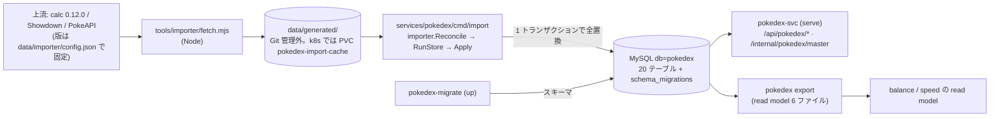
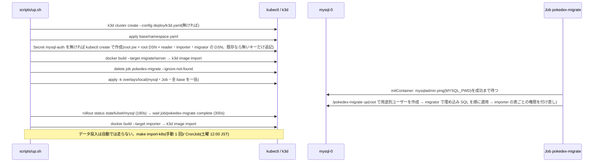

# MySQL(pokedex DB)の起動・初期化・migration・接続・投入

- 基準: 2026-10-01 の `origin/main`(PR #443 まで)に合わせて直した。行番号は書かない(ファイル名・ターゲット名で探す)。pokedex の DB は MySQL(このファイル)。record・team は TiDB(ADR-0211。別の DB・別の Secret で、このファイルの対象外)。
- 関連: リソース定義は [k8s-local.md](k8s-local.md)、コマンドの順序は [runbook-commands.md](runbook-commands.md)、環境変数は [config-env.md](config-env.md)。

## 1. データの流れ

```mermaid
flowchart LR
  UP["上流: calc 0.12.0 / Showdown / PokeAPI<br/>(版は data/importer/config.json で固定)"]
  FE["tools/importer/fetch.mjs<br/>(Node)"]
  GEN[("data/generated/<br/>Git 管理外。k8s では PVC pokedex-import-cache")]
  IMP["services/pokedex/cmd/import<br/>importer.Reconcile → RunStore → Apply"]
  DB[("MySQL db=pokedex<br/>20 テーブル + schema_migrations")]
  SVC["pokedex-svc (serve)<br/>/api/pokedex/* · /internal/pokedex/master"]
  EXP["pokedex export<br/>(read model 6 ファイル)"]
  UP --> FE --> GEN --> IMP -->|"1 トランザクションで全置換"| DB
  MIG["pokedex-migrate (up)"] -->|"スキーマ"| DB
  DB --> SVC
  DB --> EXP --> RM["balance / speed の read model"]
```

- 実データは Git に置かない(絶対ルール・ADR-0002)。`data/generated/` は `.gitignore`。Git に入るのは `data/importer/{config,effects,regulations}.json` と `examples/`。
- スキーマ作成(migrate)とデータ投入(import)は**別の担当**。import はスキーマを作らず、テーブルが無ければ `ErrSchemaNotReady`(exit 3。`importer/store.go`)。サービス起動時の自動 migrate は無い(複数レプリカの競合回避。`deploy/k8s/base/pokedex/job-migrate.yaml` の冒頭コメント)。
- 用途別の DB ユーザー(ADR-0110・ADR-0125): `pokedex_reader`(pokedex-svc。SELECT)、`pokedex_importer`(表ごとの DML。`schema_migrations` は除く)、`pokedex_migrator`(migration の DDL)。root は用途別ユーザーを作る(プロビジョニング)ときだけ使う。

## 2. MySQL の起動(2 経路。互いに独立)

| | k3d(本番相当のローカル) | `make dev` 用の docker |
|---|---|---|
| 起動 | `make up` → `kubectl apply -k deploy/k8s/overlays/local`(`scripts/up.sh`)、`rollout status statefulset/mysql` | `make db-local-up` → `scripts/db-local-up.sh` |
| 実体 | StatefulSet `mysql`(ns pokecalc)、Pod `mysql-0`、`mysql:9.7.2@sha256:29abb0a1…` | docker コンテナ `pokecalc-mysql-local`(同 image・同 digest) |
| 到達 | クラスタ内 `mysql:3306`(headless Service)。ホストからは `kubectl port-forward svc/mysql 3306:3306`(手動。`docs/runbooks/speed.md`・`docs/verify-m1.md` §3) | `127.0.0.1:3306`(`-p 127.0.0.1:3306:3306`。`scripts/db-local-up.sh`) |
| root パスワード | Secret `mysql-auth` の `mysql-root-password`(`scripts/up.sh` が `openssl rand -hex 16` で生成。ほかに用途別ユーザーの DSN 3 つ(reader・importer・migrator)と root の DSN `pokedex-dsn`。計5キー) | `.env` の `MYSQL_ROOT_PASSWORD`(空なら失敗。`.env.example` は値なし) |
| DB 作成 | `MYSQL_DATABASE=pokedex`(**初回起動時のみ有効**。`overlays/local/mysql/statefulset.yaml`) | 作らない(コンテナは DB を作らない。DSN 例は `.../pokedex?parseTime=true` だが `pokedex` DB の作成手順はスクリプトに無い) |
| 文字コード・メモリ設定 | ConfigMap `mysql-config` の `charset.cnf`(utf8mb4 / `utf8mb4_0900_ai_ci`)と `memory.cnf`(`performance_schema=OFF`・`innodb_buffer_pool_size=128M`・`innodb_log_buffer_size=16M`・`max_connections=50`。Pod の上限 768Mi に収めるため。issue #437)。`overlays/local/mysql/configmap.yaml` | 起動引数 `--character-set-server=utf8mb4 --collation-server=utf8mb4_0900_ai_ci`(`scripts/db-local-up.sh`)。`memory.cnf` 相当は無い |
| 永続化 | PVC `data-mysql-0` 1Gi(`local-path`)。`make down` でクラスタごと消える(人間の確認が要る操作。中身は importer で作り直せる。`docs/runbooks/data.md`) | コンテナ内のみ(volume なし。`docker rm` で消える) |
| 停止 | `k3d cluster stop pokecalc`(データは保持) | スクリプトの範囲外(データ削除は人間の確認。CLAUDE.md) |
| 用途 | pokedex・migrate・import が接続 | `make dev` は calc・gateway だけを起動し **DB を使わない**(`scripts/dev.sh` は例 JSON を読む)。`make migrate-up`・`make import`・`make test-db` をホストから流す用 |

## 3. 初期化と migration の順序(`make up` の DB 部分)

```mermaid
sequenceDiagram
  participant U as scripts/up.sh
  participant K as kubectl / k3d
  participant M as mysql-0
  participant J as Job pokedex-migrate
  U->>K: k3d cluster create --config deploy/k3d.yaml(無ければ)
  U->>K: apply base/namespace.yaml
  U->>K: Secret mysql-auth を無ければ kubectl create で作成(root pw + root DSN + reader・importer・migrator の DSN。既存なら無いキーだけ追記)
  U->>K: docker build --target migrate/server → k3d image import
  U->>K: delete job pokedex-migrate --ignore-not-found
  U->>K: apply -k overlays/local(mysql・Job・全 base を一括)
  J->>M: initContainer: mysqladmin ping(MYSQL_PWD)を成功まで待つ
  J->>M: /pokedex-migrate up(root で用途別ユーザーを作成 → migrator で埋め込み SQL を順に適用 → importer の表ごとの権限を付け直し)
  U->>K: rollout status statefulset/mysql (180s) → wait job/pokedex-migrate complete (300s)
  U->>K: docker build --target importer → k3d image import
  Note over U,K: データ投入は自動では走らない。make import-k8s(手動 1 回)/ CronJob(土曜 12:00 JST)
```

- Job を `up.sh` が事前に delete するのは、Job の `spec.template` が immutable で再 apply が失敗するため。
- Secret を Git に置かない理由: ADR-0100 §9。`kubectl create` で作る(`apply` は平文の `stringData` を `last-applied-configuration` に写すため。issue #327)。
- `up.sh` は pokedex の Ready を待たない。初回の import が済むまで `pokedex` は `0/1`(readiness が DB のマスタに連動。ADR-0129)。

### migration の仕組み

| 項目 | 内容 | 根拠 |
|---|---|---|
| ライブラリ | `golang-migrate/migrate/v4`(mysql driver・iofs source)。公式 CLI は使わず自前の `cmd/migrate`(理由は ADR-0100 §1) | `services/pokedex/db/migrate.go` |
| 実行ロジック本体 | `Up`/`DownAll`/`Force`/`Version`/`newRunner` は共通パッケージに切り出し、`fs.FS` を引数に取る(record-svc・team-svc も同じ実装を再利用。ADR-0211 §5) | `services/internal/dbmigrate/migrate.go` |
| SQL の持ち方 | `migrations/*.sql` を `//go:embed` でバイナリに埋め込む(実行版とコードが一致)。サービスごとの `db/migrate.go` は自分の `embed.FS` を `dbmigrate` に渡す薄いラッパー | `services/pokedex/db/migrate.go` |
| 接続 | `mysql.ParseDSN` → `MultiStatements = true` を付けて `sql.Open` | `services/internal/dbmigrate/migrate.go`(接続の組み立て) |
| コマンド | `migrate up` / `migrate version` / `migrate down -confirm <DB名>` / `migrate force -version <版> -confirm <DB名>` | `cmd/migrate/main.go` |
| `down` の防護 | `-confirm` が空、または DSN の DB 名と不一致なら**接続前に** `ErrDownNotConfirmed`。k8s・スクリプトからは呼ばない | `services/internal/dbmigrate/migrate.go`(`DownAll`。各サービスの `db/migrate.go` が再エクスポート) |
| `force` の防護 | dirty の復旧専用(issue #221)。`-confirm` 不一致は接続前に `ErrForceNotConfirmed`、負・migrations に無い版は `ErrForceUnknownVersion`(0 は未適用に戻す)、dirty でない DB で今と違う版は `ErrForceNotDirty`。手順は `docs/runbooks/data.md` | `services/internal/dbmigrate/migrate.go`(`Force`) |
| 失敗時のエラー | migration の SQL 全文を出さず「migration 名: MySQL のエラー」の1行にする(元のエラーは `errors.As` で取れる) | `services/internal/dbmigrate/migrate.go`(`describeMigrationError`) |
| 適用済みの記録 | golang-migrate の管理テーブル(既定名 `schema_migrations`。ライブラリの既定で、実クラスタでは未確認) | `services/internal/dbmigrate/migrate.go` |
| Job の image | `pokecalc/pokedex-migrate:0.1.0`(`FROM scratch`、`ENTRYPOINT /pokedex-migrate`、`CMD up`。down はイメージに含めない意図) | `services/pokedex/Dockerfile`(`migrate` ターゲット) |
| make | `migrate-up` `migrate-version`(要 `POKEDEX_DATABASE_DSN`)、`migrate-down`(要 `CONFIRM_DESTROY=<DB名>`)、`migrate-force`(要 `FORCE_VERSION=<版> CONFIRM_FORCE=<DB名>`) | ルート `Makefile`(`migrate-*`) |

### migrations(全 18 ファイル = 9 版 × up/down)

| 版 | 名前 | up | down |
|---|---|---|---|
| 000001 | create_types | `types` `type_chart` | 逆順に DROP |
| 000002 | create_master | `abilities` `items` `moves` `species` `species_abilities` `item_effects` `ability_effects` `learnsets` | 逆順に DROP |
| 000003 | create_regulations | `regulations` `regulation_species` `regulation_moves` `regulation_items` `regulation_abilities` | 逆順に DROP |
| 000004 | create_data_versions | `data_versions` | DROP |
| 000005 | widen_species_ability_slot | `species_abilities` の CHECK を slot 1〜3 → 1〜4 | CHECK を戻す |
| 000006 | create_natures | `natures` | DROP |
| 000007 | create_move_effects | `move_effects` | DROP |
| 000008 | create_move_mechanisms | `move_mechanisms` | DROP |
| 000009 | create_species_key_ledger | `species_key_ledger`(配った種族 key の台帳。追記だけ。ADR-0131) | DROP |

## 4. 接続(DSN)

| 利用者 | DSN の出所(Secret `mysql-auth` のキー) | 加工 | 根拠 |
|---|---|---|---|
| pokedex-svc(`serve`) | env `POKEDEX_DATABASE_DSN` ← `pokedex-reader-dsn`(`pokedex_reader`。SELECT のみ) | `parseTime=true` を必ず付与。`sql.Open` のみで**起動時に接続しない**(DB 不在でも起動する。DB を使う操作は 503、`/readyz` は DB に届いてマスタが揃うまで 503。ADR-0129) | `cmd/pokedex/main.go` |
| `pokedex export` | 同上の env(k3d ではホストから手動で渡す) | 同上 | `cmd/pokedex/main.go` |
| `pokedex-migrate`(Job) | `POKEDEX_PROVISION_DSN` ← `pokedex-dsn`(root。用途別ユーザーの作成と権限の付け直しだけ)、`POKEDEX_DATABASE_DSN` ← `pokedex-migrator-dsn`(migration の本体)、`POKEDEX_READER_DSN`・`POKEDEX_IMPORTER_DSN`(ユーザー・パスワードを知るためだけ) | `MultiStatements=true` を付与 | `deploy/k8s/base/pokedex/job-migrate.yaml`、`cmd/migrate/main.go` |
| `pokedex-import`(CronJob/手動 Job) | env `POKEDEX_DATABASE_DSN` ← `pokedex-importer-dsn`(`pokedex_importer`。表ごとの SELECT/INSERT/UPDATE/DELETE) | なし。DSN 無しは exit 2(`-dry-run` のときは不要) | `cmd/import/main.go` |
| ホストから(`make migrate-up` `make migrate-force` `make import` `make pokedex-export`) | 手動で `export POKEDEX_DATABASE_DSN=...`(用途に合うキーを選ぶ。migrate は `pokedex-migrator-dsn`) | k3d の場合 `kubectl get secret … \| base64 -d \| sed -E 's/@tcp\(mysql:[0-9]+\)/@tcp(127.0.0.1:13306)/'` でホストを書換え、port-forward 越しに繋ぐ | `docs/runbooks/data.md`・`docs/verify-m1.md` §3 |

- DSN の形式: go-sql-driver/mysql(`<user>:<pw>@tcp(mysql:3306)/pokedex?parseTime=true`)。5キーとも `scripts/up.sh` が乱数のパスワードで作る。エラー文に DSN(パスワード)を含めない。
- root の `pokedex-dsn` は、プロビジョニング(migrate Job・`make deploy-latest` の migrate-up)と、DB の中身を人が見る運用の手順だけが使う。サービスの Pod は使わない。
- calc-svc・gateway・judge・balance・speed は **DB に接続しない**。マスタは HTTP(`http://pokedex`)または read model ファイルで受ける(絶対ルール4。[request-flows.md](request-flows.md))。
- k3d の MySQL へは NetworkPolicy(ADR-0132)で pokedex・pokedex-migrate・pokedex-import の Pod だけが 3306 に届く。ホストからの port-forward は対象外。

## 5. データ投入(import)

| 経路 | 実行者 | 何が走るか |
|---|---|---|
| `make import-fetch` | ホスト | `cd tools/importer && npm ci && node fetch.mjs` → `data/generated/` に取得(要ネットワーク) |
| `make import-dry-run` | ホスト | `go run ./pokedex/cmd/import -data ../data -dry-run`(照合・報告だけ。DB 非接触) |
| `make import` | ホスト | 同上(`-dry-run` なし)。要 `POKEDEX_DATABASE_DSN` |
| `make import-k8s` | k3d | context が `k3d-pokecalc` のときだけ `kubectl -n pokecalc create job --from=cronjob/pokedex-import pokedex-import-manual-<時刻>`(完了は待たない) |
| CronJob `pokedex-import` | k3d | `0 12 * * 6`(土曜 12:00 JST)。`concurrencyPolicy: Forbid`。cloud overlay では `suspend: true` |

コンテナ内(`tools/importer/cronjob.sh`):

| 手順 | 内容 | 失敗時 |
|---|---|---|
| 1. flock | `data/generated/.import.lock` を非ブロッキングで取得(手動 Job と CronJob の同時実行の排他。ADR-0109) | 取れなければ exit 1(再試行) |
| 2. `node prune.mjs check` | PVC の空きが予約容量(既定 400 MiB)以上かの事前確認(ADR-0104 追記・issue #111) | 不足なら exit 3(取得・DB 更新に進まない) |
| 3. `node fetch.mjs` | Git に固定した版だけを取得 | — |
| 4. `node check-upstream.mjs` | 上流の最新版の検出(**失敗しても続行**。ログと報告に出すだけ) | 警告のみ |
| 5. `pokedex-import -data /app/data -upstream …/latest.json` | 下記。手動 Job に環境変数 `IMPORT_ALLOW_REMOVED` があるときだけ `-allow-removed` を付ける | 下表の exit code |
| 6. `node prune.mjs prune` | 5 が成功した後だけ、現在版+直前の成功版と report 直近 52 件を残して旧版を消す(再生成できるキャッシュだけ。DB・上書きは対象外) | 失敗は握りつぶさず Job を失敗にする |

`pokedex-import`(`cmd/import/main.go`)のフラグ: `-data`(既定 `../data`)`-dry-run` `-force` `-typechart`(照合する参照の相性表。既定 `<data>/../testdata/golden/typechart.json`。食い違いは Blocker `type-chart-reference-mismatch`。ADR-0118)`-upstream` `-upstream-max-age`(既定 24h)`-allow-removed`(消える種族 key・技/持ち物/特性の ID を `<種類>:<ID>` で承認する。既定は何も許さない。ADR-0131)。

| exit | 意味 | CronJob の扱い(`podFailurePolicy`) |
|---|---|---|
| 0 | 投入した / 取得元の版と変換結果が同じでスキップ / dry-run | 成功 |
| 1 | 再試行で直りうる(DB 接続・I/O・ロック競合) | `backoffLimit: 2` で再試行 |
| 2 | 使い方・設定の誤り(DSN 無し・`-allow-removed` の形式の誤り等) | `FailJob`(再試行しない) |
| 3 | 人間の対応が要る(`ErrBlocked` `ErrKeyChanged` `ErrKeyRemoved` `ErrInvalidInput` `ErrInvalidData` `ErrInvalidEffect` `ErrSchemaNotReady`・容量不足)。DB は変えない | `FailJob` |

対応の手順は `docs/runbooks/data.md`「importer が終了コード 3 で止まったとき」。

投入の中身(`importer.Reconcile` → `RunStore` → `Apply`):

| 段 | 場所 | 内容 |
|---|---|---|
| Reconcile | `importer/reconcile*.go` | 3 ソース(calc・Showdown・PokeAPI)を照合し、報告を `data/generated/reports/` へ書く。食い違いがあれば `ErrBlocked`(exit 3) |
| RunStore | `importer/store.go` | `AppliedVersions`(`data_versions`)→ 取得元の版に変換結果の版(`importer-output`。`Output` の内容ハッシュ。`importer/output_version.go`。ADR-0122)を足す → `NeedsImport` → すべて同じなら**スキップ**(`-force` で強制)。版が読めない(=migrate 未実施かも)ときは `Apply` を呼ばない |
| Apply | `importer/apply.go` | **1 トランザクションで全置換**: 検査(下表)→ 全テーブルを FK 順に DELETE → INSERT → 台帳に追記 → `data_versions` 更新 → Commit。自己参照 FK(`species.base_species_key`)のためメガは削除が先・挿入が後 |
| key の保護 | `apply.go`・`importer/key_ledger.go` | (1)台帳 `species_key_ledger` に今の `species` を足す(移行)。(2)既存の `species` と台帳の両方に対し、`showdown_id` の `key` が変わる/別の `showdown_id` が同じ `key` を奪う投入は `ErrKeyChanged` で拒否(team-svc 等が保存した key が別の種族を指すのを防ぐ)。(3)DB にあって新しい出力に無い種族 key・技/持ち物/特性の ID は、`-allow-removed` の承認が無ければ `ErrKeyRemoved`。ADR-0131 |

## 6. テーブル(全 20 + 管理テーブル)

ID 列は `ascii_bin`、日本語名は `utf8mb4_ja_0900_as_cs`(ADR-0100 §2)。`name_ja_source` は `pokeapi | override | fallback_en` の CHECK。JSON 列(`effect`)は `JSON_TYPE = 'OBJECT'` の CHECK。

| # | テーブル | 主キー | 主要列・制約 | 版 |
|---|---|---|---|---|
| 1 | `types` | `id` | `sort_order`(UNIQUE)`name_ja` `name_ja_source` | 000001 |
| 2 | `type_chart` | `(attack_type, defense_type)` | `code` ∈ {0,1,2,4}。FK → types ×2 | 000001 |
| 3 | `abilities` | `id` | `name_ja` `name_ja_source` `name_en` | 000002 |
| 4 | `items` | `id` | 同上 | 000002 |
| 5 | `moves` | `id` | `type`(FK) `category`(physical/special/status)`power`(0〜999。status は 0)`accuracy`(NULL 可)`pp` `priority`(-7〜5) | 000002 |
| 6 | `species` | `key`(`CHAR(8)`。`dex_no`-`form` の `NNNN-FFF`。CHECK で導出値と一致) | `dex_no` `form` `showdown_id`(UNIQUE)`type1` `type2` `base_hp/atk/def/spa/spd/spe`(1〜255)`is_mega` `base_species_key`(自己 FK)`required_item_id`(FK)。CHECK: メガは基底種族+必須持ち物が必須 | 000002 |
| 7 | `species_abilities` | `(species_key, slot)` | `ability_id`。slot ∈ 1〜4(000005 で 3→4 に拡張) | 000002/005 |
| 8 | `item_effects` | `item_id` | `effect` JSON | 000002 |
| 9 | `ability_effects` | `ability_id` | `effect` JSON | 000002 |
| 10 | `learnsets` | `(species_key, move_id)` | FK → species・moves(CASCADE) | 000002 |
| 11 | `regulations` | `id` | `name_ja` `is_default`(生成列 `default_marker` の UNIQUE で既定は 1 件だけ)`starts_on` `ends_on` | 000003 |
| 12 | `regulation_species` | `(regulation_id, species_key)` | FK CASCADE | 000003 |
| 13 | `regulation_moves` | `(regulation_id, move_id)` | FK CASCADE | 000003 |
| 14 | `regulation_items` | `(regulation_id, item_id)` | FK CASCADE | 000003 |
| 15 | `regulation_abilities` | `(regulation_id, ability_id)` | FK CASCADE | 000003 |
| 16 | `data_versions` | `source` | `version` `checksum`(64 桁 hex)`imported_at` DATETIME(6)。取り込み版のスキップ判定に使う。取得元ごとの行と、変換結果の版の行(`source = importer-output`。ADR-0122) | 000004 |
| 17 | `natures` | `id` | `plus` `minus`(atk/def/spa/spd/spe。両方 NULL = 無補正)。`(plus, minus)` UNIQUE | 000006 |
| 18 | `move_effects` | `move_id` | `effect` JSON(FK → moves) | 000007 |
| 19 | `move_mechanisms` | `(move_id, mechanism)` | 技の機構(多段・固定ダメージ・威力変動 等。CHECK で値を固定。行が無い = 通常の技。FK → moves CASCADE。ADR-0121) | 000008 |
| 20 | `species_key_ledger` | `species_key` | `showdown_id`(UNIQUE)`first_seen_at`。配った種族 key↔showdown_id の台帳。**追記だけ**(クエリに DELETE・UPDATE を置かない)。species への FK なし(全置換で species が消えても残す)。reader は SELECT できるが API には出さない。ADR-0131 | 000009 |
| — | `schema_migrations` | — | golang-migrate が作る(既定名。実 DB では未確認) | migrate |

## 7. SQL の書き方と生成物

| 項目 | 内容 | 根拠 |
|---|---|---|
| クエリ | `services/pokedex/db/query/pokedex.sql` に集約(`-- name:` の件数は `grep -c -- '-- name:' services/pokedex/db/query/pokedex.sql`)。手書きの SQL 文字列はコードに持たない | `importer/apply.go` の冒頭コメント |
| 生成 | `make gen-sql` → sqlc(`engine: mysql`、`schema: migrations`、`out: ../internal/store`、`emit_interface: true`) | `db/sqlc.yaml`、ルート `Makefile`(`gen-sql`) |
| 生成物 | `internal/store/{db,models,pokedex.sql,querier}.go`(Git に置かない。`make gen`(`gen-sql`)が作る。ADR-0807) | `db/sqlc.yaml` のコメント |
| 読み取り側の利用 | `internal/httpapi`(検索・master)、`internal/readmodel`(export) | `cmd/pokedex/main.go` |

## 8. DB を使うテスト

| 項目 | 内容 |
|---|---|
| `make test-db` | `POKEDEX_TEST_DSN` 必須(未設定は**失敗**)。`go test -tags mysql -p 1 ./pokedex/...`(record・team の TiDB のテストも同じターゲットで流れる)。`make test` には含まれない |
| `make test-db-docker` | Docker の使い捨ての MySQL・TiDB を起動して `make test-db` を流し、終わったら(失敗・中断でも)消す(`scripts/test-db-docker.sh`。issue #223)。Docker が無い・起動していないときは**失敗**する。`make test` には含まれない |
| 架空 seed | `services/pokedex/db/testdata/example_seed.sql`(図鑑番号 9001〜、ID は `test` 始まり、日本語名は「テスト」始まり。実データなし。ADR-0100 §7)。`db/mysql_test.go` が migrate 直後の空 DB に流す |
| レイアウト検査 | `db/layout_test.go` `move_effects_layout_test.go` `move_mechanisms_layout_test.go` `natures_layout_test.go` `key_ledger_layout_test.go`(DB 不要。migration SQL の構造を検査) |
| fake | `internal/storetest`(httpapi のテスト用ストア) |

## 9. 動作確認で DB を見るとき

| 目的 | 見る場所 |
|---|---|
| migrate が通ったか | `kubectl -n pokecalc get job pokedex-migrate`(`Complete`)、`kubectl -n pokecalc logs job/pokedex-migrate`(`up: 完了`) |
| MySQL が Ready か | `kubectl -n pokecalc get pod mysql-0` / `rollout status statefulset/mysql` |
| 投入済みか | `kubectl -n pokecalc get pods` の `pokedex` が `1/1`(`0/1` は未投入。readiness が DB のマスタに連動する。ADR-0129)、`api-smoke` の `pokedex=200`(503 `master_unavailable` なら未投入 → `make import-k8s`)、`docs/runbooks/data.md` の `SELECT COUNT(*) FROM pokedex.species` |
| 取り込んだ版 | 内部 API `/internal/pokedex/master` の `dataVersion`(`<source>=<version>@<checksum 先頭8桁>` を `,` で連結。ADR-0128)。`make pokedex-export` の `data/generated/readmodel/metadata.json` が同じ値 |
| import の失敗理由 | `kubectl -n pokecalc logs job/<pokedex-import-manual-…>`、exit code は上表。止まったときの手順は `docs/runbooks/data.md` |

## カバレッジ

- 読んだ範囲: `services/pokedex/db/` の `migrate.go`・`grants.go`・`sqlc.yaml`・全 migration の up/down(18 ファイル)、`cmd/{migrate,import,pokedex}/main.go`(主要部)、`importer/{apply,store,key_ledger}.go`(主要部)、`tools/importer/cronjob.sh` 全行、`scripts/{up,k3d-deploy-latest,test-db-docker}.sh`、`deploy/k8s` の mysql・pokedex・networkpolicy の YAML、`services/pokedex/Dockerfile`。
- 読めていない箇所: `importer/` の変換・照合ロジック(`convert*.go` `reconcile*.go`)の中身、`tools/importer/*.mjs`(fetch・check-upstream・prune)の中身、`internal/httpapi`・`internal/readmodel` の SQL の使い方、`db/query/pokedex.sql` の各クエリ本文、`db/mysql_test.go`。
- 実 DB: テーブル一覧は migration の `CREATE TABLE` 件数(000001=2・000002=8・000003=5・000004=1・000006=1・000007=1・000008=1・000009=1 = **20**。000005 は ALTER のみ)から数えた。`schema_migrations` は golang-migrate の既定名で、実 DB への接続では確かめていない。
- 未実装・スタブ: cloud の MySQL(マネージド DB 想定で overlay に無い。`cloud/cronjob-import-suspend-patch.yaml`)。record・team の TiDB は別の DB(ADR-0211)で、このファイルの対象外。
