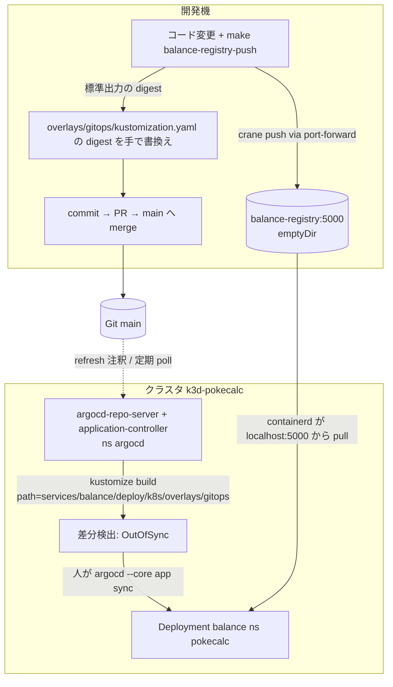

# Argo CD / GitOps

- 基準: `origin/main` を取り込んだ `docs/impl-guide`(実クラスタ `k3d-pokecalc` の読み取り確認は 2026-09-24)。実 URL・認証情報・Secret 値は書かない。
- 関連: 構成は [k8s-local.md](k8s-local.md)、コマンドは [runbook-commands.md](runbook-commands.md)・[make-targets.md](make-targets.md)、環境変数は [config-env.md](config-env.md)。

## 0. 結論(先に読む)

| 事実 | 根拠 |
|---|---|
| Git の Application は **2 件だけ**(`pokecalc-balance`・`pokecalc-speed`)。ApplicationSet・AppProject の定義は Git に **0 件** | §2 |
| calc・gateway・web・pokedex・mysql・judge は **Argo CD の管理外**。`make up` / `make api-k3d-deploy` / `make web-k3d-deploy` / `make judge-*` が `kubectl apply` する | §5 |
| 2 件とも **manual sync**(`syncPolicy` なし。`check-gitops.sh` が `automated:` を検出すると失敗) | `services/balance/scripts/check-gitops.sh:44` |
| 実クラスタの Application は `pokecalc-balance` の **1 件のみ**(OutOfSync / Healthy)。`pokecalc-speed` は未適用 | §7 |
| ADR-0206 と CLAUDE.md は「Argo CD が main の `deploy/k8s/overlays/local` を見ている」と読める記述だが、**それを見る Application は Git にもクラスタにも無い** | §8 |
| 未完了: P7-3 ArgoCD(`docs/plan.md:331`)、クラウド側(overlay `cloud` に対応する Application・レジストリ・実データの配布) | §9 |

## 1. Argo CD 本体(どこで何のために動くか)

| 項目 | 内容 | 根拠 |
|---|---|---|
| 動く場所 | クラスタ `k3d-pokecalc`(`deploy/k3d.yaml`)の namespace `argocd`。全レーン共有の 1 インスタンス | ADR-0018 §1、ADR-0605 §3 |
| 目的 | Git 上の Kustomize(`services/<svc>/deploy/k8s/overlays/gitops`)をクラスタへ同期(現状は balance・speed のみ) | ADR-0018、`docs/type-balance-design.md:143` |
| 導入 | `./scripts/argocd-bootstrap.sh`(`docs/runbooks/balance.md` §3 / `speed.md` §5 から呼ぶ。`make` ターゲットは無い) | `scripts/argocd-bootstrap.sh` |
| 取得元の固定 | upstream リポジトリのコミット SHA(`ARGOCD_INSTALL_COMMIT`、タグ v3.5.3 の指す commit)+ install.yaml の SHA-256(`EXPECTED_INSTALL_YAML_SHA256`) | `scripts/argocd-bootstrap.sh:12-13` |
| イメージ固定 | argocd・dex・redis の 3 イメージを `<repo>@sha256:` へ `sed` で書換え、全 `image:` 行が digest 形式であることを検査 | 同 `:15-19`、`:62-77` |
| 適用 | `kubectl apply -n argocd --server-side -f -` → `rollout status deployment/argocd-server`(300s)。namespace 作成は冪等 | 同 `:80-83` |
| 版更新 | スクリプトの定数 5 つを手で更新(自動追従しない。意図的) | ADR-0405 §影響と制約 |
| テスト | `scripts/argocd-bootstrap_test.sh`(偽の curl・kubectl。`make test-scripts` = `make test` に含む)。実クラスタ・実ネットワークに触れない | `Makefile:63-64` |
| リポジトリ認証 | 人が `argocd` namespace に Secret `repo-pokecalc`(label `argocd.argoproj.io/secret-type` に値 `repository`)を作る。AI は値を見ない・Git に入れない | `docs/runbooks/balance.md` §4、ADR-0018 §5 |
| CLI | `argocd --core app sync`(ログイン不要の core モード。`kubectl` の current namespace を `argocd` に切替えて実行) | `docs/runbooks/balance.md` §7 |

実クラスタの Argo CD ワークロード(全件): `argocd-server`・`argocd-repo-server`・`argocd-application-controller`(StatefulSet)・`argocd-applicationset-controller`・`argocd-notifications-controller`・`argocd-dex-server`・`argocd-redis`。argocd・dex・redis の digest 先頭は `scripts/argocd-bootstrap.sh` の定数と一致(`dd3f47d5a5e4`・`8499afd690c4`・`08ad0b1d2808`)。

## 2. Application / ApplicationSet / AppProject(Git の定義・全件)

| # | kind / name | 定義ファイル | repo | path | targetRevision | destination | syncPolicy | project |
|---|---|---|---|---|---|---|---|---|
| 1 | Application `pokecalc-balance` | `services/balance/deploy/argocd/application.yaml:1-14`(Kustomization: `.../argocd/kustomization.yaml`) | `repoURL` は placeholder(`git.example.invalid`)。適用時に注入 | `services/balance/deploy/k8s/overlays/gitops` | `main` | `https://kubernetes.default.svc` / ns `pokecalc` | なし(manual。prune・selfHeal も未設定) | `default` |
| 2 | Application `pokecalc-speed` | `services/speed/deploy/argocd/application.yaml:1-14`(同上) | 同上 | `services/speed/deploy/k8s/overlays/gitops` | `main` | 同上 | なし(manual) | `default` |
| - | ApplicationSet | 0 件(`git grep ApplicationSet` 該当なし) | - | - | - | - | - | - |
| - | AppProject | 0 件(`default` を使用) | - | - | - | - | - | - |

- repo の注入: `make balance-argocd-app` / `make speed-argocd-app` → `services/<svc>/scripts/argocd-local-app.sh`。`git remote get-url origin`(または `BALANCE_GITOPS_REPO_URL` / `SPEED_GITOPS_REPO_URL`)を `https://` の許可文字だけに制限して検査 → `check-gitops.sh ready` → `kubectl kustomize deploy/argocd | sed`(置換がちょうど 1 か所か検査)→ `kubectl apply -f`(`argocd-local-app.sh:8-28`)。理由: アカウント名を Git に入れない方針(ADR-0018 §4、R-2-8)。
- 二つのスクリプトは対象ディレクトリ・変数名・メッセージ以外同一(`diff` で確認)。

### gitops overlay(Application が見る中身)

| overlay | ファイル | 内容 |
|---|---|---|
| balance | `services/balance/deploy/k8s/overlays/gitops/kustomization.yaml` | `../../base` + `images: pokecalc/balance → localhost:5000/pokecalc/balance`、`digest: sha256:<実値>`(64 桁の 0 ではない) |
| balance | 同 `private-registry-patch.example.yaml` | `imagePullSecrets` に `balance-registry` を指定する例(クラウド用。kustomization からは参照されない) |
| speed | `services/speed/deploy/k8s/overlays/gitops/kustomization.yaml` | 同形。`newName: localhost:5000/pokecalc/speed`、**`digest: sha256:000…0`(placeholder のまま)** |

- gitops overlay は read model(ポケモン・技・特性)をマウントしない(Kustomize の load restrictor)。同期した balance は `/healthz` 200 だが analyze / coverage は 503、speed はポケモン API が 503 `master_unavailable`(ADR-0018 §影響、ADR-0605 §2a)。

## 3. 検査(クラスタを変えないもの)

| 検査 | 実体 | 見るもの |
|---|---|---|
| `make balance-gitops-template-check` / `make speed-gitops-template-check` | `services/<svc>/Makefile` → `balance-kustomize` → `scripts/check-gitops.sh template` | local・local-readmodel・gitops overlay・`deploy/argocd` が `kubectl kustomize` で描画可。Application の `repoURL` が **placeholder のまま**。`path` が gitops overlay。`newName` あり・`digest` が `sha256:<64 桁 hex>`・`newTag` なし。`automated:` なし |
| `make balance-gitops-check` / `make speed-gitops-check` | 同 `check-gitops.sh ready` | 上に加え、`*_GITOPS_REPO_URL`(適用時の値)が https / ssh の clone URL・資格情報や query を含まない・placeholder でない。image `newName` に `example.invalid`・`@` を含まない。digest が全 0 でない(**speed は現状これで失敗する**) |
| `make test-scripts` | `scripts/argocd-bootstrap_test.sh` | §1 のスクリプトのハッシュ不一致・digest 形式・定数空・冪等性・runbook の記述(`test_runbooks`) |
| `make check-publishable` | `scripts/check-publishable.sh` | 実 URL・認証情報がコミットに無いこと(Argo 専用ではない) |

- CI(`.github/`)は存在しない。GitOps の検査は手元の `make` のみ。

## 4. レジストリ(ローカル k3d で image を GitOps と噛み合わせる仕組み)

| 要素 | 内容 | 根拠 |
|---|---|---|
| クラスタ内レジストリ | namespace `balance-registry` に Deployment/Service `registry`(registry 3.1.1 を digest 固定、containerPort=hostPort 5000、`emptyDir` で永続しない、Recreate) | `services/balance/deploy/local-registry/registry.yaml`、`kustomization.yaml` |
| 適用 | `make balance-registry-apply`(`kubectl apply -k` + rollout 待ち)。speed は専用 apply を持たず共有 | `services/balance/Makefile`、ADR-0605 §1 |
| pull 側 | ノードの containerd が `localhost:5000` を HTTP で pull(localhost は平文許可)。overlay の `newName: localhost:5000/...` はこのため | ADR-0018 §2 |
| push 側 | `make balance-registry-push` / `speed-registry-push` → `local-registry-push.sh`: `docker build` → `docker save` → `kubectl -n balance-registry port-forward svc/registry <5001|5002>:5000` → `crane push --insecure` → `crane digest`。標準出力の最終行が `localhost:5000/pokecalc/<svc>@sha256:…` | `services/balance/scripts/local-registry-push.sh:25-46` |
| 実 push(リリース用) | `make balance-docker-push` → `publish-image.sh`(`docker buildx --push`、`latest`・`local` タグと placeholder を拒否)。`*_RELEASE_IMAGE` が必須 | `services/balance/scripts/publish-image.sh` |

## 5. GitOps の対象範囲

| 対象 | デプロイ手段 | Argo CD 管理 |
|---|---|---|
| balance-svc | `make balance-k3d-deploy`(local overlay。`docker build` → `k3d image import` → `kubectl apply -k` → rollout)、または Argo CD(gitops overlay) | **可能**(Application `pokecalc-balance`) |
| speed-svc | `make speed-k3d-deploy` 系、または Argo CD | **可能**(Application `pokecalc-speed`。未適用) |
| calc・gateway | `make api-k3d-deploy`(`deploy/k8s/overlays/local-api`) | 対象外 |
| web | `make web-k3d-deploy`(`local-web`) | 対象外 |
| pokedex・mysql・migrate Job・import CronJob | `make up`(`deploy/k8s/overlays/local`)、`make import-k8s` | 対象外 |
| judge-svc | 手順は `docs/runbooks/` に judge 用が無く、Argo 定義も Git に無い | 対象外(定義なし) |
| `deploy/k8s/overlays/cloud` | 対応する Application なし | 対象外 |

## 6. コミットからクラスタ反映まで(現状の実装)

| 段 | 自動 / 手動 | 備考 |
|---|---|---|
| image build・push・digest 取得 | 手動(`make *-registry-push`) | 同じ内容なら digest は同じ |
| overlay の digest 更新 | **手動**(runbook の `sed`) | 自動化なし |
| main への反映 | PR(`gh pr create` → `gh pr merge`。COORDINATION.md) | 直接 push は deny |
| Argo CD の検知 | 定期 poll または `kubectl -n argocd annotate application <name> argocd.argoproj.io/refresh=normal` | Webhook は未設定(Git に定義なし) |
| クラスタ反映 | **手動 sync**(`argocd --core app sync <name> --timeout 180`) | `syncPolicy.automated` なし |
| 確認 | `kubectl -n pokecalc rollout status`、Pod の image の digest = overlay の digest、`/api/balance/healthz` = 200 | `docs/runbooks/balance.md` §8 |

噛み合う点 / 噛み合わない点:
- 噛み合う: digest 固定の overlay を Git が正本とし、Pod の image と一致することを確認できる(ADR-0018、`docs/type-balance-test-strategy.md:63-64`)。
- 噛み合わない: `make *-k3d-deploy`(local overlay。`pokecalc/<svc>:local` を `k3d image import`)で上書きすると、同じ Deployment を別内容にするため Application が OutOfSync になり、manual sync なので戻らない(ADR-0018、ADR-0605 §2a)。
- 噛み合わない: レジストリが `emptyDir` のため、registry Pod の再作成で image が消え、push し直しが要る。
- 噛み合わない: gitops overlay は read model を持たないため、同期後の実データ API は 503。

## 7. 実クラスタの状態(2026-09-24 読み取り)と Git の差異

| 対象 | 実クラスタ | Git | 差異 |
|---|---|---|---|
| Application `pokecalc-balance` | Sync=`OutOfSync` / Health=`Healthy`。`spec.source`(path・`main`)は Git と一致。`syncPolicy` なし。最後の sync は Succeeded(2026-09-22T03:13Z)。`status.summary.images` = `pokecalc/balance:local` | gitops overlay の image は `localhost:5000/pokecalc/balance@sha256:…` | Pod が local overlay の image(`pokecalc/balance:local`)で動いており、gitops の digest と不一致 = OutOfSync の原因(ADR-0018 が予告した挙動) |
| Application `pokecalc-speed` | **存在しない** | 定義あり | 未適用(`docs/ai-shared/CURRENT_STATE.md` の SP5 記述と一致。overlay の digest も placeholder) |
| ApplicationSet | 0 件(CRD `applicationsets.argoproj.io` は導入済み) | 0 件 | なし |
| AppProject | `default` のみ使用 | 0 件 | なし |
| Secret(argocd ns) | `repo-pokecalc` 他 4 件(名前のみ確認。値は未読) | Git に置かない(runbook で人が作成) | 想定どおり |
| レジストリ | `balance-registry` に Deployment/Service/Pod `registry` が Running | `services/balance/deploy/local-registry` | 差異なし |

## 8. 文書の記述とのずれ

| 文書 | 記述 | 実際 |
|---|---|---|
| `docs/adr/0206-wire-to-pokedex-svc.md:52,165` | Argo CD が main の `deploy/k8s/overlays/local` を見ている | そのパスを見る Application は Git・クラスタのどちらにも無い(§2・§7) |
| `CLAUDE.md:119`、`docs/adr/0104-importer-cronjob-and-make-import.md:9`、`docs/ai-shared/CURRENT_STATE.md:120` | 「Argo CD が main を見る」ため main へは PR のみ | 見ているのは balance(と将来の speed)の gitops overlay のみ。main への PR 運用の理由としては、全体を見ているわけではない |
| `docs/type-balance-design.md:165` | 「マージすれば Argo CD が差分を検知して反映できる状態」 | 検知は poll までで、反映は手動 sync(自動 sync は TB0・SP5 とも禁止。`check-gitops.sh:44`) |
| `docs/requirements.md:97` | デプロイは Kustomize + ArgoCD、overlays は local / cloud | Application は balance・speed 用のみ。`overlays/cloud` を対象とする Application なし |

## 9. 未完了・未実装(明記)

| 項目 | 状態 | 根拠 |
|---|---|---|
| P7-3 ArgoCD(GitOps) | 未着手(`[ ]`) | `docs/plan.md:331` |
| damage 系(calc・gateway・web・pokedex・mysql)の Application | なし | §5 |
| judge-svc の gitops overlay・Application・runbook | なし | §5 |
| `pokecalc-speed` の実クラスタ適用・レジストリ push・sync | 未実施(人間確認待ち) | ADR-0605 §4、`docs/plan.md:264-266` |
| 自動 sync・prune・selfHeal | 意図的に無効(TB0・SP5 の方針)。有効化は未決 | `docs/type-balance-design.md:687`、`check-gitops.sh:44` |
| ApplicationSet / AppProject / App-of-Apps | なし。Application 分割の方針は未決 | `docs/type-balance-design.md:494,686` |
| Webhook・通知(notifications-controller は稼働のみ) | Git に設定なし | 該当ファイルなし(`git grep` で確認) |
| クラウドのレジストリ・overlay の `newName` 差替え・実データの GitOps 配布 | 未決(クラウドのデプロイ先が決まってから) | ADR-0018 §影響、ADR-0605 §2a |
| registry namespace の共有名への改名(`pokecalc-registry`) | 提案のみ | ADR-0605 §1 |
| 公式 install.yaml の実取得・適用の自動テスト | なし(検証ロジックのみテスト。実適用は手動) | ADR-0405 §2 |

## 10. 関連 ADR・文書(Argo を含む全 43 ファイルの分類)

| 区分 | 件数 | ファイル |
|---|---|---|
| 定義・スクリプト・Makefile | 14 | `scripts/argocd-bootstrap.sh`・`scripts/argocd-bootstrap_test.sh`・`Makefile`、`services/balance/`(`Makefile`・`README.md`・`deploy/argocd/application.yaml`・`deploy/local-registry/kustomization.yaml`・`scripts/argocd-local-app.sh`・`scripts/check-gitops.sh`)、`services/speed/`(`Makefile`・`README.md`・`deploy/argocd/application.yaml`・`scripts/argocd-local-app.sh`・`scripts/check-gitops.sh`) |
| ADR | 7 | 0018(balance の GitOps。方式の正)・0104・0206・0405(bootstrap の固定)・0600・0603・0605(speed の GitOps) |
| runbook | 2 | `docs/runbooks/balance.md`(節 3〜9)・`docs/runbooks/speed.md`(節 4〜10) |
| 設計・計画 | 6 | `docs/type-balance-design.md`・`docs/type-balance-test-strategy.md`・`docs/speed-design.md`・`docs/judge-design.md`・`docs/plan.md`・`docs/requirements.md` |
| 共有状態 | 6 | `docs/ai-shared/`(`CLAUDE_LOG.md`・`CODEX_LOG.md`・`COORDINATION.md`・`CURRENT_STATE.md`・`DECISIONS.md`・`claude-review.md`) |
| ルート | 3 | `AGENTS.md`(`:144` Application は balance 専用・初期は manual)・`CLAUDE.md`・`CODEX_KICKOFF.md` |
| 本書系(docs/impl) | 5 | `architecture.md`・`config-env.md`・`k8s-local.md`・`make-targets.md`・`runbook-commands.md`(本書は追加前のため件数に含まない) |

合計 14+7+2+6+6+3+5 = 43(`git grep -il argo` の件数と一致)。

## カバレッジ

- 機械的な洗い出し: `git grep -il argo` = 43 ファイル(上表で全件分類)。`git grep ApplicationSet` / `AppProject` = 0 件。`kind: Application` を持つファイル = 2 件。`.github/` は存在しない。
- 全文を読んだ: `scripts/argocd-bootstrap.sh`、`services/{balance,speed}/deploy/argocd/*`・`deploy/k8s/overlays/*`(gitops・local・local-readmodel の全ファイル)、`services/balance/deploy/local-registry/`(kustomization・registry.yaml 前半)、`services/{balance,speed}/scripts/{argocd-local-app,check-gitops,local-registry-push}.sh`、`services/balance/scripts/publish-image.sh`、`docs/runbooks/balance.md` 節 2〜9、ADR-0018・0605(決定・影響・未決の節)、ADR-0405(決定 §2・§3・影響)、両 Makefile の GitOps 関連行。
- 部分的に読んだ: `scripts/argocd-bootstrap_test.sh`(冒頭とテスト名のみ)、`docs/runbooks/speed.md`(Argo 関連行と balance との差分のみ)、ADR-0104・0206・0600・0603、`docs/plan.md`・`docs/requirements.md`・設計書・`docs/ai-shared/*`・`AGENTS.md`・`CODEX_KICKOFF.md`・両 README(Argo を含む行のみ)。
- 実クラスタ(読み取りのみ): `argocd` の Deployment/StatefulSet・ConfigMap 名・Secret 名(値は未読)・Application(spec/status)、`pokecalc` の Deployment、`balance-registry` のリソース。`argocd-cm`・`argocd-cmd-params-cm` の中身と Application の `operationState` の詳細は未確認。
- 読めていない・未確認: `services/speed/scripts/publish-image.sh`(balance と `diff` して差分なしの範囲のみ)、`docs/ai-shared/{CLAUDE_LOG,CODEX_LOG,claude-review}.md` の Argo 記述の文脈、Argo CD の定期 poll 間隔の実設定(既定値を使っているかは未確認)、`argocd` CLI の実行結果。
- 未実装・スタブ・TODO: §9 に全件。speed の gitops overlay の `digest` は placeholder(全 0)。
