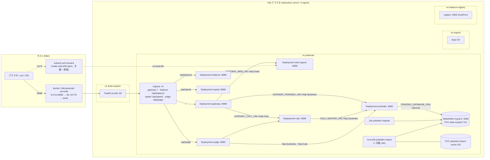

# ローカル(k3d)環境と Kubernetes リソース

- 基準: `origin/main` 3379b03 取り込み後。実クラスタの状態は 2026-09-24 に `kubectl get` で読み取り(変更なし)。
- 関連: コマンドの実行順は [runbook-commands.md](runbook-commands.md)、DB は [db-mysql.md](db-mysql.md)、Argo CD は `gitops-argocd.md`(C で作成予定)、ワークロードの型・依存は [architecture.md](architecture.md)。

## 1. 全体像



- 8080 は k3d の loadbalancer(docker コンテナ)が持つ公開ポート。Traefik へ入り、Ingress の path 最長一致で振り分ける(gateway は `/` の Prefix。`/api/balance` などはより長いので各サービスへ直接届き、gateway を通らない。`deploy/k8s/base/gateway/ingress.yaml:1-3`)。
- 5173 は**クラスタの公開ポートではない**。`make web-k3d-open` が張る port-forward(`web/Makefile:85-86`)で、止めると消える。web は gateway を通らず Service に直結する。
- web の Ingress は無い。`web` へは gateway が `GATEWAY_WEB_URL=http://web` へ転送して届く(ADR-0205。`deploy/k8s/overlays/local/api/gateway-patch.yaml:15-16`)。
- calc-svc の DB 直結は無い。マスタは起動時に `http://pokedex` から取る(ADR-0206)。DB に触るのは pokedex・migrate・import だけ(絶対ルール4)。

## 2. ポート対応(ホスト → クラスタ内)

| ホスト側 | 経路 | 宛先 | 定義 |
|---|---|---|---|
| `localhost:8080` | docker `k3d-pokecalc-serverlb` → Traefik:80 → Ingress | gateway Service:80 → Pod:8080(`/`)/ balance・speed・judge(各 path) | `deploy/k3d.yaml:8-11` |
| `localhost:52779`(動的) | serverlb → k3s API :6443 | kube-apiserver | k3d が割当(`docker ps` の実測値。固定ではない) |
| `localhost:5173` | `kubectl port-forward svc/web 5173:80`(手動) | web Service:80 → Pod:8080 | `web/Makefile:85-86` |
| `localhost:5000`(**ノード側**) | registry の `hostPort: 5000` | registry Pod:5000(クラスタ内レジストリ) | `services/balance/deploy/local-registry/registry.yaml` |
| `localhost:5001` / `5002`(Mac 側) | `kubectl -n balance-registry port-forward svc/registry`(スクリプト内で一時) | registry:5000。5001=balance、5002=speed | `services/balance/Makefile:7`、`services/speed/Makefile:10` |
| `127.0.0.1:3306`(**k8s 外**) | `make db-local-up` の docker mysql | `make dev` 用。クラスタの mysql とは別物 | `scripts/db-local-up.sh:38` |
| `localhost:8080` / `8081`(**k8s 外**) | `make dev` がホストで起動する gateway / calc-svc | k3d 稼働中は 8080 が衝突するので `DEV_GATEWAY_PORT` を変える | `scripts/dev.sh:25-26` |
| `localhost:5173`(**k8s 外**) | `make web-dev`(Vite) | WASM で計算(バックエンド不要) | `web/Makefile:40-41` |

Pod 内の待ち受けはすべて 8080(mysql は 3306、registry は 5000)。Service はすべて `port: 80 → targetPort: http`(mysql のみ headless の 3306)。

## 3. Namespace(全 3 件 + 既定)

| Namespace | 用途 | 定義 |
|---|---|---|
| `pokecalc` | アプリ全体 | `deploy/k8s/base/namespace.yaml`(`up.sh:28` が最初に単独 apply) |
| `balance-registry` | クラスタ内 image レジストリ(balance・speed が共有。ADR-0605 §1) | `services/balance/deploy/local-registry/namespace.yaml` |
| `argocd` | Argo CD 本体と Application(詳細は C) | `scripts/argocd-bootstrap.sh` が作る(マニフェストは Git に無い) |

## 4. ワークロード(全件)

image は base のタグ → local overlay(および `make *-k3d-deploy`)が `:local` に差し替える。entrypoint は Dockerfile の `ENTRYPOINT`(いずれも `FROM scratch`、UID 65532。web だけ nginx-unprivileged の UID 101)。

| 名前 | 種別 | image(base → local) | entrypoint / args | 主な env | probe | limits | 定義 |
|---|---|---|---|---|---|---|---|
| `calc` | Deployment | `pokecalc/calc:0.1.0` → `:local` | `/calc`(`services/calc/Dockerfile:18`) | `CALC_MASTER_URL=http://pokedex` `GOMEMLIMIT=56MiB` | ready `/readyz` / live `/healthz` | 200m / 64Mi | `deploy/k8s/base/calc/deployment.yaml` |
| `gateway` | Deployment | `pokecalc/gateway:0.1.0` → `:local` | `/gateway`(`services/gateway/Dockerfile:18`) | `GATEWAY_CALC_URL=http://calc` `GATEWAY_POKEDEX_URL=http://pokedex` `GOMEMLIMIT` + local: `GATEWAY_CORS_ALLOWED_ORIGINS=http://localhost:5173` `GATEWAY_WEB_URL=http://web` | `/healthz` ×2 | 200m / 64Mi | `deploy/k8s/base/gateway/deployment.yaml`、`overlays/local/api/gateway-patch.yaml` |
| `web` | Deployment | `pokecalc/web:0.1.0` → `:local` | nginx-unprivileged の既定(`web/Dockerfile:34-40`、設定 `web/nginx.conf`。`listen 8080`) | なし。`/tmp` は emptyDir | `/healthz` ×2 | 200m / 64Mi | `deploy/k8s/base/web/deployment.yaml` |
| `pokedex` | Deployment | `pokecalc/pokedex:0.1.0`(retag なし) | `/pokedex` `args: [serve]`(`services/pokedex/Dockerfile:27-31`) | `POKEDEX_DATABASE_DSN` ← Secret `mysql-auth` の `pokedex-dsn` | `/healthz` ×2 | 200m / 64Mi | `deploy/k8s/base/pokedex/deployment.yaml` |
| `balance` | Deployment | `pokecalc/balance:0.1.0` → `:local` | `/balance-api`(`services/balance/Dockerfile:13`) | `PORT=8080` + local: `BALANCE_POKEMON_TYPES_PATH` `BALANCE_MOVES_PATH` `BALANCE_ABILITIES_PATH`(ConfigMap を mount) | `/healthz` ×2 | 100m / 64Mi | `services/balance/deploy/k8s/base/deployment.yaml` |
| `speed` | Deployment | `pokecalc/speed:0.1.0` → `:local` | `/speed-api`(`services/speed/Dockerfile:23`) | `PORT=8080` + local: `SPEED_POKEMON_PATH` | `/healthz` ×2 | 100m / 64Mi | `services/speed/deploy/k8s/base/deployment.yaml` |
| `judge` | Deployment | `pokecalc/judge:0.1.0` → `:local` | `/judge-api`(`services/judge/Dockerfile:23`) | `JUDGE_POKEDEX_BASE_URL=http://pokedex` `JUDGE_CALC_BASE_URL=http://calc` | `/healthz` ×2 | 100m / 64Mi | `services/judge/deploy/k8s/base/deployment.yaml` |
| `mysql` | StatefulSet(1) | `mysql:9.7.2@sha256:29abb0a1…`(digest 固定) | イメージ既定(mysqld)。`charset.cnf` を `/etc/mysql/conf.d` に mount | `MYSQL_ROOT_PASSWORD` ← Secret `mysql-root-password` / `MYSQL_DATABASE=pokedex` | exec `mysqladmin ping -h 127.0.0.1` | 500m / 512Mi | `deploy/k8s/overlays/local/mysql/statefulset.yaml` |
| `pokedex-migrate` | Job | `pokecalc/pokedex-migrate:0.1.0` + initContainer `wait-for-mysql`(`mysql:9.7.2`) | `/pokedex-migrate` `CMD up`(`Dockerfile:22`) | `POKEDEX_DATABASE_DSN` ← `pokedex-dsn` / init: `MYSQL_PWD` ← `mysql-root-password` | — | — | `deploy/k8s/base/pokedex/job-migrate.yaml`(backoff 3・deadline 600s・TTL 300s) |
| `pokedex-import` | CronJob `0 12 * * 6` Asia/Tokyo | `pokecalc/pokedex-importer:0.1.0` | `/app/tools/importer/cronjob.sh`(`Dockerfile:56`。flock → `fetch.mjs` → `check-upstream.mjs` → `pokedex-import`) | `HOME=/tmp` `npm_config_cache` `POKEDEX_DATABASE_DSN` ← `pokedex-dsn` | — | — | `deploy/k8s/base/pokedex/cronjob-import.yaml`(Forbid・backoff 2・deadline 3600s・TTL 14d・exit 2/3 は FailJob) |
| `registry` | Deployment(ns balance-registry) | `registry:3.1.1@sha256:325b4b29…` | イメージ既定 | — | `/v2/` | 200m / 128Mi | `services/balance/deploy/local-registry/registry.yaml` |

- 全 Deployment は `replicas: 1`、`automountServiceAccountToken: false`、`readOnlyRootFilesystem`、`capabilities drop ALL`、`seccomp RuntimeDefault`。
- 手動 import は `make import-k8s` が `kubectl create job --from=cronjob/pokedex-import pokedex-import-manual-<時刻>` で作る Job(`Makefile:179-184`)。
- **読み取り**: `overlays/local` は calc・gateway・web を `:local` タグで描画するが、`scripts/up.sh` はそれらの image を build/import しない(pokedex の 3 image だけ。`up.sh:48-55, 80-81`)。`make up` 単独では calc/gateway/web は起動できない構成に読める(未検証)。`verify-m1.md` §3 が `up` の直後に `api-k3d-deploy`・`web-k3d-deploy` を置くのはこのため。

## 5. Service(全件)

| 名前 | 種別 | port | selector(`app.kubernetes.io/name`) | 定義 |
|---|---|---|---|---|
| `calc` `gateway` `web` `pokedex` | ClusterIP | 80 → `http`(8080) | 同名 | `deploy/k8s/base/*/service.yaml` |
| `balance` `speed` `judge` | ClusterIP | 80 → `http`(8080) | 同名 | `services/*/deploy/k8s/base/service.yaml` |
| `mysql` | **headless**(`clusterIP: None`) | 3306 → `mysql` | `mysql` | `deploy/k8s/overlays/local/mysql/service.yaml` |
| `registry`(ns balance-registry) | ClusterIP | 5000 → `registry` | `balance-registry` | `local-registry/registry.yaml` |

`mysql` が headless のため、`mysql:3306` は Pod `mysql-0` の IP に直接解決される(DSN は `@tcp(mysql:3306)`。`up.sh:42`)。

## 6. Ingress(全 4 件。すべて `ingressClassName: traefik`、host なし・TLS なし)

| 名前 | path(Prefix) | backend | 定義 |
|---|---|---|---|
| `gateway` | `/` | Service `gateway`:http | `deploy/k8s/base/gateway/ingress.yaml`(**cloud overlay では `$patch: delete`**。ADR-0210 §2) |
| `balance` | `/api/balance` | Service `balance`:http | `services/balance/deploy/k8s/base/ingress.yaml` |
| `speed` | `/api/speed` | Service `speed`:http | `services/speed/deploy/k8s/base/ingress.yaml` |
| `judge` | `/api/judge` | Service `judge`:http | `services/judge/deploy/k8s/base/ingress.yaml` |

## 7. ConfigMap / Secret / PVC(全件)

| 種別 | 名前 | 中身 | 作る者 | 参照する者 |
|---|---|---|---|---|
| Secret | `mysql-auth` | キー `mysql-root-password` `pokedex-dsn`(**値は Git に置かない**。ADR-0100 §9) | `scripts/up.sh:33-43`(無いときだけ乱数で作成。既存は上書きしない) | mysql(root pw)、pokedex・pokedex-migrate・pokedex-import(DSN)、migrate の initContainer(`MYSQL_PWD`) |
| ConfigMap | `mysql-config` | `charset.cnf`(utf8mb4 / `utf8mb4_0900_ai_ci`) | `overlays/local/mysql/configmap.yaml` | mysql StatefulSet(`/etc/mysql/conf.d/charset.cnf`) |
| ConfigMap | `pokedex-name-overrides`(任意) | 日本語名の上書き JSON | `up.sh:85-89`(`data/local/name_ja_overrides.json` があるときだけ) | CronJob(`optional: true`、`/app/data/local` に mount) |
| ConfigMap | `balance-pokemon-types-<hash>` `balance-moves-<hash>` `balance-abilities-<hash>` | 架空の例 JSON(local overlay の `configMapGenerator`) | `balance/deploy/k8s/overlays/local` | balance(`BALANCE_*_PATH`) |
| ConfigMap | `speed-pokemon-<hash>` | 架空の例 JSON | `speed/deploy/k8s/overlays/local` | speed(`SPEED_POKEMON_PATH`) |
| ConfigMap | `balance-readmodel` | pokedex export の 3 ファイル(実データ由来。Git 管理外) | `balance/scripts/k3d-deploy-readmodel.sh:28` | balance(local-readmodel overlay) |
| ConfigMap | `speed-readmodel` | pokedex export の speed 用 1 ファイル | `speed/scripts/k3d-deploy-readmodel.sh:30` | speed(local-readmodel overlay) |
| PVC | `data-mysql-0` | 1Gi RWO(`volumeClaimTemplates`) | mysql StatefulSet | mysql(`/var/lib/mysql`) |
| PVC | `pokedex-import-cache` | 2Gi RWO(取得キャッシュ・スナップショット・報告) | `deploy/k8s/base/pokedex/pvc-import-cache.yaml` | CronJob/手動 Job(`/app/data/generated`) |

環境変数の全一覧は [config-env.md](config-env.md)。

## 8. Kustomize の構成と apply 経路

```
deploy/k8s/base/                 namespace + pokedex(Deployment/Service/Job/CronJob/PVC) + calc + gateway(+Ingress) + web
deploy/k8s/overlays/local/       base + mysql/ ; components: api/(gateway patch・calc/gateway を :local) web/(web を :local)
deploy/k8s/overlays/local-api/   base/calc + base/gateway ; component local/api   … make api-k3d-deploy
deploy/k8s/overlays/local-web/   base/web ; component local/web                   … make web-k3d-deploy
deploy/k8s/overlays/cloud/       base ; patch: CronJob suspend、gateway Ingress 削除
services/{balance,speed}/deploy/k8s/overlays/{local,local-readmodel,gitops}   services/judge/deploy/k8s/overlays/local
```

| overlay(`kubectl kustomize` の描画結果) | 含むリソース | 使う経路 |
|---|---|---|
| `deploy/k8s/base`(13) | Namespace, Deployment×4(calc/gateway/pokedex/web), Service×4, Ingress(gateway), Job(pokedex-migrate), CronJob, PVC | 単独 apply しない(namespace が付かず default に作られるため。`up.sh:59-61`) |
| `overlays/local`(16) | base + ConfigMap(mysql-config), Service(mysql), StatefulSet(mysql) | `make up`(`up.sh:66`) |
| `overlays/local-api`(5) | Deployment/Service ×(calc, gateway), Ingress(gateway) | `make api-k3d-deploy`。Job・mysql に触れない(他レーンと共有クラスタのため) |
| `overlays/local-web`(2) | Deployment/Service web | `make web-k3d-deploy` |
| `overlays/cloud`(12) | base − Ingress、CronJob は `suspend: true` | `make k8s-render` の描画確認のみ(**cloud に MySQL・Secret・image 配布経路が無い**。`cronjob-import-suspend-patch.yaml:1-3`) |
| `services/balance/.../local`(6) | Deployment, Service, Ingress + ConfigMap×3(例データ) | `make balance-k3d-deploy` |
| `services/balance/.../local-readmodel`(3) | 上記から ConfigMap を除き `/etc/balance/readmodel/*` を参照(ConfigMap は script が別途作る) | `make balance-k3d-deploy-readmodel` |
| `services/balance/.../gitops`(3) | `localhost:5000/pokecalc/balance@sha256:…`(digest 固定) | Argo CD(C で扱う) |
| `services/speed/...` | balance と同型(`local` 4 = +ConfigMap×1、`local-readmodel` 3、`gitops` 3。gitops の digest は現状 `sha256:000…`(未確定プレースホルダ)) | `make speed-k3d-deploy` / `-readmodel` / Argo CD |
| `services/judge/.../local`(3) | Deployment, Service, Ingress | `make judge-k3d-deploy` |
| `services/balance/deploy/local-registry`(3) | Namespace, Deployment, Service(registry) | `make balance-registry-apply` |
| `services/{balance,speed}/deploy/argocd`(各 1) | Application `pokecalc-balance` / `pokecalc-speed` | `make *-argocd-app`(C で扱う) |

Component は `kustomize.config.k8s.io/v1alpha1`(`overlays/local/api`・`overlays/local/web`)。local と local-api/local-web が**同じ patch を共有**するための分割(ADR-0203 追記「apply の分離」)。

## 9. 実クラスタとの差異(2026-09-24 読み取り)

| # | 観測 | マニフェスト(Git)との差 |
|---|---|---|
| 1 | Secret `mysql-auth` のキーが **5 つ**: `mysql-root-password` `pokedex-dsn` `pokedex-importer-dsn` `pokedex-migrator-dsn` `pokedex-reader-dsn` | Git の `up.sh` が作るのは 2 つだけ。稼働中の `pokedex` Deployment は `pokedex-reader-dsn`、CronJob は `pokedex-importer-dsn`、`pokedex-migrate` Job は 4 キー(`pokedex-dsn` `pokedex-migrator-dsn` `pokedex-reader-dsn` `pokedex-importer-dsn`)を参照している(いずれも `kubectl get -o jsonpath` でキー名のみ確認。値は読んでいない)。`git log --all -S` でも Git 履歴に該当のキー名が無い → **どのブランチにも未コミットの変更(役割別 DB ユーザー)が適用されている**。作業ツリーは読んでいない |
| 2 | ConfigMap `calc-master-example-*` ×2、`calc-typechart-*` | Git に無い(ADR-0206 で calc のファイル方式マスタを廃止した残骸) |
| 3 | ConfigMap `balance-pokemon-types-<hash>` が 3 世代 | `configMapGenerator` のハッシュ違いが `kubectl apply`(prune なし)で残る |
| 4 | balance・speed は `local-readmodel` 方式(env は `*_PATH` のみ、annotation `readmodel-hash`) | `local` overlay(例データ)ではなく readmodel でデプロイ済み。`speed-pokemon-*`(例データ)は残骸 |
| 5 | Job `pokedex-import-manual-20260922185252` が `Failed`(`DeadlineExceeded`)、他 3 件 `Complete` | 手動 Job は TTL 14 日で消える。失敗 1 件は残存 |
| 6 | Job `pokedex-migrate` が `Complete`、`pokedex` Pod が直近に再作成(調査時に約 4 分前) | 他レーンが調査中も操作している(共有クラスタ)。読み取りのみ行った |
| 7 | Application `pokecalc-balance` が `OutOfSync` / `Healthy`。`pokecalc-speed` は無い | Git に定義はあるが speed の Application は未適用(C で詳述) |
| 8 | Ingress は 4 件(gateway/balance/speed/judge) | 一致 |
| 9 | Deployment 7・StatefulSet 1・CronJob 1・Service 8・PVC 2・Namespace(pokecalc/argocd/balance-registry) | 一致(件数) |
| 10 | image: pokedex のみ `:0.1.0`、他は `:local`、mysql は digest 固定 | 一致(local overlay / `*-k3d-deploy` の結果) |

## 件数の突き合わせ

| 項目 | マニフェスト(描画) | 実クラスタ(pokecalc ns) |
|---|---|---|
| Deployment | 7(calc gateway web pokedex balance speed judge)+ registry | 7 |
| StatefulSet | 1 | 1 |
| CronJob | 1 | 1 |
| Job(定義) | 1(pokedex-migrate) | 1 + 手動 4 |
| Service | 8(mysql 含む) | 8 |
| Ingress | 4 | 4 |
| PVC | 2(うち 1 は volumeClaimTemplates) | 2 |
| Secret | 0(`up.sh` が実行時に作る) | 1 |
| ConfigMap(Git 由来) | mysql-config, balance×3, speed×1 | 13(残骸・script 生成を含む。#2〜4) |

## カバレッジ

- 読んだ範囲: `deploy/` の全 35 ファイル、`services/{balance,speed,judge}/deploy/` の全 YAML(`kubectl kustomize` で 18 の描画をすべて実行)、各 Dockerfile の `FROM`/`ENTRYPOINT`/`USER`、`scripts/up.sh` 全行。
- 読めていない箇所: `services/{balance,speed}/deploy/k8s/overlays/local/*.example.json` の中身、gitops overlay の digest 検査(`check-gitops.sh`)の判定ロジック、`services/balance/deploy/argocd` の Application の詳細(C)、`balance-registry` の image 配布の実動作。
- 未実装・スタブ: cloud overlay(MySQL・Secret・image 配布経路が無い。CronJob は suspend)、`GATEWAY_ASSETS_URL`(画像配信。未設定 → 404。`gateway/deployment.yaml:1-3`)、speed の gitops digest(プレースホルダ)、`services/record`・`services/team`(空。architecture.md)。
- 推測を含む記述: 「`make up` 単独では calc/gateway/web が起動しない」(§4)は `up.sh` とマニフェストからの読み取りで、実行して確認していない。
