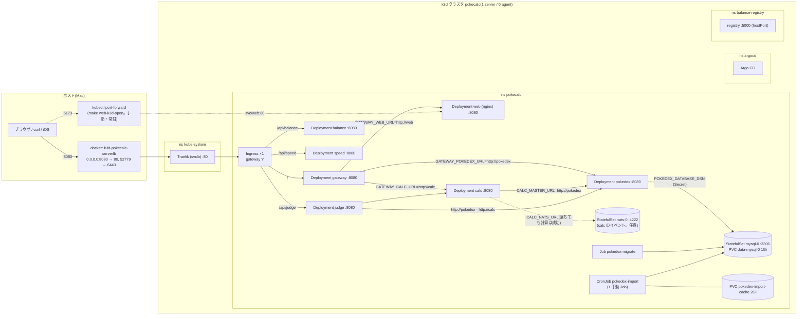

# ローカル(k3d)環境と Kubernetes リソース

- 基準: 2026-10-01 の `origin/main`(PR #443 まで)のマニフェスト・スクリプトに合わせて直した。行番号は書かない(ファイル名・ターゲット名で探す)。§9 の実クラスタとの差異は 2026-09-24 の読み取りで、解消したものはそう書いてある。
- 関連: コマンドの実行順は [runbook-commands.md](runbook-commands.md)、DB は [db-mysql.md](db-mysql.md)、Argo CD は `gitops-argocd.md`(C で作成予定)、ワークロードの型・依存は [architecture.md](architecture.md)。
- クラスタ内レジストリの PVC `registry-data`(2Gi・`local-path`。ADR-0408)、NetworkPolicy(ADR-0132)、NATS(ADR-0212)は、
  §9「実クラスタとの差異」・「件数の突き合わせ」の読み取り(2026-09-24)より後に増えた。実クラスタの件数との比較には使えない。

## 1. 全体像


```mermaid
flowchart LR
  subgraph HOST["ホスト(Mac)"]
    BR["ブラウザ / curl / iOS"]
    PF["kubectl port-forward<br/>(make web-k3d-open。手動・常駐)"]
    DK["docker: k3d-pokecalc-serverlb<br/>0.0.0.0:8080 → 80, 52779 → 6443"]
  end
  subgraph K3D["k3d クラスタ pokecalc(1 server / 0 agent)"]
    subgraph KS["ns kube-system"]
      TR["Traefik (svclb) :80"]
    end
    subgraph PC["ns pokecalc"]
      IG["Ingress ×1<br/>gateway '/'"]
      GW["Deployment gateway :8080"]
      WEB["Deployment web (nginx) :8080"]
      CALC["Deployment calc :8080"]
      POKE["Deployment pokedex :8080"]
      BAL["Deployment balance :8080"]
      SPD["Deployment speed :8080"]
      JDG["Deployment judge :8080"]
      MY[("StatefulSet mysql-0 :3306<br/>PVC data-mysql-0 1Gi")]
      NATS[("StatefulSet nats-0 :4222<br/>(calc のイベント。任意)")]
      MIG["Job pokedex-migrate"]
      IMP["CronJob pokedex-import<br/>(+ 手動 Job)"]
      PVC[("PVC pokedex-import-cache 2Gi")]
    end
    subgraph AC["ns argocd"]
      ARGO["Argo CD"]
    end
    subgraph BR2["ns balance-registry"]
      REG["registry :5000 (hostPort)"]
    end
  end
  BR -->|":8080"| DK --> TR --> IG
  IG -->|"/"| GW
  IG -->|"/api/balance"| BAL
  IG -->|"/api/speed"| SPD
  IG -->|"/api/judge"| JDG
  GW -->|"GATEWAY_CALC_URL=http://calc"| CALC
  GW -->|"GATEWAY_POKEDEX_URL=http://pokedex"| POKE
  GW -->|"GATEWAY_WEB_URL=http://web"| WEB
  CALC -->|"CALC_MASTER_URL=http://pokedex"| POKE
  CALC -.->|"CALC_NATS_URL(落ちても計算は成功)"| NATS
  JDG -->|"http://pokedex · http://calc"| POKE
  JDG --> CALC
  POKE -->|"POKEDEX_DATABASE_DSN (Secret)"| MY
  MIG --> MY
  IMP --> MY
  IMP --- PVC
  BR -.->|":5173"| PF -.->|"svc/web:80"| WEB
```

- 8080 は k3d の loadbalancer(docker コンテナ)が持つ公開ポート。Traefik へ入り、Ingress は gateway の `/` の 1 件だけ。`/api/balance|speed|judge` も gateway が各サービスへ転送する(直結 Ingress は ADR-0414・0416 で撤去。`deploy/k8s/base/gateway/ingress.yaml` の冒頭コメント)。
- 5173 は**クラスタの公開ポートではない**。`make web-k3d-open` が張る port-forward(`web/Makefile`)で、止めると消える。web は gateway を通らず Service に直結する。
- web の Ingress は無い。`web` へは gateway が `GATEWAY_WEB_URL=http://web` へ転送して届く(ADR-0205。`deploy/k8s/overlays/local/api/gateway-patch.yaml`)。
- どの経路も、Pod 間は NetworkPolicy(§10)で許可した通信だけが通る。ホストからの port-forward・`kubectl exec` は対象外。
- calc-svc の DB 直結は無い。マスタは起動時に `http://pokedex` から取る(ADR-0206)。DB に触るのは pokedex・migrate・import だけ(絶対ルール4)。

## 2. ポート対応(ホスト → クラスタ内)

| ホスト側 | 経路 | 宛先 | 定義 |
|---|---|---|---|
| `localhost:8080` | docker `k3d-pokecalc-serverlb` → Traefik:80 → Ingress | gateway Service:80 → Pod:8080(`/`。balance・speed・judge へは gateway が転送) | `deploy/k3d.yaml` |
| `localhost:52779`(動的) | serverlb → k3s API :6443 | kube-apiserver | k3d が割当(`docker ps` の実測値。固定ではない) |
| `localhost:5173` | `kubectl port-forward svc/web 5173:80`(手動) | web Service:80 → Pod:8080 | `web/Makefile`(`web-k3d-open`) |
| `localhost:5000`(**ノード側**) | registry の `hostPort: 5000` | registry Pod:5000(クラスタ内レジストリ) | `services/balance/deploy/local-registry/registry.yaml` |
| `localhost:5001` / `5002`(Mac 側) | `kubectl -n balance-registry port-forward svc/registry`(スクリプト内で一時) | registry:5000。5001=balance、5002=speed | `services/balance/Makefile`、`services/speed/Makefile`(`*_REGISTRY_PORT`) |
| `127.0.0.1:3306`(**k8s 外**) | `make db-local-up` の docker mysql | `make dev` 用。クラスタの mysql とは別物 | `scripts/db-local-up.sh` |
| `localhost:8080` / `8081`(**k8s 外**) | `make dev` がホストで起動する gateway / calc-svc | k3d 稼働中は 8080 が衝突するので `DEV_GATEWAY_PORT` を変える | `scripts/dev.sh` |
| `localhost:5173`(**k8s 外**) | `make web-dev`(Vite) | WASM で計算(バックエンド不要) | `web/Makefile`(`web-dev`) |

Pod 内の待ち受けはすべて 8080(mysql は 3306、registry は 5000)。Service はすべて `port: 80 → targetPort: http`(mysql のみ headless の 3306)。

## 3. Namespace(全 3 件 + 既定)

| Namespace | 用途 | 定義 |
|---|---|---|
| `pokecalc` | アプリ全体 | `deploy/k8s/base/namespace.yaml`(`scripts/up.sh` が最初に単独 apply) |
| `balance-registry` | クラスタ内 image レジストリ(balance・speed が共有。ADR-0605 §1) | `services/balance/deploy/local-registry/namespace.yaml` |
| `argocd` | Argo CD 本体と Application(詳細は C) | `scripts/argocd-bootstrap.sh` が作る(マニフェストは Git に無い) |

## 4. ワークロード(全件)

image は base のタグ → local overlay(および `make *-k3d-deploy`)が `:local` に差し替える。entrypoint は Dockerfile の `ENTRYPOINT`(いずれも `FROM scratch`、UID 65532。web だけ nginx-unprivileged の UID 101)。

| 名前 | 種別 | image(base → local) | entrypoint / args | 主な env | probe | limits | 定義 |
|---|---|---|---|---|---|---|---|
| `calc` | Deployment | `pokecalc/calc:0.1.0` → `:local` | `/calc`(`services/calc/Dockerfile`) | `CALC_MASTER_URL=http://pokedex` `GOMEMLIMIT=56MiB` | ready `/readyz` / live `/healthz` | 200m / 64Mi | `deploy/k8s/base/calc/deployment.yaml` |
| `gateway` | Deployment | `pokecalc/gateway:0.1.0` → `:local` | `/gateway`(`services/gateway/Dockerfile`) | `GATEWAY_CALC_URL=http://calc` `GATEWAY_POKEDEX_URL=http://pokedex` `GOMEMLIMIT` + local: `GATEWAY_CORS_ALLOWED_ORIGINS=http://localhost:5173` `GATEWAY_WEB_URL=http://web` | `/healthz` ×2 | 200m / 64Mi | `deploy/k8s/base/gateway/deployment.yaml`、`overlays/local/api/gateway-patch.yaml` |
| `web` | Deployment | `pokecalc/web:0.1.0` → `:local` | nginx-unprivileged の既定(`web/Dockerfile`、設定 `web/nginx.conf`。`listen 8080`) | なし。`/tmp` は emptyDir | `/healthz` ×2 | 200m / 64Mi | `deploy/k8s/base/web/deployment.yaml` |
| `pokedex` | Deployment | `pokecalc/pokedex:0.1.0`(retag なし) | `/pokedex` `args: [serve]`(`services/pokedex/Dockerfile`) | `POKEDEX_DATABASE_DSN` ← Secret `mysql-auth` の `pokedex-reader-dsn`、`POKEDEX_DB_*`(接続プール) | ready `/readyz`(DB に届きマスタが揃うまで Ready にならない。ADR-0129)/ live `/healthz`。preStop `sleep 5`・terminationGracePeriod 30s | 200m / 64Mi | `deploy/k8s/base/pokedex/deployment.yaml` |
| `balance` | Deployment | `pokecalc/balance:0.1.0` → `:local` | `/balance-api`(`services/balance/Dockerfile`) | `PORT=8080` + local: `BALANCE_POKEMON_TYPES_PATH` `BALANCE_MOVES_PATH` `BALANCE_ABILITIES_PATH`(ConfigMap を mount) | `/healthz` ×2 | 100m / 64Mi | `services/balance/deploy/k8s/base/deployment.yaml` |
| `speed` | Deployment | `pokecalc/speed:0.1.0` → `:local` | `/speed-api`(`services/speed/Dockerfile`) | `PORT=8080` + local: `SPEED_POKEMON_PATH` | `/healthz` ×2 | 100m / 64Mi | `services/speed/deploy/k8s/base/deployment.yaml` |
| `judge` | Deployment | `pokecalc/judge:0.1.0` → `:local` | `/judge-api`(`services/judge/Dockerfile`) | `JUDGE_POKEDEX_BASE_URL=http://pokedex` `JUDGE_CALC_BASE_URL=http://calc` | `/healthz` ×2 | 100m / 64Mi | `services/judge/deploy/k8s/base/deployment.yaml` |
| `mysql` | StatefulSet(1) | `mysql:9.7.2@sha256:29abb0a1…`(digest 固定) | イメージ既定(mysqld)。`charset.cnf`・`memory.cnf` を `/etc/mysql/conf.d` に mount | `MYSQL_ROOT_PASSWORD` ← Secret `mysql-root-password` / `MYSQL_DATABASE=pokedex` | exec `mysqladmin ping -h 127.0.0.1`(timeout 5s。liveness は失敗6回まで許す) | 500m / 768Mi(512Mi では import 中に OOMKill された。issue #437。`memory.cnf` で常駐を下げている) | `deploy/k8s/overlays/local/mysql/statefulset.yaml` |
| `pokedex-migrate` | Job | `pokecalc/pokedex-migrate:0.1.0` + initContainer `wait-for-mysql`(`mysql:9.7.2`) | `/pokedex-migrate` `CMD up`(`services/pokedex/Dockerfile`) | `POKEDEX_PROVISION_DSN` ← `pokedex-dsn`(root。用途別ユーザーの作成だけ)/ `POKEDEX_DATABASE_DSN` ← `pokedex-migrator-dsn`(migration)/ `POKEDEX_READER_DSN` ← `pokedex-reader-dsn`・`POKEDEX_IMPORTER_DSN` ← `pokedex-importer-dsn`(ユーザー・パスワードを知るためだけ)/ init: `MYSQL_PWD` ← `mysql-root-password` | — | — | `deploy/k8s/base/pokedex/job-migrate.yaml`(backoff 3・deadline 600s・TTL 300s) |
| `pokedex-import` | CronJob `0 12 * * 6` Asia/Tokyo | `pokecalc/pokedex-importer:0.1.0` | `/app/tools/importer/cronjob.sh`(`services/pokedex/Dockerfile`。flock → `prune.mjs check` → `fetch.mjs` → `check-upstream.mjs` → `pokedex-import` → `prune.mjs prune`) | `HOME=/tmp` `npm_config_cache` `POKEDEX_DATABASE_DSN` ← `pokedex-importer-dsn`(`IMPORT_ALLOW_REMOVED` は手動 Job にだけ付ける) | — | — | `deploy/k8s/base/pokedex/cronjob-import.yaml`(Forbid・backoff 2・deadline 3600s・TTL 14d・exit 2/3 は FailJob)。cronjob.sh の順は 容量確認 → 取得 → 上流検出 → 投入 → prune |
| `nats` | StatefulSet(1。local overlay のみ) | `nats:2.15.0@sha256:cd3fcd4e…` | `-js -sd /data`(JetStream。PVC 1Gi) | — | — | 200m / 256Mi | `deploy/k8s/overlays/local/nats/statefulset.yaml`(calc のイベント発行用。calc は落ちていても動く。ADR-0212) |
| `registry` | Deployment(ns balance-registry) | `registry:3.1.2@sha256:ddf75434…` | イメージ既定 | — | `/v2/` | 200m / 128Mi | `services/balance/deploy/local-registry/registry.yaml` |

- 全 Deployment は `replicas: 1`、`automountServiceAccountToken: false`、`readOnlyRootFilesystem`、`capabilities drop ALL`、`seccomp RuntimeDefault`。
- 手動 import は `make import-k8s` が `kubectl create job --from=cronjob/pokedex-import pokedex-import-manual-<時刻>` で作る Job(`Makefile` の `import-k8s`。kubectl の context が `k3d-pokecalc` でなければ作らない)。
- `overlays/local` は calc・gateway・web を `:local` タグで描画するが、`scripts/up.sh` はそれらの image を build/import しない(pokedex の migrate・server・importer の 3 image だけ)。`make up` だけでは calc・gateway・web は `ImagePullBackOff` で起動しない(`overlays/local/api/kustomization.yaml` の `newTag: local` から)。`make deploy-latest`(または `make api-k3d-deploy`・`make web-k3d-deploy`)で入れる。`pokedex` も、初回の import が済むまでは `0/1`(readiness が DB のマスタに連動する。ADR-0129)。`docs/verify.md` §1-1 は、import → §4 の `make deploy-latest` の順にしてある。

## 5. Service(全件)

| 名前 | 種別 | port | selector(`app.kubernetes.io/name`) | 定義 |
|---|---|---|---|---|
| `calc` `gateway` `web` `pokedex` | ClusterIP | 80 → `http`(8080) | 同名 | `deploy/k8s/base/*/service.yaml` |
| `balance` `speed` `judge` | ClusterIP | 80 → `http`(8080) | 同名 | `services/*/deploy/k8s/base/service.yaml` |
| `mysql` | **headless**(`clusterIP: None`) | 3306 → `mysql` | `mysql` | `deploy/k8s/overlays/local/mysql/service.yaml` |
| `registry`(ns balance-registry) | ClusterIP | 5000 → `registry` | `balance-registry` | `local-registry/registry.yaml` |

`mysql` が headless のため、`mysql:3306` は Pod `mysql-0` の IP に直接解決される(DSN は `@tcp(mysql:3306)`。`scripts/up.sh` が作る)。

## 6. Ingress(全 1 件。すべて `ingressClassName: traefik`、host なし・TLS なし)

| 名前 | path(Prefix) | backend | 定義 |
|---|---|---|---|
| `gateway` | `/` | Service `gateway`:http | `deploy/k8s/base/gateway/ingress.yaml`(**cloud overlay では `$patch: delete`**。ADR-0210 §2) |

## 7. ConfigMap / Secret / PVC(全件)

| 種別 | 名前 | 中身 | 作る者 | 参照する者 |
|---|---|---|---|---|
| Secret | `mysql-auth` | 5キー: `mysql-root-password`・`pokedex-dsn`(root。プロビジョニング専用)・`pokedex-reader-dsn`・`pokedex-importer-dsn`・`pokedex-migrator-dsn`(**値は Git に置かない**。ADR-0100 §9・ADR-0110) | `scripts/up.sh`(新規は `kubectl create` で5キーを乱数で作る。既存は無いキーだけ `patch` で追記し、既存の値は変えない) | mysql(root pw)、pokedex(reader)、pokedex-migrate(4キー)、pokedex-import(importer)、migrate の initContainer(`MYSQL_PWD`)、`make deploy-latest`・runbook(ホストから port-forward 越しに使う) |
| Secret | `tidb-root-auth`・`record-db-auth`・`team-db-auth` | TiDB の root と record・team 用 DSN(TiDB Operator の導入に成功したときだけ作る。ADR-0211・ADR-0226) | `scripts/k3d-m2-deploy.sh`(`make up`・`make deploy-latest` が呼ぶ) | TiDB・record/team の migrate Job(pokedex は使わない) |
| ConfigMap | `mysql-config` | `charset.cnf`(utf8mb4 / `utf8mb4_0900_ai_ci`)・`memory.cnf`(`performance_schema=OFF`・`innodb_buffer_pool_size=128M`・`innodb_log_buffer_size=16M`・`max_connections=50`。issue #437) | `overlays/local/mysql/configmap.yaml` | mysql StatefulSet(`/etc/mysql/conf.d/` に subPath で2ファイル) |
| ConfigMap | `pokedex-name-overrides`(任意) | 日本語名の上書き JSON | `scripts/up.sh`(`data/local/name_ja_overrides.json` があるときだけ) | CronJob(`optional: true`、`/app/data/local` に mount) |
| ConfigMap | `balance-pokemon-types-<hash>` `balance-moves-<hash>` `balance-abilities-<hash>` | 架空の例 JSON(local overlay の `configMapGenerator`) | `balance/deploy/k8s/overlays/local` | balance(`BALANCE_*_PATH`) |
| ConfigMap | `speed-pokemon-<hash>` | 架空の例 JSON | `speed/deploy/k8s/overlays/local` | speed(`SPEED_POKEMON_PATH`) |
| ConfigMap | `balance-readmodel` | pokedex export の 3 ファイル(実データ由来。Git 管理外) | `scripts/gitops/k3d-deploy-readmodel.sh`(`SERVICE=balance`) | balance(local-readmodel overlay) |
| ConfigMap | `speed-readmodel` | pokedex export の speed 用 1 ファイル | `scripts/gitops/k3d-deploy-readmodel.sh`(`SERVICE=speed`) | speed(local-readmodel overlay) |
| PVC | `data-mysql-0` | 1Gi RWO(`volumeClaimTemplates`) | mysql StatefulSet | mysql(`/var/lib/mysql`) |
| PVC | `pokedex-import-cache` | 2Gi RWO(取得キャッシュ・スナップショット・報告) | `deploy/k8s/base/pokedex/pvc-import-cache.yaml` | CronJob/手動 Job(`/app/data/generated`) |
| PVC | `registry-data`(namespace `balance-registry`) | 2Gi RWO・`local-path`。push 済み image を永続化(ADR-0408 §3。issue #292) | `services/balance/deploy/local-registry/registry.yaml` | クラスタ内レジストリ(`/var/lib/registry`) |

環境変数の全一覧は [config-env.md](config-env.md)。

## 8. Kustomize の構成と apply 経路

```
deploy/k8s/base/                 namespace + pokedex(Deployment/Service/Job/CronJob/PVC) + calc + gateway(+Ingress) + web + networkpolicy
deploy/k8s/overlays/local/       base + mysql/ + nats/ ; components: api/(gateway patch・calc/gateway を :local) web/(web を :local)
deploy/k8s/overlays/local-api/   base/calc + base/gateway ; component local/api   … make api-k3d-deploy
deploy/k8s/overlays/local-web/   base/web ; component local/web                   … make web-k3d-deploy
deploy/k8s/overlays/cloud/       base ; patch: CronJob suspend、gateway Ingress 削除
services/{balance,speed}/deploy/k8s/overlays/{local,local-readmodel,gitops}   services/judge/deploy/k8s/overlays/local
```

| overlay(`kubectl kustomize` の描画結果) | 含むリソース | 使う経路 |
|---|---|---|
| `deploy/k8s/base`(23) | Namespace, Deployment×4(calc/gateway/pokedex/web), Service×4, Ingress(gateway), Job(pokedex-migrate), CronJob, PVC, NetworkPolicy×10 | 単独 apply しない(namespace が付かず default に作られるため。`scripts/up.sh` のコメント) |
| `overlays/local`(28) | base + ConfigMap(mysql-config), Service×2(mysql・nats), StatefulSet×2(mysql・nats) | `make up`(`scripts/up.sh` の `kubectl apply -k deploy/k8s/overlays/local`) |
| `overlays/local-api`(5) | Deployment/Service ×(calc, gateway), Ingress(gateway) | `make api-k3d-deploy`。Job・mysql に触れない(他レーンと共有クラスタのため) |
| `overlays/local-web`(2) | Deployment/Service web | `make web-k3d-deploy` |
| `overlays/cloud`(22) | base − Ingress、CronJob は `suspend: true` | `make k8s-render` の描画確認のみ(**cloud に MySQL・Secret・image 配布経路が無い**。`cronjob-import-suspend-patch.yaml` のコメント) |
| `services/balance/.../local`(6) | Deployment, Service + ConfigMap×3(例データ。Ingress は無い) | `make balance-k3d-deploy` |
| `services/balance/.../local-readmodel`(3) | 上記から ConfigMap を除き `/etc/balance/readmodel/*` を参照(ConfigMap は script が別途作る) | `make balance-k3d-deploy-readmodel` |
| `services/balance/.../gitops`(3) | `localhost:5000/pokecalc/balance@sha256:…`(digest 固定) | Argo CD(C で扱う) |
| `services/speed/...` | balance と同型(`local` 4 = +ConfigMap×1、`local-readmodel` 3、`gitops` 3。gitops の digest は現状 `sha256:000…`(未確定プレースホルダ)) | `make speed-k3d-deploy` / `-readmodel` / Argo CD |
| `services/judge/.../local`(3) | Deployment, Service, Ingress | `make judge-k3d-deploy` |
| `services/balance/deploy/local-registry`(4) | Namespace, Deployment, Service(registry), PVC `registry-data`(ADR-0408 §3。以前は `emptyDir` で PVC は無かった) | `make balance-registry-apply` |
| `services/{balance,speed}/deploy/argocd`(各 1) | Application `pokecalc-balance` / `pokecalc-speed` | `make *-argocd-app`(C で扱う) |

Component は `kustomize.config.k8s.io/v1alpha1`(`overlays/local/api`・`overlays/local/web`)。local と local-api/local-web が**同じ patch を共有**するための分割(ADR-0203 追記「apply の分離」)。

## 9. 実クラスタとの差異(2026-09-24 に読み取り。#1 は 2026-10-01 に解消)

| # | 観測 | マニフェスト(Git)との差 |
|---|---|---|
| 1 | Secret `mysql-auth` のキーが 5 つ(`mysql-root-password` `pokedex-dsn` `pokedex-importer-dsn` `pokedex-migrator-dsn` `pokedex-reader-dsn`) | **解消**。役割別 DB ユーザー(ADR-0110)の変更は `scripts/up.sh` に入った。新規クラスタは5キーを作り、既存クラスタには無いキーだけを追記する(2026-10-01 の実クラスタも同じ5キー) |
| 2 | ConfigMap `calc-master-example-*` ×2、`calc-typechart-*` | Git に無い(ADR-0206 で calc のファイル方式マスタを廃止した残骸) |
| 3 | ConfigMap `balance-pokemon-types-<hash>` が 3 世代 | `configMapGenerator` のハッシュ違いが `kubectl apply`(prune なし)で残る |
| 4 | balance・speed は `local-readmodel` 方式(env は `*_PATH` のみ、annotation `readmodel-hash`) | `local` overlay(例データ)ではなく readmodel でデプロイ済み。`speed-pokemon-*`(例データ)は残骸 |
| 5 | Job `pokedex-import-manual-20260922185252` が `Failed`(`DeadlineExceeded`)、他 3 件 `Complete` | 手動 Job は TTL 14 日で消える。失敗 1 件は残存(2026-10-01 には消えている) |
| 6 | Application `pokecalc-balance` が `OutOfSync` / `Healthy`。`pokecalc-speed` は無い | Git に定義はあるが speed の Application は未適用(C で詳述) |
| 7 | Ingress は 4 件(gateway/balance/speed/judge) | 観測時点(Ingress 撤去前。ADR-0414・0416 後の再デプロイで gateway の 1 件になる。残った旧 Ingress は手動削除) |

## 10. NetworkPolicy(ADR-0132)

`deploy/k8s/base/networkpolicy/` の10本(`default-deny-ingress` と許可9本)が base に入り、local・cloud の両 overlay に描画される。
**ingress だけ**を絞る(egress は絞らない)。許可は「宛先 Pod のポート(8080 などの containerPort。Service の 80 ではない)」と「送信元」の組ごとに1本。

| 宛先 | 送信元 |
|---|---|
| gateway・balance・speed・judge | kube-system の Traefik(`allow-traefik-ingress`。balance・speed・judge は直結 Ingress 撤去後も許可が残る。共有 base のため別 PR) |
| calc・pokedex・web・balance・speed・judge(:8080) | gateway(`allow-gateway-upstream`) |
| calc | judge(`allow-calc-ingress`) |
| pokedex | calc・judge(`allow-pokedex-ingress`。L4 なので `/internal` も届く。gateway が `/internal` を 404 にする層は残る) |
| mysql(:3306) | pokedex・pokedex-migrate・pokedex-import(`allow-mysql-ingress`) |
| nats(:4222) | calc(`allow-nats-ingress`) |
| TiDB(:4000 と TiDB 内部) | record-migrate・team-migrate と、同じ TiDB の Pod(`allow-tidb-client-ingress`・`allow-tidb-internal`)。TiDB Operator(namespace `tidb-admin`)から PD 2379・TiDB 10080・TiKV 20180 へは `allow-tidb-operator-ingress`(ラベルは k3d で実測。ADR-0226) |
| calc・pokedex・balance・speed・judge(:8080) | observability の Prometheus(`allow-prometheus-metrics`) |
| gateway のメトリクス専用ポート(:9090) | observability の Prometheus(`allow-prometheus-gateway-metrics`。公開ポート :8080 は Traefik だけ。issue #216) |

- 新しい Pod 間の通信を足すときは、許可を足さないと届かない(全体が止まる)。止まったときの戻し方は ADR-0132 の「実クラスタでの確認手順」(`kubectl -n pokecalc delete networkpolicy default-deny-ingress` で許可だけが残る)。
- ホストからの `kubectl port-forward`・`kubectl exec` は NetworkPolicy の対象外。runbook の port-forward 手順はそのまま使える。
- 検査: `services/gateway/deploytest/networkpolicy_test.go`(描画の静的検査)。実クラスタでは `make api-smoke`・`web-k3d-smoke`・`import-k8s` が通ること。

## 件数の突き合わせ

2026-10-01 に `kubectl kustomize` と `kubectl -n pokecalc get`(読み取りのみ)で数えた。実クラスタは `make deploy-latest` までの状態で、nats はまだ入っていない(`make up` を新しく流すと入る)。

| 項目 | マニフェスト(描画) | 実クラスタ(pokecalc ns) |
|---|---|---|
| Deployment | 7(calc gateway web pokedex balance speed judge)+ registry(別 ns) | 7 |
| StatefulSet | 2(mysql・nats) | 1(mysql) |
| CronJob | 1 | 1 |
| Job(定義) | 1(pokedex-migrate) | 手動の import の Job が数件(migrate は TTL 300s で消える) |
| Service | 9(mysql・nats 含む) | 8 |
| Ingress | 4 | 4 |
| PVC | 3(うち 2 は volumeClaimTemplates) | 2 |
| NetworkPolicy | 10 | 10 |
| Secret | 0(`up.sh` が実行時に作る) | 1(`mysql-auth`) |
| ConfigMap(Git 由来) | mysql-config, balance×3, speed×1 | 13(残骸・script 生成を含む。#2〜4) |

## カバレッジ

- 読んだ範囲: `deploy/` の YAML、`services/{balance,speed,judge}/deploy/` の全 YAML(`kubectl kustomize` で描画)、各 Dockerfile の `FROM`/`ENTRYPOINT`/`USER`、`scripts/up.sh` 全行。base・local・local-api・local-web・cloud の描画の件数は 2026-10-01 に数え直した。それ以外の overlay の件数は 2026-09-24 のまま。
- 読めていない箇所: `services/{balance,speed}/deploy/k8s/overlays/local/*.example.json` の中身、gitops overlay の digest 検査(`check-gitops.sh`)の判定ロジック、`services/balance/deploy/argocd` の Application の詳細(C)、`balance-registry` の image 配布の実動作。
- 未実装・スタブ: cloud overlay(MySQL・Secret・image 配布経路が無い。CronJob は suspend)、`GATEWAY_ASSETS_URL`(画像配信。未設定 → 404。`deploy/k8s/base/gateway/deployment.yaml` のコメント)、speed の gitops digest(プレースホルダ)、`services/record`・`services/team`(空。architecture.md)。
- 推測を含む記述: 「`make up` だけでは calc/gateway/web が `ImagePullBackOff` になる」(§4)は `up.sh` とマニフェストからの読み取りで、新しいクラスタで実行して確認していない(`docs/verify.md` §1-1 の通し実行は人間の確認待ち)。
