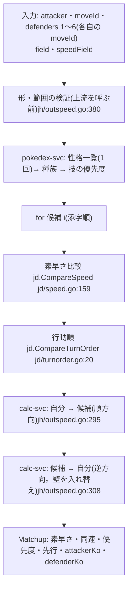

# ダメージ計算以外の計算(balance・speed・judge)

- 基準: `origin/main` 8368756(2026-09-25)。`path:行` はこの版の行番号(ずれたら関数名で探す)。推測は書かず、未確認は「カバレッジ」節に書く。
- HTTP の経路・起動時の read model 読み込み・検査順は [request-flows.md](request-flows.md) の §7・§8。ここでは計算そのものを書く。engine の式は [damage-engine.md](damage-engine.md)。
- 略記: `bal` = `services/balance/internal/balance`、`spd` = `services/speed/internal/speed`、`jd` = `services/judge/internal/judge`、`jh` = `services/judge/internal/httpapi`。

## 0. 3 サービスの比較

| サービス | engine を呼ぶか | 計算の中身 | 使うマスタ(どこから) |
|---|---|---|---|
| balance | **呼ばない**(独自実装。`bal` は engine を import しない) | タイプ相性の掛け算・分類・集計 | 相性表: `testdata/golden/typechart.json` の埋め込みコピー(`services/balance/internal/master/type_chart_data.go:21`)。ポケモンのタイプ・技・特性: `pokedex export` の read model(`BALANCE_{POKEMON_TYPES,MOVES,ABILITIES}_PATH`) |
| speed | 呼ぶ(`engine.EffectiveStat`) | 素早さ実数値・表・順位 | ポケモンの素早さ種族値: read model(`SPEED_POKEMON_PATH`) |
| judge | 呼ぶ(素早さは `engine.EffectiveStat` を直接、ダメージは calc-svc の HTTP 経由で `engine.CalcDamage`) | 素早さ比較 × 確定数 × 行動順 | pokedex-svc(種族・性格・技の優先度)を HTTP で都度取得 |

## 1. タイプバランス(services/balance)

### 1.1 共通の部品

| 部品 | 内容 | 場所 |
|---|---|---|
| タイプ一覧 | 18 タイプを**コードに持つ**(表示順の正)。`Valid()` もこの一覧で判定 | `bal/model.go:9-51` |
| 倍率(型) | `Multiplier`: 等倍 = 4 の整数(0/1/2/4/8/16) | `bal/model.go:54-63` |
| 倍率(特性込み) | `Effectiveness{Num, Den}`: 既約分数(int64)。積は交差約分・128bit でオーバーフロー検査、比較も 128bit | `bal/effectiveness.go:19,72` `Mul`、`:106` `Cmp` |
| 相性表 | `TypeChartProvider.Matchup(攻撃, 防御)`。データのコード 0/1/2/4 を `Multiplier` 0/2/4/8 に変換。タイプ集合はちょうど 18 でないと起動エラー | `services/balance/internal/master/type_chart_data.go:57` `LoadTypeChart`、`:135` `Matchup` |
| 防御の相性 | 1〜2 タイプ(重複不可)について `combined = combined × matchup / 4` | `bal/defense.go:22` `CalculateDefense` |
| 特性込みの防御 | 下表 | `bal/ability.go:134` `CalculateDefenseWithAbility` |
| 6 分類 | 0 → immune、≤1/4 → quad_resist、<1 → resist、=1 → neutral、<4 → weak、≥4 → quad_weak | `bal/effectiveness.go:137` `ClassifyEffectiveness` |
| 攻撃タイプ | 変化技を除いた技のタイプ(重複除去・表示順) | `bal/offense.go:140` `attackTypesOf` |

特性の効果(`CalculateDefenseWithAbility` `bal/ability.go:134`)の適用順:

| 順 | 処理 | 場所 |
|---|---|---|
| 1 | 型だけの相性を計算(`CalculateDefense`) | `:135` |
| 2 | 特性の全効果を検証(攻撃タイプに関係なく) | `:144-148` |
| 3 | 型由来の無効(×0)は確定。特性を適用しない | `:151-153` |
| 4 | 効果を順に: `immune` / `absorb`(該当タイプ → ×0)、`type_multiplier`(該当タイプ → ×係数)、`super_effective_multiplier`(型だけの相性が ×1 超 → ×係数) | `:158-183` |
| 5 | 最終値が型だけの値と同じなら `source = type`・`effect = none`、違えば `source = ability` | `:185-197` |

- 特性の read model は `pokedex export` が engine の `AbilityEffect` から作る: `DefImmuneTypes` → `immune`、`DefAbsorbTypes` → `absorb`、`DefResistType` → `type_multiplier`、`ReduceSuperEffective` → `super_effective_multiplier`(4096 基準の値を約分して分子・分母 1〜16。`services/pokedex/internal/readmodel/readmodel.go:295` `normalizedAbilityEffects`)。engine では `DefResistType` は**攻撃実数値**に掛かるが、balance では**相性の倍率**として掛かる(同じ定義の別の使い方)。
- 意図: 特性ごとの分岐を持たず、正規化した効果データで表す(`bal/ability.go:8-9` のコメント、ADR-0017)。相性表をデータから読む(ADR-0015)。

### 1.2 各機能(入力 → 計算 → 出力)

| 機能(ADR) | 入力 | 計算 | 出力 | 場所 |
|---|---|---|---|---|
| TB1 防御相性(0014・0017) | メンバー 1〜6(タイプ・任意の特性) | 18 攻撃タイプ × メンバーで `CalculateDefenseWithAbility` → 6 分類 → 攻撃タイプごとに weak(quad_weak を含む)/ quad_weak / resist(quad_resist を含む。無効は含まない)/ immune / neutral を数える | メンバーごとの 18 件 + チームの 18 件 | `bal/analysis.go:97` `AnalyzeDefense` |
| TB2 攻撃範囲(0016) | メンバー 1〜6 × 技 0〜4(ID 重複不可) | メンバーの攻撃タイプごとに単タイプ 18 種への `Matchup` の最大値。×1 以上 = effective、×2 = superEffective。チームは最大値と人数(技の数ではない) | メンバーごと + チームの 18 件 | `bal/offense.go:55` `AnalyzeCoverage` |
| TB4 仮想敵(0400) | メンバー 1〜6・仮想敵 1〜6(タイプ・特性・技) | 被弾 = 仮想敵の攻撃タイプ中の最大(メンバーのタイプ+特性)、与弾 = メンバーの攻撃タイプ中の最大(仮想敵のタイプ+特性)。safe = 被弾 < 1、superEffective = 与弾 ≥ 2。攻撃技が無い側は null | 仮想敵ごとの行・人数 | `bal/threat.go:64` `AnalyzeThreats`、`:156` `bestDefense` |
| TB5 おすすめ(0401) | メンバー 1〜6・limit 1〜20(既定 10)・カタログ | 穴 = TB1 で resist も immune も 0 の攻撃タイプ(防御の穴)と、TB2 で effective が 0 の単タイプ(攻撃の穴。攻撃技が 1 つも無ければ穴なし)。171 通り(単 18 + 複合 153)の型について、防御の穴を型だけで ×1 未満にする数 + 攻撃の穴を自分のタイプで ×1 以上にする数を数え、合計降順 → 弱点数(×2 以上)昇順 → 定義順で並べ limit で切る。該当ポケモンと、特性で防御の穴を埋めるポケモンも返す | 候補・穴・特性の選択肢 | `bal/recommend.go:92` `RecommendTypes`、`:248` `recommendCandidates`、`:321` `matchingPokemon`、`:388` `abilityOptionsFor` |
| TB6 技範囲(0404) | 技 1〜4(攻撃技を 1 つ以上) | 18 単タイプへの最大倍率(TB2 を 1 人の仮メンバーで呼ぶ)。カタログの全ポケモンについて型だけで最大 ≤ 1/2 なら walledBy、型だけでは超えるが特性のどれかで ≤ 1/2 なら walledByAbility | 相性表・受けられるポケモン | `bal/moverange.go:82` `AnalyzeMoveRange`、`:138` `moveRangeWalledBy` |

- HTTP ハンドラ: analyze `services/balance/internal/httpapi/server.go:153`、coverage `:359`、threats `threats.go:22`、recommendations `recommendations.go:28`、move-range `moverange.go:25`。
- カタログ(TB5・TB6)は read model の全ポケモン(`services/balance/internal/master/pokemon_types.go:197` `AllPokemon`)。レギュレーションの絞り込みは export 側の責務(`bal/recommend.go:33-34` のコメント)。特性 ID が特性の read model に無ければその特性だけ飛ばす(`bal/recommend.go:411-413`、`bal/moverange.go:176-179`)。
- ダメージ量・実数値・持ち物・テラス・天候は扱わない(タイプ相性と特性だけ)。

## 2. 素早さ比較(services/speed)

| 段 | 内容 | 場所 |
|---|---|---|
| 入力 | 素早さ種族値 1〜255・SP 0〜32・性格(minus / neutral / plus)・ランク -6〜+6・スカーフ有無 | `spd/speed.go:49` `Input` |
| 実数値 → ランク | engine の個体(素早さだけ埋める)を作り `engine.EffectiveStat(…, spe)`。性格の「もう一方」は攻撃に置く(値に影響しない) | `spd/speed.go:59` `Speed`、`:90` `toEngineNature` |
| スカーフ | ランク後に `(v×6144 + 2047) / 4096`(五捨五超入。engine の `pokeRound` と同じ丸め) | `spd/speed.go:105` `applyScarf` |
| 表の行(プリセット) | 6 種: 無振り / 準速(SP32)/ 最速(SP32・上昇)/ 最速スカーフ / 最速+1 / 最速+2。定義は 1 か所 | `spd/table.go:71` `presetDefinitions` |
| 表 | roster の全ポケモン × 指定プリセットで `Speed` → 素早さ降順 → pokemonId 昇順 → プリセット順。同じ値を 1 段(Tier)にまとめる(2 件以上なら同速) | `spd/table.go:137` `BuildTable` |
| 自分の位置 | mode = preset(無振り/準速/最速 + スカーフ)/ custom(SP・性格・ランク・スカーフ)/ raw(実数値を直接)で自分の値を出し、6 プリセットの表と比べて faster / slower / tie を数える | `spd/position.go:217` `Position`、`:135` `positionResult` |
| raw の範囲 | 種族値 × SP × 性格 × ランク × スカーフの全組み合わせを `Speed` で総当たりした最小〜最大(初回だけ計算してキャッシュ) | `spd/position.go:88` `RawSpeedRange`、`:94` |

- engine に無いのはスカーフの補正だけなので、それだけを speed が持つ(`spd/speed.go:1-2` のコメント、ADR-0600 §3)。プリセットは「入力の作り方の型」でマスタではない(ADR-0601 §2。ADR-0009 と同じ考え方)。
- HTTP ハンドラ: table `services/speed/internal/httpapi/server.go:88`、pokemon `:172`、position `position.go:25`。
- 素早さに効く特性・持ち物(スカーフ以外)・まひ・追い風・トリックルームは扱わない(入力に無い)。

## 3. 判定(services/judge: 素早さ × 確定数)

`POST /api/judge/v1/outspeed-and-ko` のハンドラ `jh/outspeed.go:183` `outspeedAndKo`。

| 段 | 内容 | 場所 |
|---|---|---|
| 素早さ | `engine.EffectiveStat`(実数値 → ランク)→ 追い風(8192)とスカーフ(6144)を追い風 → スカーフの順に `chainSpeedModifiers` で連結(各段 `(m*mod + 2048) / 4096`)→ `(v×M + 2047) / 4096` を 1 回 | `jd/speed.go:76` `Speed`、`:114`、`:125` |
| スカーフ判定 | 持ち物 ID が設定 1 つ(`JUDGE_CHOICE_SCARF_ITEM_ID`。空なら既定値)と一致するか。持ち物一覧は持たない | `jd/speed.go:183` `IsChoiceScarf` |
| 比較 | `outspeeds` = 攻撃側 > 防御側(トリックルームなら <)。`speedTie` は常に ==(反転しない) | `jd/speed.go:159` `CompareSpeed` |
| 行動順 | 優先度が違えば高い方が先(素早さ・トリックルームを見ない)。同じなら `outspeeds`、同速なら `Tie = true`(先行は false) | `jd/turnorder.go:20` `CompareTurnOrder` |
| 確定数 | calc-svc の `POST /api/calc` を候補ごとに 2 回(順方向・逆方向)。KO は calc-svc の応答(= engine の `ComputeKO`)をそのまま写す。逆方向は `attackerScreens` と `defenderScreens` を入れ替え、天候・フィールドはそのまま | `jh/outspeed.go:295-339`、`:609` `toReverseClientField`、`services/judge/internal/client/calc.go:96` `Damage` |
| 性格 | pokedex-svc の性格一覧を 1 回取って表にし、両側で引く。無い ID は 422(黙って無補正にしない) | `jd/nature.go:40` `Lookup` |
| 失敗 | どの候補で失敗しても全体を失敗(部分成功なし。ADR-0703 §3) | `jh/outspeed.go:175-182` のコメント |

- judge が自分で持つ計算は素早さの補正だけ。ダメージは式を複製せず calc-svc に任せる(`jd/speed.go:1-4` のコメント、ADR-0701 §2・§1)。
- 素早さの SP・ランクの範囲検査は `judge.Speed` をダミーの種族値で呼んで再利用する(`jh/outspeed.go:485`)。
- 未対応(コードで確認): 素早さに効く特性・スカーフ以外の持ち物・まひは素早さに入らない(`jd.Individual` に項目が無い。`jd/speed.go:45-54`)。#235。技の追加効果によるランク変化(ADR-0107 の `MoveEffect`)は judge のこのハンドラでは使っていない(`jh/outspeed.go` に参照なし)。

## カバレッジ

- 読んだ(全行): `bal/{model,effectiveness,defense,ability,analysis,offense,move,pokemon,threat,moverange,recommend}.go`、`spd/{speed,pokemon,table,position}.go`、`jd/{speed,nature,turnorder}.go`、`jh/outspeed.go`、`services/pokedex/internal/readmodel/readmodel.go:295-340`。
- 読んだ(一部): `services/balance/internal/master/type_chart_data.go`・`abilities.go`・`pokemon_types.go`(関数宣言とコメント)、balance / speed の httpapi(関数宣言と呼び出し行)、`services/judge/internal/client/{calc,pokedex}.go`(関数宣言と `Move` の priority 部分)。
- 読んでいない: balance / speed の read model loader の検証本体、`services/balance/internal/httpapi/validate.go`、speed / judge の httpmetrics、各サービスのテスト、ADR-0014〜0017・0400〜0404・0600〜0605・0700〜0705 の本文(ADR 番号はコードのコメントからの引用)。
