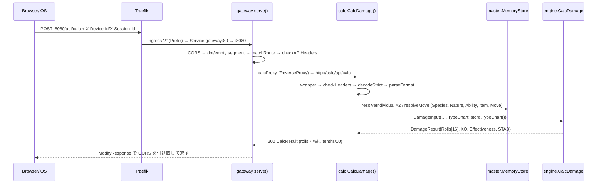
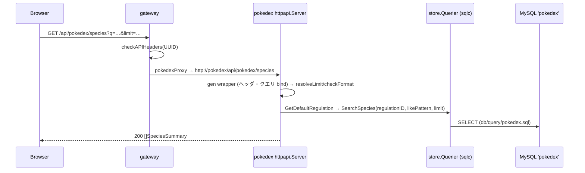
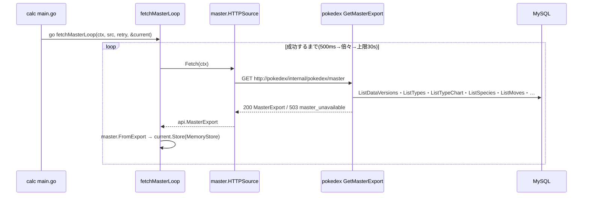
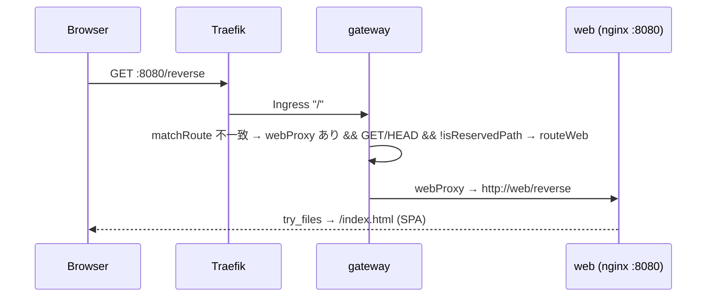
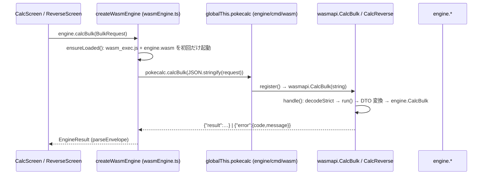

# 主要な処理フロー

- 基準: `origin/main` 3379b03。行番号はこの版。全ルートは [api-endpoints.md](api-endpoints.md)、構成は [architecture.md](architecture.md)。
- 略記: `gw` = `services/gateway/internal/httpapi`、`calc` = `services/calc/internal/httpapi`、`gen` = `services/internal/api/openapi.gen.go`。

## 1. POST /api/calc(gateway 経由。ダメージ計算)

| # | 場所 | 内容 | 失敗時 |
|---|---|---|---|
| 1 | `deploy/k3d.yaml`(`8080:80` loadbalancer)→ `deploy/k8s/base/gateway/ingress.yaml`(path `/` → svc `gateway`) | ホスト 8080 → Traefik :80 → gateway Service :80 → Pod :8080 | 接続不可 = クラスタ/ポート問題 |
| 2 | `gw/server.go:106` `serve` | Origin 判定・プリフライトは 204 で終了(`:112`) | — |
| 3 | `gw/server.go:125`、`routing.go:81,95` | `.`/`..`・連続スラッシュを 404 `not_found`(上流へ送らない) | 404 |
| 4 | `gw/routing.go:59` `matchRoute` | `/api/calc` と `/api/calc/*` → `routeCalc`。未知パスは 404(ヘッダ無しでも) | 404 `not_found` |
| 5 | `gw/headers.go:19` `checkAPIHeaders` | 2 ヘッダが各 1 つ・非空・正準 UUID | 400 `missing_header` / `invalid_header` |
| 6 | `gw/server.go:156` → `proxy.go:40` `newReverseProxy` | `Rewrite`: `SetURL(GATEWAY_CALC_URL)`・`SetXForwarded`。上流ヘッダの CORS を除去し許可オリジンだけ付与(`:52`) | 接続不可/タイムアウト → 503 `upstream_unavailable`(`:61`) |
| 7 | `calc/server.go:50` `NewHandler` → `:72` `e.POST("/api/calc", wrapper.CalcDamage)` | `gen:1339` `CalcDamage` がヘッダ必須を検証(本文は検証しない) | 400 `missing_header`/`invalid_header`(`server.go:131` `errorBodyFor`) |
| 8 | `calc/readiness.go:23` `NewDeferredHandler`(k3d の実運用。`CALC_MASTER_URL` 方式) | `current()` が nil の間は 503。取得済みなら `NewServer(store)` の生成ラッパへ | 503 `master_unavailable` |
| 9 | `calc/server.go:177` `CalcDamage` → `errors.go:95` `decodeStrict`(`limitedBody`: 1MiB) | 未知フィールド拒否・末尾ゴミ拒否 | 400 `invalid_json` / `unknown_field` |
| 10 | `calc/convert.go:16,23,33` | format・status・teraType の列挙検証(ID 解決より先) | 400 `invalid_enum` |
| 11 | `calc/convert.go:117` `resolveIndividual`、`:165` `resolveMove`、`:89` `parseField` | ID → `engine` 型。`Store` は `calc/internal/master/master.go:20` | 400 `unknown_species`/`unknown_nature`/`unknown_ability`/`unknown_item`/`unknown_move` |
| 12 | `calc/errors.go:85` `validateIndividual` → `engine.Individual.Validate` | SP 範囲(各 0..32・合計 ≤ 66)・ランク等 | 400 `invalid_input` |
| 13 | `engine/damage.go:192` `CalcDamage` | 相性(`TypeChart.Effectiveness` `typechart.go:206`)→ 無効判定 → 基礎ダメージ(整数 floor)→ 16 乱数 × `pokeRound`(4096 基準)→ `ComputeKO`(`ko.go:17`) | `errFromEngine`(`errors.go:74`)で sentinel → code |
| 14 | `calc/convert.go:261` `calcResultFrom` | `rolls`・確定数・表示 %(tenths ÷ 10) | — |

- 計算はイベント保存に依存しない(record/team は未実装で呼ばない。CLAUDE.md 絶対ルール5)。
- `make dev`(k8s なし)では `CALC_MASTER_PATH`(ファイル方式)で `NewHandler`(`calc/server.go:50`)を使う。マスタは即時ロードで、503 経路は無い。

## 2. POST /api/calc/bulk と /api/calc/reverse

手順 1〜6 は同じ。calc 内の差分:

| 操作 | ハンドラ | 追加の検証・解決 | engine | 応答写像 |
|---|---|---|---|---|
| bulk | `calc/server.go:223` `CalcBulk` | `limits.go:25` `checkBulkLimits`(presets ≤ 8・itemVariants ≤ 64 かつ重複なし)→ `resolveSpecies("defenderSpeciesKey")`・`resolveItems` | `engine/bulk.go:214` `CalcBulk`(防御側プリセット × 持ち物候補) | `convert.go:279` `bulkResultFrom` |
| reverse | `calc/server.go:277` `CalcReverse` | `limits.go:34` `checkReverseLimits`(itemCandidates ≤ 64・observations ≤ 16・maxCandidates 0..128)→ `convert.go:209` `convertObservations` | `engine/reverse.go:301` `CalcReverse`(総当たり探索) | `convert.go:304` `reverseResultFrom` |

- 件数上限は契約の `maxItems` と実装の定数(`limits.go:15-21`)を揃える(生成ラッパは本文スキーマを検証しないため。ADR-0208 §3)。
- 上限超過は 400 `invalid_input`(`checkItemIDLimit` `limits.go:51`)。`duplicate_preset`・`unknown_preset`・`no_observation` などは engine の sentinel(`errors.go:56` `engineSentinels`)。

## 3. マスタ参照 GET /api/pokedex/*(gateway → pokedex-svc → MySQL)

| # | 場所 | 内容 | 失敗時 |
|---|---|---|---|
| 1 | `gw/routing.go:66`(前方一致 `/api/pokedex/`)、`server.go:158` | `GATEWAY_POKEDEX_URL` 未設定なら上流なし | 503 `upstream_unavailable` |
| 2 | `pokedex/internal/httpapi/server.go:32` `NewHandler`、`:46` `registerPokedexRoutes` | 6 操作 + `/internal/pokedex/master` を生成ラッパ経由で登録。`/api/calc*` は直接 404(`:60` `registerCalcNotFoundRoutes`) | 404 `not_found` |
| 3 | `search.go:46` `resolveLimit`、`:57` `checkFormat` | limit 1〜200(既定は `defaultSearchLimit`)。DB を呼ぶ前に検証 | 400 `invalid_input`/`invalid_enum` |
| 4 | `search.go:78` `SearchSpecies`(moves `:105`・items `:133`・species/{key} `:158`・moves/{key} `:202`・natures `:219`) | 既定レギュレーションの使用可能集合だけ返す(`GetDefaultRegulation` → `SearchSpecies`。`db/query/pokedex.sql:257,285`) | DB 不通・0 行 → 503 `master_unavailable`(`errors.go:53` `unavailable`。DB のエラー文は出さない) |
| 5 | `search.go:158` `GetSpecies` | 種族キー形式(`speciesKeyPattern`)→ `GetSpeciesByKey` → 特性・習得技 | 400 `invalid_input`・404 `not_found` |

- `GetMove`(`:202`)は使用可能集合の外の技も返す(判定レーンが priority を引くため)。
- Web の online マスタは `web/src/master/onlineSource.ts:67-71`(`api/pokedex/{species,items,natures}`)から呼ぶ。

## 4. calc-svc のマスタ取得(起動時)

| # | 場所 | 内容 |
|---|---|---|
| 1 | `services/calc/cmd/calc/main.go:80` `loadConfig` | `CALC_MASTER_URL` と `CALC_MASTER_PATH` はちょうど 1 つ。`CALC_TYPECHART_PATH` が設定されていたら起動エラー |
| 2 | `main.go:120` `newHandler` | URL 方式はすぐ HTTP 起動し `fetchMasterLoop`(`:151`)で再試行。`NewDeferredHandler`(`readiness.go:23`)に `atomic.Pointer` を渡す |
| 3 | `calc/internal/master/export.go:435` `HTTPSource.Fetch` | `GET {base}/internal/pokedex/master`。200 以外 → `ErrMasterUnavailable`、本文不正 → `ErrInvalidMaster`(上限 `maxMasterExportBytes`) |
| 4 | `pokedex/internal/httpapi/master.go:19,27` | `data_versions` が 0 件なら `errEmpty`(= 未投入)→ 503 |
| 5 | `export.go:52` `FromExport` | 相性表(`buildTypeChart` `:94`)・特性・持ち物・種族・技・性格を検証して `MemoryStore`(engine 型)化。DB 行 → engine 型の写像は `services/internal/master` |
| 6 | `readiness.go` | 取得まで calc の 3 操作と `/readyz` は 503 `master_unavailable`、`/healthz` は 200。取得後の再取得なし |

- pokedex が未投入(`make import-k8s` 前)のとき、calc は 503 のまま再試行し続ける。`api-smoke` は 503 を見て架空 ID にフォールバックする(`services/gateway/scripts/smoke.sh` の `master_source=example`)。

## 5. Web 配信(gateway が `/` を web に転送)

| # | 場所 | 内容 |
|---|---|---|
| 1 | `gw/server.go:132-138` | `matchRoute` が拾えないパスは、`WebURL` 設定済み・GET/HEAD・非予約(`routing.go:32,48,53`)のときだけ `routeWeb` |
| 2 | 予約パス | 先頭セグメントが `api`・`assets`・`healthz`・`internal` のどれかなら Web に流さず 404(`/apix` 等は予約語ではない) |
| 3 | `GATEWAY_WEB_URL` | `http://web`(`deploy/k8s/overlays/local/api/gateway-patch.yaml`)。base には置かない |
| 4 | `web/nginx.conf` | `/api` と `/api/` は 404、`/healthz` は 200、`/assets/` は `try_files … =404`(immutable キャッシュ)、`/engine.wasm`・`/wasm_exec.js` は no-cache、それ以外は `/index.html` にフォールバック |
| 5 | `GET :8080/healthz` | gateway 自身の `healthz`(web の `/healthz` ではない)。web の `/healthz` は port-forward(5173)経由でだけ見える |

- `:5173`(`make web-k3d-open` の port-forward)は nginx に直結し、`/api/*` は 404。API を使う画面はここでは動かない(gateway の 8080 を使う)。
- `make web-dev`(Vite)は `API_PROXY_TARGET`・`BALANCE_PROXY_TARGET` で `/api`・`/api/balance` を転送できる(`web/vite.config.ts`)。

## 6. WASM 経路(オフライン計算。HTTP を通らない)

| # | 場所 | 内容 |
|---|---|---|
| 1 | `web/src/App.tsx:93` | `createWasmEngine(browserWasmLoader())`。読み込みは初回計算まで遅延。モードの既定は `offline`(`app/calcMode.ts`、localStorage `pokecalc.calcMode`) |
| 2 | `web/src/screens/CalcScreen.tsx:459-468` / `ReverseScreen.tsx:320-329` | `buildBulkRequest`/`buildReverseRequest`(`domain/requests.ts:95,214`)→ `engine.calcBulk`/`calcReverse`。**画面は単発 `calc` を呼ばない**(`grep '\.calc('` で画面側に該当なし。`calc` は両エンジンが実装するのみ) |
| 3 | `web/src/engine/wasmEngine.ts:142,160-175` | `globalThis.pokecalc[fn](JSON.stringify(request))`。失敗は `engine_unavailable`(自動でオンラインへ切り替えない) |
| 4 | `engine/cmd/wasm/main_js.go:61-70` | `pokecalc.{calc,calcBulk,calcReverse}` と `pokecalcReady` を登録し `select{}` で待機。引数が文字列 1 つでなければ `invalid_json` |
| 5 | `engine/wasmapi/wasmapi.go:109` `handle` | panic 回復・厳格デコード(`:188`)・`json.Marshal`(改行なし) |
| 6 | `engine/wasmapi/requests.go:39,124,276` | DTO → engine 型。**`typeChart` はリクエストに必須**(省略は `type_chart_missing`)。マスタ解決は Web 側(`web/src/master/`)。相性表は `@typechart` = `testdata/golden/typechart.json` |
| 7 | ビルド | `scripts/wasm.sh`: `GOOS=js GOARCH=wasm go build ./cmd/wasm` → `web/public/engine.wasm`、`wasm_exec.js` をコピー(Git 管理外) |

- 同じ失敗は HTTP と WASM で同じ `code`(ADR-0200)。一致は `make test-wasm`・`web-test-wasm` の共有ベクタ(`engine/wasmapi/testdata/vectors.json`)で検査。
- オンライン(`createApiEngine` `web/src/api/apiEngine.ts:229`)は画面の実体を ID に写して `POST api/calc{,/bulk,/reverse}`(`:283,320,353`、ヘッダは `:240-241`)。応答を DTO に戻す(`mapCalcResult` 等)。

## 7. judge-svc(POST /api/judge/v1/outspeed-and-ko)

Traefik `/api/judge` → judge(gateway 非経由)。

| # | 場所 | 内容 | 失敗時 |
|---|---|---|---|
| 1 | `judge/internal/httpapi/server.go:34` `New`、`:79` `requireRequestContext` | ヘッダ非空(UUID 検証なし) | 400 `invalid_request` |
| 2 | `outspeed.go:120` `outspeedAndKo` | 本文(上限・形)→ defenders 件数 1..6 → sp/ranks/format → 性格 → 種族 → calc の順(コメント `:113-119`) | 400/413 `request_too_large` |
| 3 | `outspeed.go:144` | `deps.Pokedex == nil \|\| deps.Calc == nil`(`JUDGE_*_BASE_URL` 未設定) | 503 `upstream_unavailable` |
| 4 | `client/pokedex.go:118` `Natures`、`:36` `Species` | `GET http://pokedex/api/pokedex/natures`・`/species/{key}`(端末 ID/セッション ID を転送) | 404 → `unknown_species` 等 / 503 |
| 5 | `judge/internal/judge/speed.go:159` `CompareSpeed`・`:183` `IsChoiceScarf` | 素早さ比較(スカーフ判定 `IsChoiceScarf`、`JUDGE_CHOICE_SCARF_ITEM_ID`) | — |
| 6 | `client/calc.go:96` `Damage` | `POST http://calc/api/calc`(候補ごと。1 件でも失敗すれば全体失敗。ADR-0703) | 503 |

## 8. balance-svc・speed-svc(read model)

| サービス | 経路 | 起動時 | リクエスト時の検査順 |
|---|---|---|---|
| balance | Traefik `/api/balance` → `services/balance/internal/httpapi/server.go:101` `New`(生成ラッパ + `requireRequestContext`)| `cmd/api/main.go:26`(`main`)が `BALANCE_{POKEMON_TYPES,MOVES,ABILITIES}_PATH` を読み(`config.go`)、未設定は nil のまま起動 | 検査順(`server.go:352-354` coverage、`recommendations.go:21-25`・`threats.go:14-18`・`moverange.go:19-23` のコメント): ヘッダ(400)→ 本文 16KiB(400/413)→ read model 有無(503)→ 未知 ID(422)→ 200。ハンドラ: analyze `server.go:149`・coverage `:355`・threats `threats.go:22`・recommendations `recommendations.go:28`・move-range `moverange.go:25` |
| speed | Traefik `/api/speed` → `services/speed/internal/httpapi/server.go:38` `New` | `cmd/api/main.go` が `SPEED_POKEMON_PATH` を読む | 検査順は未確認(コード全行は未読)。ハンドラ: pokemon `:168`・table `:84`・position `position.go:25` |

- read model の作り方: `pokedex export -out <dir>`(`services/pokedex/cmd/pokedex/main.go:109`)→ `data/generated/readmodel/` → ConfigMap(`make balance-k3d-deploy-readmodel` 等。手順は B 章)。
- ローカル overlay は架空データの ConfigMap(`services/{balance,speed}/deploy/k8s/overlays/local/`)。

## 9. importer(マスタ投入)

| # | 場所 | 内容 |
|---|---|---|
| 1 | `deploy/k8s/base/pokedex/cronjob-import.yaml` | 毎週土曜 12:00 JST。`concurrencyPolicy: Forbid`、失敗終了コード 2・3 は再試行しない(`podFailurePolicy`) |
| 2 | `tools/importer/cronjob.sh` | `flock -n` で排他(取れなければ終了 1)→ `fetch.mjs`(固定版の取得)→ `check-upstream.mjs`(失敗は警告)→ `pokedex-import -data … -upstream …` |
| 3 | `services/pokedex/cmd/import/main.go:67` `run` | `LoadInput` → `Reconcile`(食い違いの裁定が要れば `ErrBlocked`)→ `-dry-run` なら終了 → `POKEDEX_DATABASE_DSN` で `RunStore`(`-force` で版が同じでも投入) |
| 4 | `services/pokedex/db/migrations/` | スキーマは `pokedex-migrate` Job が事前に適用(`up`) |

## カバレッジ

- 読んだ: 上記の各 `path:行` の関数本体(gateway 全ファイル、calc `server.go`・`readiness.go`・`errors.go`・`limits.go`・`convert.go`(宣言と解決部)・`master/export.go`(`HTTPSource`)、pokedex `server.go`・`search.go`・`errors.go`・`master.go`(冒頭)、`cmd/{pokedex,import}/main.go`、`tools/importer/cronjob.sh`、judge `server.go`・`outspeed.go`(`:113-200`)・`client/*` の関数一覧、`engine/damage.go`(全体)・`wasmapi.go`・`requests.go`(calc 部)・`main_js.go`、`web/src/{engine/wasmEngine.ts,api/apiEngine.ts(抜粋),App.tsx(抜粋)}`、`web/nginx.conf`、`scripts/wasm.sh`)。
- 読めていない・保証しない: `engine/bulk.go`・`reverse.go` の探索アルゴリズム、`pokedex/master.go` の後半(全テーブルの詰め替え)、`balance`/`speed` の各ハンドラ本体の分岐(検査順は `server.go` 冒頭コメントと ADR に基づく。コード全行は未確認)、judge `outspeed.go:200-560` と `judge/speed.go`、`web/src/screens/*` の描画・状態管理、`iOS` の通信経路(README のみ)。
- 未実装: record/team 連携(計算後の保存・お気に入り)は無い。gateway の `/assets/*` は上流未設定。
