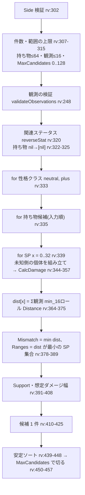

# 逆算(調整推定。engine/reverse.go)

- 基準: `origin/main` 8368756(2026-09-25)。`path:行` はこの版の行番号(ずれたら関数名で探す)。推測は書かず、未確認は「カバレッジ」節に書く。
- 略記: `rv` = `engine/reverse.go`。ダメージ 1 回ぶんの計算は [damage-engine.md](damage-engine.md)。HTTP / WASM の入口は [request-flows.md](request-flows.md) の §2・§6。
- 設計の正は ADR-0010 の §R(P1-12 改訂)。§3.1・§4〜§7 の旧仕様(型 Archetype・格子 3,267 点)はコードから削除済み(§R6。`engine/reverse_test.go:1526` `TestReverseLegacyAPIRemoved`)。

## 1. 何を推定するか

| `Side` | 観測するもの | 推定する側 | 関連ステータス(`rv:221` `reverseStat`) | 仮定 |
|---|---|---|---|---|
| `defender` | 自分が与えたダメージ(相手 HP の減少) | 相手の防御側 | 物理 → `def`、特殊 → `spd` | 相手の HP の SP = 32(`AssumedHPSP`) |
| `attacker` | 自分が受けたダメージ(自分 HP の減少) | 相手の攻撃側 | 物理 → `atk`、特殊 → `spa` | 相手の HP は計算に使わない(`AssumedHPSP` = 0) |

- 未知の分類は物理と同じ扱い(`reverseStat`)。変化技・威力 0 の技は探索の前に、全候補でダメージが 0(相性・特性の無効)なら探索の後に `ErrMoveDealsNoDamage` を返す(#317。ADR-0117 §3)。calc-svc は 400 `invalid_input`、WASM は `invalid_input` に写す。
- 推定するのは **関連ステータスの SP(0〜32)・性格クラス・持ち物** の 3 つ。特性・ランク・状態異常・テラスは推定しない(§6)。

## 2. 入力(`ReverseInput` `rv:160`)

| フィールド | 意味 | 全観測で共通か |
|---|---|---|
| `Known` | 既知側の個体(defender なら攻撃側 = 自分、attacker なら防御側 = 自分) | 共通 |
| `UnknownSpecies` | 相手の種族(SP・性格・持ち物は渡さない) | 共通 |
| `Move`・`Field`・`Critical`・`Format`・`TypeChart` | そのまま `CalcDamage` に渡す | 共通 |
| `ItemCandidates` | 探索する持ち物(解決済み)。`nil` 要素 = 持ち物なし。`nil`/空は「持ち物なしの 1 通り」 | — |
| `Observations` | 1〜16 件。各件は `Percent`(1..100)・`PercentTenths`(1..1000)・`Damage`(>0)の**ちょうど 1 つ**。`Note` は計算に使わない | 各件が別の 1 発 |
| `MaxCandidates` | 返す件数の上限。0 = 無制限、1..128 | — |

## 3. 処理の流れ(`CalcReverse` `rv:301`)

| 段 | 内容 | 場所 |
|---|---|---|
| 未知側の個体 | `Species = UnknownSpecies`・Lv50・`Nature = natureForClass`・`SP = {関連: x}`(defender なら `HP: 32` も)・`Item = 候補`・`Status = none`。特性・ランク・テラスはゼロ値 | `rv:340-347` |
| ダメージ計算 | 既知側と未知側を `Side` に応じて攻撃/防御に置き、`CalcDamage`。1 回でも error なら全体を error(部分結果なし) | `rv:348-361` |
| 代表性格 | `neutral` = 無補正、`plus` = `{Plus: 関連, Minus: atk}`(関連が atk のときだけ `Minus: spa`)。下降補正は探索しない | `rv:236` `natureForClass`、`rv:78` `reverseClasses` |

## 4. 観測との照合と一致度

### 4.1 1 観測 × 1 ロール(`Observation.Matches` `rv:100`・`Distance` `rv:128`)

S = 100(`Percent`)/ 1000(`PercentTenths`)、v = 観測値、`x = S·damage − v·maxHP`。maxHP は `DamageResult.DefenderHP`(defender 側なら相手、attacker 側なら自分の最大 HP)。

| 観測の種類 | `Matches`(説明できる) | `Distance`(説明できないときの近さ。0.1% 単位の整数) |
|---|---|---|
| `Percent` / `PercentTenths` | `abs(x) < maxHP`(真値が開区間 (v−1, v+1) に入る)。v が 100%(1000)なら `x ≥ 0` も可(瀕死で頭打ち) | 両立なら 0、それ以外 `(abs(x) / maxHP) × 10`(Percent)/ `× 1`(PercentTenths) |
| `Damage` | `damage == D` | 一致なら 0、それ以外 `max(1, 1000·abs(damage − D) / maxHP)` |
| maxHP ≤ 0 | false | `1 << 30`(0 にしない) |

- 開区間 (v−1, v+1) は「切り捨て・四捨五入・切り上げのどれで観測 v を作っても真値が入る最小の区間」。実機の丸め規則が未確認のため(ADR-0010 §R2。`engine/reverse_test.go:534` `TestObservationMatchesAnyRounding`)。
- 単位を 0.1% に揃えるのは、観測の種類が混ざっても距離を足せるようにするため(ADR-0010 §R2)。

### 4.2 候補(性格クラス × 持ち物)ごとの値

| 値 | 定義 | 場所 |
|---|---|---|
| `dist[x]` | SP = x のときの Σ(観測ごとに 16 ロール中の最小 `Distance`)。観測ごとに別のロールでよい | `rv:364-375` |
| `Mismatch` | `min_x dist[x]` | `rv:378-383` |
| `Ranges` / `SPCount` | `dist[x] == Mismatch` の SP を昇順に集め、隣接する値を極大区間にまとめる(`collapseSPRanges` `rv:279`)。非連続なら複数区間のまま | `rv:384-389,414-415` |
| `Exact` | `Mismatch == 0`(全観測を説明できる SP がある)。このとき `Ranges` は説明できる SP の集合そのもの | `rv:416` |
| `Support` | `Ranges` の各 SP で、各観測を説明できるロールの延べ数 | `rv:391-400` |
| `MinPercentTenths` / `MaxPercentTenths` | `Ranges` の全 SP での `DisplayPercentRangeTenths` の最小・最大(表示%) | `rv:401-408` |

- 説明できる SP が 1 つも無くても候補は必ず返す(距離が最小の SP 付き。`Exact = false`)。要件「正確さより候補の提示を優先」(ADR-0010 §R3。`engine/reverse_test.go:1023` `TestReverseNoExactStillReturnsCandidates`)。
- 1 区間に畳まないのは、説明できない SP を候補に見せないため(ADR-0010 §R3。`engine/reverse_test.go:799` `TestReverseNonContiguousRangesKept`)。

## 5. 列挙順・並び・打ち切り

| 項目 | 内容 | 場所 |
|---|---|---|
| 列挙順(定義順) | 性格クラス `neutral` → `plus`、その中で `ItemCandidates` の添字順 | `rv:333-335` |
| 並び | `Mismatch` 昇順 → `Support` 降順 → `SPCount` 降順 → 定義順(`sort.SliceStable` なので同点は定義順のまま) | `rv:439-448` |
| 打ち切り | 並べた後に `MaxCandidates`(> 0 のとき)で上から切る | `rv:450-453` |
| `ExactCount` | 切る前の `Exact` 候補の数 | `rv:429-434` |

- float の一致度を使わないので、ネイティブと WASM で並びが食い違わない(ADR-0010 §R4)。
- 観測上区別できない候補(例: 等倍技に対する半減きのみと持ち物なし)は同点で両方残る(決め打ちしない。ADR-0010 §R4)。

## 6. 複数観測の扱い

- 全観測は同じ `Move`・`Field`・`Critical`・`Known` を共有する(入力が 1 つずつしか無い。`rv:159` のコメント、ADR-0010 §8)。技を変えた観測は混ぜられない。
- SP ごとの 16 ロールは 1 回だけ計算し、全観測で使い回す(`rv:357-375`)。
- 観測を足すと `dist` が各 SP で単調に増えるだけなので、`Exact` な SP 集合は狭まるか同じ(絞り込み。`engine/reverse_test.go:914` `TestReverseMultipleObservationsNarrow`)。説明できない観測が 1 つ混ざると `Exact` が消える(`:984` `TestReverseUnreachableSecondObservationRemovesExact`)。

## 7. 計算量と上限

| 量 | 式 | 上限時(持ち物 64・観測 16) |
|---|---|---:|
| 候補数 | 2 × 持ち物数 | 128 |
| `CalcDamage` 呼び出し | 2 × 持ち物数 × 33 | 4,224 |
| `Distance` 評価 | 上記 × 観測数 × 16 | 1,081,344 |
| `Matches` 評価(Support) | Σ候補 SPCount × 観測数 × 16 | 最大 1,081,344 |

- 上限の値は `rv:49-56`(ADR-0108 決定1。calc-svc の契約 ADR-0208 §1 と同値)。上限ちょうどの実測は約 25ms(ADR-0108 §6 が引く ADR-0208 の計測)。
- メモリは候補 1 件ごとに `[33]DamageResult` と `dist[33]`(`rv:336-337`)。

## 8. 結果の型

`ReverseResult`(`rv:207`): `Side`・`Stat`(関連ステータス)・`AssumedHPSP`・`Candidates`・`ExactCount`。

`ReverseCandidate`(`rv:183`): `NatureClass`・`Nature`(代表性格の構造値)・`Item`/`ItemID`・`Ranges`(`[]SPRange{Min, Max}`、両端含む)・`SPCount`・`Exact`・`Mismatch`・`Support`・`MinPercentTenths`/`MaxPercentTenths`。

境界での写し:

| 経路 | 変換 | 場所 |
|---|---|---|
| WASM | 件数検査 → DTO 変換 → `validateIndividual`(既知側)・`validateSpecies`(推定側)→ `CalcReverse` → 表示%は `tenthPercent`(小数 1 桁の JSON 数値) | `engine/wasmapi/requests.go:276` `reverseRequest.run` |
| calc-svc | 観測はキーの有無で「ちょうど 1 つ」を数え直す(engine は 0 を未指定とみなすため)→ `CalcReverse` → `natureId` を性格の構造値から逆引き・表示%は tenths ÷ 10 | `services/calc/internal/httpapi/convert.go:209` `convertObservations`、`:304` `reverseResultFrom` |

## 9. 限界(コードと ADR で確認できるもの)

| 限界 | 根拠 | issue |
|---|---|---|
| 相手の H は 32 固定。H を振らない相手は B(D) を低く見積もった範囲として出る | ADR-0010 §R7、`rv:341-343` | — |
| 下降補正の性格は探索しない | ADR-0010 §R1、`rv:78` | — |
| 特性は探索しない。`UnknownAbilities` で渡した候補(0〜3 件。空はゼロ値)だけを試し、結果が同じ特性は1つの候補にまとめる。API・画面からはまだ渡らない | ADR-0126、`engine/ability_candidates.go` | #272 |
| 相手のランク・状態異常・テラスは推定しない(未知側は 0 / none / なし) | ADR-0010 §8、`rv:344-347` | — |
| 攻撃側は持ち物の倍率と SP・性格が観測上ほぼ区別できず、候補が多く残る | ADR-0010 §R7 | — |
| 1 回の整数%観測で説明できる SP は真値の候補で平均 23/33(情報量が小さい) | ADR-0010 §R5・§R7 の計測 | — |
| `Format`・`TeraType` など `CalcDamage` が読まない入力は逆算でも効かない | [damage-engine.md](damage-engine.md) §13 | #232 |

## カバレッジ

- 読んだ(全行): `engine/reverse.go`、`engine/wasmapi/requests.go:224-365`、`services/calc/internal/httpapi/convert.go:209-330`。ADR-0010 の §8 と §R1〜§R8。
- 読んだ(一部): `engine/reverse_test.go` はテスト関数名の一覧だけ(本文の期待値は読んでいない)。
- 読んでいない: `engine/reverse_recall_test.go`(Recall 計測の本体)、ADR-0010 §1〜§7 の旧仕様の本文、Web / iOS の逆算画面(観測の入力 UI・件数制限の扱い)。
