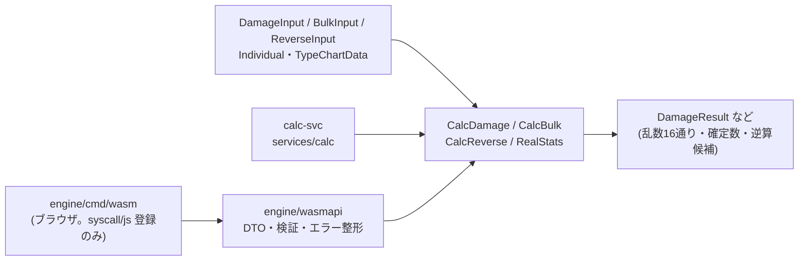

# engine(計算エンジン)

DB・HTTP・ファイル・時刻・乱数を持ち込まない純粋な Go パッケージ。ダメージ・確定数(KO 率)・一括計算・逆算(調整推定)・
実数値・表示用パーセントを計算する。タイプ相性表は呼び出し側が渡すデータ(`TypeChartData`)であり、コードには持たない。
同じコードを calc-svc(サーバー)とブラウザ用 WASM の両方から使う(全体像は [`docs/architecture.md`](../docs/architecture.md))。



## ディレクトリ

| パス | 役割 |
|---|---|
| `engine/`(ルート直下) | ダメージ・確定数・一括計算・逆算・実数値・タイプ相性表の純粋ロジック(`damage.go`・`bulk.go`・`reverse.go`・`stats.go`・`ko.go`・`typechart.go` ほか) |
| `engine/presets` | 攻撃側プリセットの正(`attacker.json`。ビルド時に embed。Web・iOS は契約テストで同じファイルを読む。ADR-0114) |
| `engine/wasmapi` | JS 境界の DTO・検証・エラー整形。ネイティブ Go でテストできる |
| `engine/cmd/wasm` | ブラウザ向けエントリ。`globalThis.pokecalc` に関数を登録するだけの薄いラッパー |
| `engine/cmd/wasmexpect` | Go/WASM 一致テスト(`make test-wasm`)用の期待値を生成するネイティブ Go ツール |

## よく使うコマンド

```sh
cd "$(git rev-parse --show-toplevel)"
make test-engine        # ユニットテスト(ルートの make test にも含まれる)
make test-golden        # @smogon/calc 照合(全件一致が必須。CLAUDE.md 絶対ルール3。ルートの make test にも含まれる)
make test-all-species   # 全ポケモン網羅・性質テスト
make wasm test-wasm     # WASM ビルド → Go/WASM の結果一致テスト
```

## 関連 ADR

[0004](../docs/adr/0004-damage-rounding-and-order.md)(丸め順)・
[0005](../docs/adr/0005-modifier-scope-and-data-driven-effects.md)(補正の適用範囲・データ駆動の効果)・
[0006](../docs/adr/0006-ko-probability-model.md)(確定数モデル)・
[0008](../docs/adr/0008-golden-rounding-corrections.md)(ゴールデンでの丸め補正)・
[0009](../docs/adr/0009-bulk-calc-presets.md)(一括計算のプリセット)・
[0010](../docs/adr/0010-reverse-estimation.md)(逆算)・
[0011](../docs/adr/0011-wasm-boundary.md)(WASM 境界)・
[0013](../docs/adr/0013-type-chart-as-data.md)(タイプ相性表はデータ)・
[0114](../docs/adr/0114-attacker-preset-catalog.md)(攻撃側プリセットのカタログ)。
