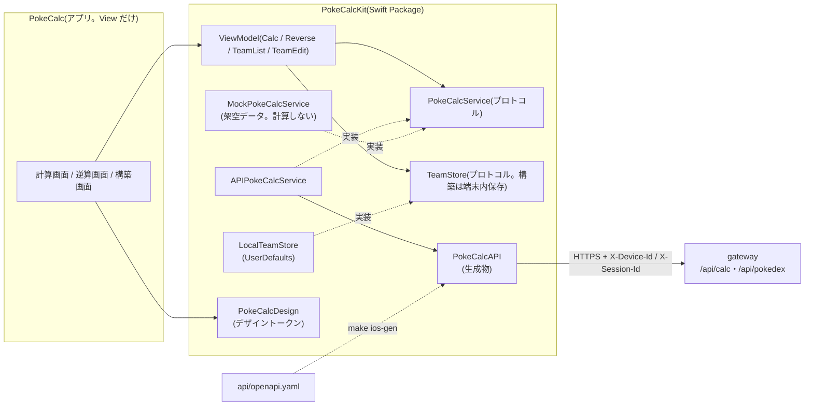

# iOS(SwiftUI)

iPhone 向けのダメージ計算アプリ(計算画面・逆算画面・構築ビルダー)。gateway 経由で calc / pokedex の API を呼び、接続先が無いときは架空データのモックで動く。
API クライアントは `api/openapi.yaml` から swift-openapi-generator で生成し、手で書かない(契約は変更しない)。
シミュレータでの確認は [docs/runbooks/ios.md](../docs/runbooks/ios.md)、実機インストールは [docs/runbooks/ios-device-install.md](../docs/runbooks/ios-device-install.md)(人間の作業)。設計は [ADR-0500](../docs/adr/0500-ios-app-architecture.md)、見た目は [docs/design.md](../docs/design.md)。


```mermaid
flowchart LR
  subgraph App["PokeCalc(アプリ。View だけ)"]
    Views["計算画面 / 逆算画面 / 構築画面"]
  end
  subgraph Kit["PokeCalcKit(Swift Package)"]
    VM["ViewModel(Calc / Reverse / TeamList / TeamEdit)"] --> Service["PokeCalcService(プロトコル)"]
    VM --> TeamStore["TeamStore(プロトコル。構築は端末内保存)"]
    APIImpl["APIPokeCalcService"] -.->|実装| Service
    Mock["MockPokeCalcService<br/>(架空データ。計算しない)"] -.->|実装| Service
    LocalStore["LocalTeamStore<br/>(UserDefaults)"] -.->|実装| TeamStore
    APIImpl --> Gen["PokeCalcAPI<br/>(生成物)"]
    Design["PokeCalcDesign<br/>(デザイントークン)"]
  end
  Views --> VM
  Views --> Design
  Gen -->|"HTTPS + X-Device-Id / X-Session-Id"| Gateway["gateway<br/>/api/calc・/api/pokedex"]
  Spec["api/openapi.yaml"] -.->|"make ios-gen"| Gen
```

## ディレクトリ

| パス | 役割 |
|---|---|
| `PokeCalcKit/Sources/PokeCalcAPI/Generated` | `api/openapi.yaml` の生成物(`pokedex`・`calc` タグだけ。Git に置かない・手で編集しない。ADR-0807) |
| `PokeCalcKit/Sources/PokeCalcBalanceAPI/Generated` | `services/balance/api/openapi.yaml` の生成物(タイプバランス。schema 名が衝突するので別モジュール。ADR-0415。Git に置かない) |
| `PokeCalcKit/Sources/PokeCalcSpeedAPI/Generated` | `services/speed/api/openapi.yaml` の生成物(素早さ比較。P6-24。Git に置かない) |
| `PokeCalcKit/Sources/*/GenRequired.swift` | 生成物が無いときに `make ios-gen` を案内する手書きファイル(ADR-0807) |
| `PokeCalcKit/Sources/PokeCalcCore` | ドメインの型・`PokeCalcService`(API 実装とモック)・ViewModel・表示の整形・設定・端末 ID |
| `PokeCalcKit/Sources/PokeCalcCore/Resources` | モックの架空データ(JSON。名前はすべて「テスト」で始める) |
| `PokeCalcKit/Sources/PokeCalcDesign` | デザイントークン(docs/design.md と同じ名前・値) |
| `PokeCalcKit/Tests` | XCTest(ロジック) |
| `PokeCalc.xcodeproj` / `PokeCalc/` | アプリ(SwiftUI の View だけ)。フォルダ同期で手書きのプロジェクト |
| `PokeCalc/Config/PokeCalc.xcconfig` / `PokeCalc-Info.plist` | API の接続先(`POKECALC_API_BASE_URL`。空ならモック) |
| `PokeCalcUITests/` | XCUITest(主要な画面操作。モック強制) |
| `tools/openapi-gen/` | 生成器の版を固定する生成専用パッケージと生成設定 |
| `scripts/` | テストの合否判定・生成・Info.plist の検査・シミュレータ起動 |

## よく使うコマンド

```sh
cd "$(git rev-parse --show-toplevel)"
make ios-gen                         # 生成物を作る(Git に置かない。変更が無ければ何もしない。Xcode で開く前に1回)
make ios-test                        # 生成・生成物の一致・XCTest・XCUITest(シミュレータ)・Info.plist の検査
make ios-sim-run IOS_SCREEN=calc     # モックで起動してスクリーンショット(root / calc / reverse / team / speed / judge)
cd ios/PokeCalcKit && swift test     # ロジックだけを macOS で手早く
```

Xcode 27 が要る(`xcode-select` が CommandLineTools のままでも、スクリプトが `DEVELOPER_DIR` を Xcode に向ける)。
API の生成物は Git に置かない(ADR-0807)。`make ios-*` は前段で `make ios-gen` を流すが、**Xcode で
`PokeCalc.xcodeproj` を直接開いてビルドするときは、先にリポジトリのルートで `make ios-gen` を1回実行する**
(仕様を変えたときも同じ)。無いと `GenRequired.swift` に「cannot find type 'Client'」が出る。
生成対象の一覧は `scripts/openapi-targets.sh`。生成器のビルド結果は `tools/openapi-gen/.build`(Git 管理外)に残り、
2回目以降は速い。
失敗・スキップ・テスト 0 件は失敗として扱う。署名チームの設定と実機インストールは人間の作業(P6-4)。

「このアプリについて」(ホーム右上の i)の「データの扱い」から「この端末のデータを削除」(サーバーの履歴・お気に入り・構築。
端末内の構築は消さない)。モックの挙動は `POKECALC_MOCK_DEVICE_DATA=partial|fail-once` で切り替える(ADR-0501「P6-7」)。
素早さ比較画面(ホームの「素早さを比べる」。P6-24。契約は `services/speed/api/openapi.yaml`)のモックは `POKECALC_MOCK_SPEED=table-error|position-error|pokemon-error|all-error`、
起動時に開くのは `POKECALC_OPEN_SPEED_SCREEN_AT_LAUNCH=1`(ADR-0503)。
**判定の入口は既定で非表示**(F-07。再設計まで。`FeatureVisibility`)。環境変数 `POKECALC_SHOW_JUDGE=1` で出る(判定の XCUITest と `make ios-sim-run IOS_SCREEN=judge` が使う)。
判定画面(ホームの「抜いて倒せるか判定」。P6-25。契約は `services/judge/api/openapi.yaml`)のモックは `POKECALC_MOCK_JUDGE=error|candidate-error|marks|speed-notes`(`speed-notes` は素早さの反映/無視の文と、状態異常まひの付与を固定値で返す。ADR-0512)、
起動時に開くのは `POKECALC_OPEN_JUDGE_SCREEN_AT_LAUNCH=1`(ADR-0504)。

計算の防御側・逆算の相手のポケモン検索シートは、検索語が空のとき先頭に「よく使う相手」(過去に相手として計算した種族。
`GET /api/record/frequent-opponents`)を出す。取得に失敗しても何も出さず、検索と計算は塞がない。
モックの挙動は `POKECALC_MOCK_FREQUENT_OPPONENTS=empty|fail` で切り替える(ADR-0501「P6-23」)。
お気に入り・計算履歴の画面(ADR-0511。ルートの「お気に入り・履歴」)は、お気に入りの一覧と外す操作、「よく計算する相手」(件数・最後に計算した日)を出す。
計算画面の「攻撃側/防御側をお気に入りに追加」から追加する。取得・保存に失敗しても計算は使える。
モックの挙動は `POKECALC_MOCK_FAVORITES=list|fail|unavailable|full` で切り替える(未設定は空のストアで、追加・外すが動く)。
起動時に開くのは `POKECALC_OPEN_FAVORITES_SCREEN_AT_LAUNCH=1`。
ポケモン画像(ADR-0508)は既定でモックも画像なし(タイプ色エンブレム)。`POKECALC_MOCK_IMAGES=1` で架空キー 9001-000・9003-000 だけ小さな架空 PNG(data URL)が出る。API 接続では gateway の `/images/manifest.json` を起動時に1回だけ取得し、無ければエンブレムのまま。

### 構築のテキスト書き出し・取り込み(P6-20)

構築編集画面の「テキストで書き出し・取り込み」でシートを開く。メンバーカードの「この1体を書き出す」は、その1体を書き出した状態で開く。
書き出しはコピーと共有(ShareLink)。取り込みは貼り付けて「内容を確認」を押す。取り込めなかった行は行番号・内容・理由で一覧に出し、
取り込める体があれば「取り込める N 体だけ追加」か「やめる」を選ぶ(取り込めなかった行が無ければ「N 体を追加」)。
追加は構築編集の画面に入るだけで、保存は画面の「保存」。

書式は Showdown と同じ行構成で、値は**日本語名**(実 Showdown の英語名のテキストとは互換にしない。取り込もうとすると名前が
解決できず「取り込めなかった行」に出る)。能力は努力値ではなく SP(`SP: 32 Atk / 20 Spe`。0〜32・合計66)。`EVs:`・`IVs:` は取り込めない。
決定は [ADR-0506](../docs/adr/0506-ios-showdown-text.md)。

```
ニック (ポケモン名) @ 持ち物
Ability: 特性
Tera Type: タイプ
SP: 32 Atk / 20 Spe
Nature: 性格
- 技名
```

## 関連 ADR

[0500](../docs/adr/0500-ios-app-architecture.md)(構成・生成・モック・設定・テスト)・
[0501](../docs/adr/0501-ios-screen-acceptance.md)(画面ごとの受け入れ条件と判断)・[0503](../docs/adr/0503-ios-speed-screen-and-multi-contract-generation.md)(素早さ画面)・[0504](../docs/adr/0504-ios-judge-screen.md)(判定画面)・
[0009](../docs/adr/0009-bulk-calc-presets.md)(一括計算のプリセット)・[0010](../docs/adr/0010-reverse-estimation.md) §R(逆算)・
[0200](../docs/adr/0200-calc-svc-api-contract.md)・[0202](../docs/adr/0202-gateway-routing-and-headers.md)(API 契約)。
依存(完全固定): swift-openapi-generator 1.13.1・swift-openapi-runtime 1.12.1・swift-openapi-urlsession 1.3.1・swift-http-types 1.8.0(Apache-2.0)。
