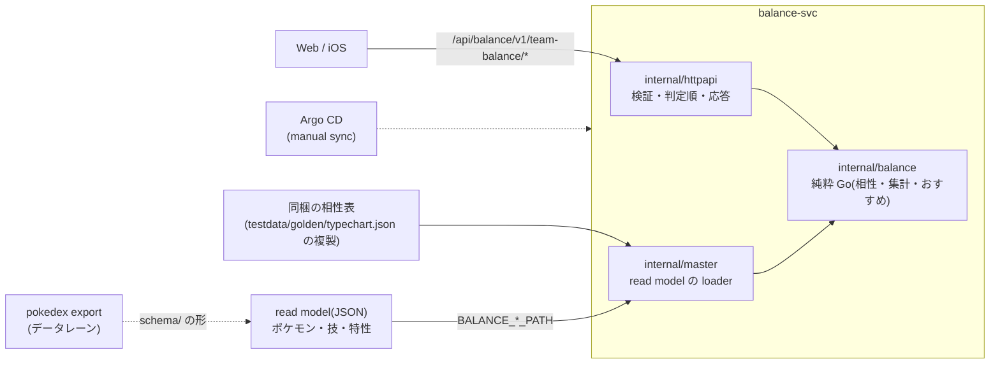

# balance-svc(タイプバランスチェッカー)

最大 6 体のパーティについて、防御の相性・攻撃範囲・特性による変化・仮想敵との相性を分析し、穴をふさぐおすすめタイプと該当ポケモンを返す。
damage-calc とは兄弟サービスで、互いの実行時 API に依存しない。マスタは pokedex が出力する read model(JSON)を起動時に読む。
HTTP の契約の正は [`api/openapi.yaml`](api/openapi.yaml)。手順書は [`docs/runbooks/balance.md`](../../docs/runbooks/balance.md)。



## ディレクトリ

| パス | 役割 |
|---|---|
| `api/openapi.yaml` | 外部 API 契約の正(`make balance-gen` で `internal/api` を生成) |
| `internal/balance` | 純粋 Go のコア。倍率は整数と既約分数(float なし)。analyze / coverage / threats / recommendations の計算 |
| `internal/master` | read model(ポケモン・技・特性)と同梱の相性表の loader。検証に失敗したら起動しない |
| `internal/httpapi` | HTTP の検証・判定順(400 → 413 → 503 → 422 → 200、それ以外は 500)・応答の変換 |
| `internal/api` | oapi-codegen の生成物(手で書かない) |
| `cmd/api` | 起動・環境変数の読み込み・graceful shutdown |
| `cmd/checkreadmodel` | export の read model をサービスと同じ loader で検証する |
| `schema/` | read model の JSON Schema(pokedex export 向け) |
| `testdata/` | 架空データの example(実データは Git に置かない) |
| `deploy/` | Kustomize(base / local / gitops)、Argo CD Application、クラスタ内レジストリ |
| `scripts/` | smoke・レジストリへの push・Application の適用・GitOps の検査 |

## エンドポイント

| path | 内容 | ADR |
|---|---|---|
| `POST .../analyze` | 各メンバーの 18 タイプの防御倍率とチーム集計(特性も反映) | 0014・0017 |
| `POST .../coverage` | 技から攻撃範囲(有効打 = 等倍以上) | 0016 |
| `POST .../threats` | 仮想敵ごとの受ける・与える最大倍率 | 0400 |
| `POST .../recommendations` | 防御・攻撃範囲の穴と、ふさぐタイプ候補・該当ポケモン | 0401 |

## よく使うコマンド

```sh
cd "$(git rev-parse --show-toplevel)"
make balance-test balance-lint balance-build   # ルートの make test / lint / build にも含まれる
make balance-gen                               # OpenAPI を変えたら
make balance-k3d-deploy balance-smoke          # k3d に local overlay(架空データ)でデプロイして疎通確認
make balance-k3d-deploy-readmodel balance-smoke-readmodel  # pokedex export の実データ(data/generated/readmodel)で
make balance-sync-typechart                    # testdata/golden/typechart.json が変わったら
```

## 環境変数

| 名前 | 内容(未設定・空文字なら該当する機能は 503) |
|---|---|
| `BALANCE_POKEMON_TYPES_PATH` | ポケモンのタイプ・日本語名・特性の候補の read model |
| `BALANCE_MOVES_PATH` | 技のタイプ・分類の read model |
| `BALANCE_ABILITIES_PATH` | 特性の効果の read model |

## 関連 ADR

[0012](../../docs/adr/0012-domain-service-boundaries.md)(サービス境界)・[0014](../../docs/adr/0014-balance-tb1-defense-analysis.md)・
[0015](../../docs/adr/0015-balance-type-chart-from-data.md)(相性表)・[0016](../../docs/adr/0016-balance-tb2-offense-coverage.md)・
[0017](../../docs/adr/0017-balance-tb3-ability-effects.md)・[0018](../../docs/adr/0018-balance-local-gitops-verification.md)(GitOps)・
[0400](../../docs/adr/0400-balance-tb4-threat-check.md)・[0401](../../docs/adr/0401-balance-tb5-recommend-types.md)・
[0402](../../docs/adr/0402-balance-read-model-json-schema.md)(JSON Schema)・[0403](../../docs/adr/0403-balance-readmodel-wiring.md)(実データの配線)。直接依存とライセンスは [`DEPENDENCIES.md`](DEPENDENCIES.md)。
