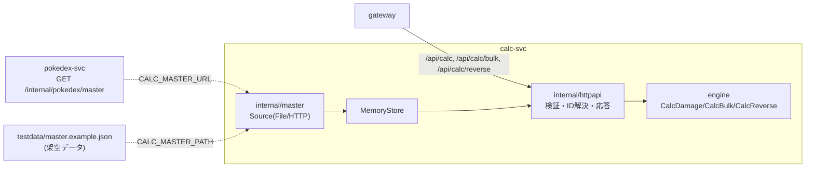

# calc-svc

ダメージ計算・一括計算・逆算の HTTP サービス(ステートレス)。契約は `api/openapi.yaml` の `calc` タグ。
計算は `engine/` の公開 API を呼ぶだけで、独自の式を持たない。マスタは起動時に pokedex-svc の内部 API(または
テスト用ファイル)から読み、メモリに載せる。



## ディレクトリ

| パス | 役割 |
|---|---|
| `internal/httpapi` | `api.ServerInterface` の実装。厳格デコード・列挙検証・ID解決・engine呼び出し・応答の変換 |
| `internal/master` | `Store`(Species/Move/Item/Ability/Nature/TypeChart)と、`MasterExport` からの読み込み(`export.go`)、入手元 `Source`(ファイル・HTTP) |
| `cmd/calc` | 起動・環境変数の読み込み・URL方式のバックオフ再取得・graceful shutdown |
| `calctest` | 他サービスのテストから calc-svc の実物を起動するための口(gateway の契約テスト等が使う) |
| `testdata/master.example.json` | 架空データの `MasterExport`(ファイル方式・`make dev`・テストの fallback で使う) |

## よく使うコマンド(リポジトリのルートで)

```sh
cd "$(git rev-parse --show-toplevel)"
make test lint build          # engine・services 全体の一部として実行される
make api-docker-build         # イメージのビルド
make api-kustomize            # k8s マニフェストが描画できるか
```

ローカルでの起動・k3d への疎通確認は [`docs/runbooks/api.md`](../../docs/runbooks/api.md)。

## 関連 ADR

- [ADR-0200](../../docs/adr/0200-calc-svc-api-contract.md) calc-svc の API 契約とマスタ境界
- [ADR-0204](../../docs/adr/0204-calc-master-from-pokedex-internal-api.md) マスタを pokedex-svc の内部 API から受け取る(起動時1回・準備状態・`/readyz`)
- [ADR-0206](../../docs/adr/0206-wire-to-pokedex-svc.md) k3d を pokedex-svc につなぐ
