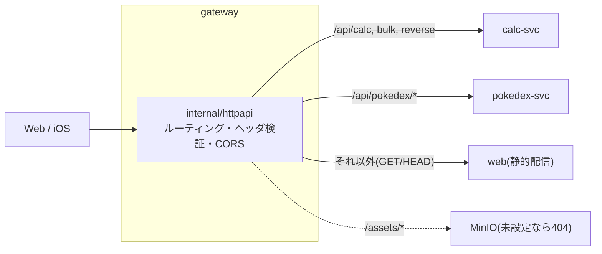

# gateway

クライアント(Web / iOS)の唯一の入口。`/api/calc`・`/api/pokedex`・`/assets`・Web の静的配信を各上流へ転送し、
`/api/*` の `X-Device-Id` / `X-Session-Id`(UUID)を検証し、CORS に答える。上流の失敗は書き換えずに 503 で返す。



## ディレクトリ

| パス | 役割 |
|---|---|
| `internal/httpapi` | ルーティング(`routing.go`)・ヘッダ検証(`headers.go`)・CORS(`cors.go`)・上流への転送(`proxy.go`)・エラー整形(`errors.go`) |
| `cmd/gateway` | 起動・環境変数の読み込み |
| `scripts/smoke.sh` | k3d 上のスモーク(POSIX sh。pokedex-svc から計算用の ID を動的に取得する) |
| `deploytest` | k8s マニフェストの静的検査(kubectl 不要)とスモークスクリプトの回帰テスト |

## 環境変数

| 名前 | 必須 | 意味 |
|---|---|---|
| `GATEWAY_ADDR` | いいえ(既定 `:8080`) | 待ち受けアドレス |
| `GATEWAY_CALC_URL` | はい | calc-svc の基底 URL |
| `GATEWAY_POKEDEX_URL` | いいえ(base の既定は `http://pokedex`) | pokedex-svc の基底 URL。DB が空のクラスタでは初回の `make import-k8s` を実行するまで 503 |
| `GATEWAY_ASSETS_URL` | いいえ | 画像配信(MinIO)の基底 URL。未設定なら `/assets/*` は 404 |
| `GATEWAY_WEB_URL` | いいえ | Web の静的配信の基底 URL。設定時は予約パス以外の GET/HEAD を転送 |
| `GATEWAY_CORS_ALLOWED_ORIGINS` | いいえ | カンマ区切りの許可オリジン(完全一致)。空なら CORS ヘッダを付けない |
| `GATEWAY_UPSTREAM_TIMEOUT` | いいえ(既定 `10s`) | 上流の応答ヘッダを待つ上限 |

## ルーティング

| パス | 転送先 | ヘッダ検証 |
|---|---|---|
| `/api/calc`、`/api/calc/*` | calc-svc | あり |
| `/api/pokedex/*` | pokedex-svc | あり |
| `/assets/*`(GET / HEAD) | assets の上流 | なし |
| `GET /healthz` | gateway 自身 | なし |
| それ以外(`/api/balance` を含む) | `GATEWAY_WEB_URL` 未設定なら 404。設定時は GET / HEAD を Web へ転送 | なし |

## よく使うコマンド(リポジトリのルートで)

```sh
cd "$(git rev-parse --show-toplevel)"
make test lint build          # engine・services 全体の一部として実行される
make api-docker-build         # calc・gateway のイメージのビルド
make api-k3d-deploy           # k3d(既存クラスタ)へ calc・gateway だけをデプロイ
make api-smoke                # gateway 経由のスモーク
make api-kustomize            # k8s マニフェストが描画できるか
make dev                      # k3d を使わずローカルで calc-svc・gateway を起動
```

ローカルでの起動・k3d への疎通確認・確認ポイントは [`docs/runbooks/api.md`](../../docs/runbooks/api.md)。

## 関連 ADR

- [ADR-0202](../../docs/adr/0202-gateway-routing-and-headers.md) ルーティング・ヘッダ検証・CORS・上流の失敗
- [ADR-0203](../../docs/adr/0203-api-k3d-deploy-and-smoke.md) k3d デプロイとスモーク
- [ADR-0205](../../docs/adr/0205-gateway-web-upstream.md) Web を後ろに置く(`GATEWAY_WEB_URL`)
- [ADR-0206](../../docs/adr/0206-wire-to-pokedex-svc.md) pokedex-svc につなぐ
