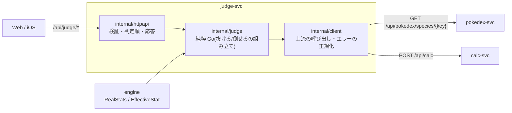

# judge-svc(判定サービス。素早さ×ダメージ連動)

「自分のポケモン(道具・調整込み)が、想定した相手を素早さで抜けて、かつ使う技で倒せるか」を 1 回の request で判定する。
新しい計算式は持たない。素早さの実数値は engine を直接呼び、ダメージと確定数は calc-svc の公開 API の結果をそのまま使う。
HTTP の契約の正は [`api/openapi.yaml`](api/openapi.yaml)。設計の正は [`docs/judge-design.md`](../../docs/judge-design.md)。

**現在の状態: JD0(基盤)完了。** `make judge-test`・`judge-lint`・`judge-build` は緑(critic PASS)。受け入れ条件は ADR-0700。JD1(判定 API 本体)は未着手。



## ディレクトリ

| パス | 役割 |
|---|---|
| `api/openapi.yaml` | 外部 API 契約の正(`make judge-gen` で `internal/api` を生成) |
| `internal/client` | pokedex-svc・calc-svc への HTTP クライアント。タイムアウトと、上流のエラーの正規化(ADR-0700 §3) |
| `internal/judge` | 純粋 Go のコア(JD1 で中身が入る。抜けるか・倒せるかの組み立て) |
| `internal/httpapi` | HTTP の検証・判定順・応答の変換 |
| `internal/api` | oapi-codegen の生成物(手で書かない) |
| `cmd/api` | 起動・環境変数の読み込み・graceful shutdown |
| `deploy/k8s` | Kustomize(base / overlays/local)。judge は `/api/judge` prefix の自分の Ingress を持つ(gateway は変更しない) |
| `scripts/smoke.sh` | k3d へのデプロイ後の疎通確認 |

## エンドポイント

| path | 内容 | ADR |
|---|---|---|
| `GET /healthz`・`GET /api/judge/healthz` | 200 `{"status":"ok"}`。上流の設定・疎通に依存しない | 0700 |
| `POST /api/judge/v1/outspeed-and-ko` | 抜けるか(`outspeeds` / `speedTie`)+ 倒せるか(`ko`)。**JD1 で追加** | JD1 の ADR |

## よく使うコマンド

```sh
cd "$(git rev-parse --show-toplevel)"
make judge-gen                           # OpenAPI を変えたら(internal/api を生成)
make judge-test judge-lint judge-build   # ルートの make test / lint / build にも含まれる
make judge-kustomize                     # deploy/k8s/overlays/local の描画を確認
make judge-k3d-deploy && make judge-smoke  # k3d へデプロイして healthz を確認
```

## 環境変数

| 名前 | 内容 |
|---|---|
| `JUDGE_POKEDEX_BASE_URL` | pokedex-svc のベース URL。未設定なら起動はするが、判定の API は 503 |
| `JUDGE_CALC_BASE_URL` | calc-svc のベース URL。同上 |
| `JUDGE_UPSTREAM_TIMEOUT` | 上流 1 回ぶんのタイムアウト(duration。既定 `3s`) |
| `PORT` | 待受ポート(既定 8080) |

設定されているのに不正(http/https でない・ホストが無い・タイムアウトが 0 以下)なら起動しない。

## 関連 ADR

[0012](../../docs/adr/0012-domain-service-boundaries.md)(サービス境界)・[0700](../../docs/adr/0700-judge-jd0-foundation.md)(JD0 基盤・上流の呼び方・エラーの正規化)。
`ko` の欄の意味の正は [0006](../../docs/adr/0006-ko-probability-model.md)(確率モデル)・[0010 §3](../../docs/adr/0010-reverse-estimation.md)(表示%の丸め)。judge は転記するだけで再計算しない。
