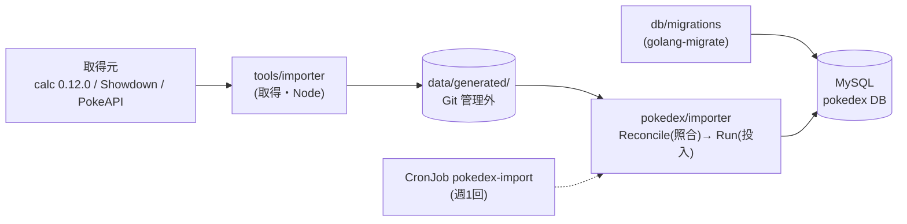

# pokedex(マスタの DB と取込)

ポケモン・技・持ち物・特性・タイプ相性・レギュレーション(v1 は M-C)の共通マスタを MySQL に持つ。
スキーマは golang-migrate で管理し、取得済みスナップショット(`tools/importer`)を照合して冪等に投入する CLI がある。
マスタを読む HTTP API は未実装(P2-3 で追加予定)。手順書は [`docs/runbooks/data.md`](../../docs/runbooks/data.md)。



## ディレクトリ

| パス | 役割 |
|---|---|
| `db/migrations` | スキーマ(golang-migrate の up/down) |
| `db/query` | sqlc 用の SQL(生成先は `internal/store`) |
| `internal/store` | sqlc の生成物(手で書かない。`make gen-sql`) |
| `importer` | 取得済みスナップショットの変換・照合(`Reconcile`)・DB への投入(`RunStore`) |
| `cmd/migrate` | migrate CLI(`up` / `down` / `version`) |
| `cmd/import` | import CLI(照合・報告・投入。`-dry-run` で DB に触れず確認できる) |

## よく使うコマンド

```sh
cd "$(git rev-parse --show-toplevel)"
make migrate-up          # POKEDEX_DATABASE_DSN が必須
make import-dry-run      # 変換と報告だけ(DB には触らない)
make import              # 投入(POKEDEX_DATABASE_DSN が必須。取得は make import-fetch)
make import-k8s          # k3d 上の CronJob を手動で1回流す
make test-db             # DB を使うテスト(POKEDEX_TEST_DSN が必須。make test には含めない)
```

## 関連 ADR

[0002](../../docs/adr/0002-master-data-source.md)(取得元と責務分離)・
[0100](../../docs/adr/0100-pokedex-schema-and-migrate.md)(スキーマ・migrate)・
[0101](../../docs/adr/0101-importer-fetch-convert-load.md)(取得・変換・投入)・
[0102](../../docs/adr/0102-data-lane-dependency-pins-2026-09.md)(依存の版固定)・
[0103](../../docs/adr/0103-importer-reconcile-report-and-pins.md)(照合・差分報告)・
[0104](../../docs/adr/0104-importer-cronjob-and-make-import.md)(CronJob・make import)。
