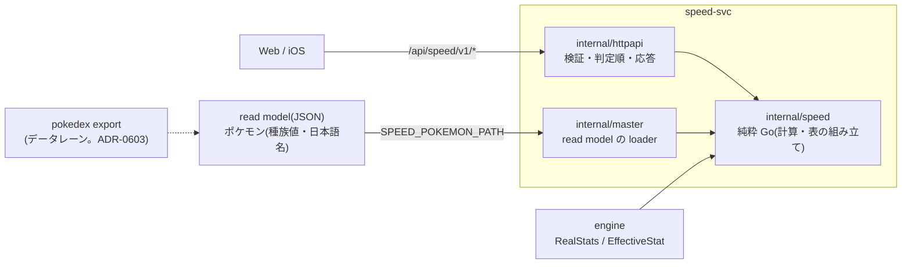

# speed-svc(素早さ比較サービス)

使用可能なポケモン全員の素早さを速い順の表にし、自分のポケモンの位置を比べる。
damage-calc・balance とは兄弟サービスで、互いの実行時 API に依存しない。実数値・ランクの式は engine を呼ぶだけで複製しない。
HTTP の契約の正は [`api/openapi.yaml`](api/openapi.yaml)。手順書は [`docs/runbooks/speed.md`](../../docs/runbooks/speed.md)。



## ディレクトリ

| パス | 役割 |
|---|---|
| `api/openapi.yaml` | 外部 API 契約の正(`make speed-gen` で `internal/api` を生成) |
| `internal/speed` | 純粋 Go のコア。`Speed`(実数値・ランクは engine、スカーフだけ自前)、`Presets`/`BuildTable`(表の組み立て)、`Position`(自分の位置) |
| `internal/master` | read model(ポケモン)の loader。検証に失敗したら起動しない |
| `internal/httpapi` | HTTP の検証・判定順(400 → 413 → 503 → 422 → 200、それ以外は 500)・応答の変換 |
| `internal/api` | oapi-codegen の生成物(手で書かない) |
| `cmd/api` | 起動・環境変数の読み込み・graceful shutdown |
| `testdata/` | 架空データの example(実データは Git に置かない) |
| `deploy/` | Kustomize(base / local=架空データ / local-readmodel=pokedex export の実データ。ADR-0603 / gitops=digest 固定。ADR-0605)と Argo CD Application |
| `scripts/` | smoke・k3d への read model デプロイ・GitOps の検査とイメージの push |

## エンドポイント

| path | 内容 | ADR |
|---|---|---|
| `GET .../pokemon` | 使用可能なポケモン一覧(pokemonId 昇順) | 0600 |
| `GET .../table` | 6 行のプリセット(`presets` で絞り込み)を速い順の段にまとめて返す。同じ値は同速として 1 段 | 0601 |
| `POST .../position` | 自分のポケモン(`mode`: preset / custom / raw)の実数値と、表の中の位置(速い行数・同速の行・遅い行数) | 0602 |

## よく使うコマンド

```sh
cd "$(git rev-parse --show-toplevel)"
make speed-test speed-lint speed-build   # ルートの make test / lint / build にも含まれる
make speed-gen                           # OpenAPI を変えたら
make speed-kustomize
make speed-docker-build
make speed-k3d-deploy-readmodel && make speed-smoke-readmodel   # pokedex export の実データで動かす(ADR-0603)
make speed-gitops-template-check                                # GitOps の overlay と Application の形(クラスタを変えない)
```

read model の実データは `SPEED_READMODEL_DIR`(既定 `data/generated/readmodel`)の `speed-pokemon.json`。Git には置かない。

## 環境変数

| 名前 | 内容(未設定・空文字なら該当する機能は 503) |
|---|---|
| `SPEED_POKEMON_PATH` | ポケモンの種族値・日本語名・タイプの read model |
| `PORT` | 待受ポート(既定 8080) |

## 関連 ADR

[0012](../../docs/adr/0012-domain-service-boundaries.md)(サービス境界)・[0600](../../docs/adr/0600-speed-sp0-foundation.md)(基盤・計算・read model)・
[0601](../../docs/adr/0601-speed-sp1-table.md)(表の6行・速い順・同速)・[0602](../../docs/adr/0602-speed-sp2-position.md)(自分の位置)・[0603](../../docs/adr/0603-speed-sp4-readmodel-wiring.md)(read model の配線)・
[0605](../../docs/adr/0605-speed-sp5-gitops.md)(GitOps。digest 固定の overlay・Argo CD Application・balance のレジストリを共有)。
直接依存とライセンスは [`DEPENDENCIES.md`](DEPENDENCIES.md)。
