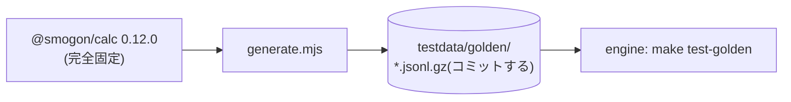

# tools/golden(ゴールデンベクタの生成)

固定版 `@smogon/calc@0.12.0` を外部 oracle として、engine のダメージ計算と照合するテストベクタを生成する。
Champions 世代(`Generations.get(0)`)を主に使い、Champions の mechanics に無い効果(持ち物・特性)だけ
gen9(`Generations.get(9)`)の legacy-effects で検証する(SP は `max(0, 8×SP-4)` の努力値に換算)。



## よく使うコマンド

```sh
cd "$(git rev-parse --show-toplevel)"
cd tools/golden && npm ci   # 初回のみ
make golden-generate        # 期待値の再生成(計算ロジックを変えたら)
make test-golden            # 生成済みベクタで engine を照合
```

## 関連 ADR

[0002](../../docs/adr/0002-master-data-source.md)(追記 P2-1b。oracle を Champions 世代へ切り替え)。
