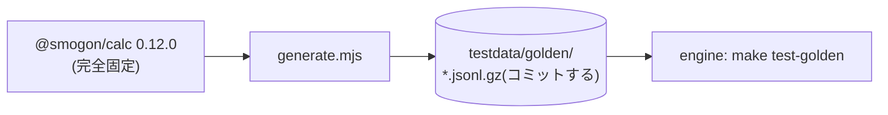

# tools/golden(ゴールデンベクタの生成)

固定版 `@smogon/calc@0.12.0` を外部 oracle として、engine のダメージ計算と照合するテストベクタを生成する。
Champions 世代(`Generations.get(0)`)を主に使い、Champions の mechanics に無い効果(持ち物・特性)だけ
gen9(`Generations.get(9)`)の legacy-effects で検証する(SP は `max(0, 8×SP-4)` の努力値に換算)。


```mermaid
flowchart LR
  Calc["@smogon/calc 0.12.0<br/>(完全固定)"] --> Gen["generate.mjs"]
  Gen --> Vec[("testdata/golden/<br/>*.jsonl.gz(コミットする)")]
  Vec --> Test["engine: make test-golden"]
```

## よく使うコマンド

```sh
cd "$(git rev-parse --show-toplevel)"
make golden-generate        # npm ci(package-lock.json どおり)→ 期待値の再生成(計算ロジックを変えたら)
make test-golden            # 生成済みベクタで engine を照合
```

## 効果定義の照合(ADR-0120)

`testdata/golden/effects.json` の持ち物・特性は1種ずつ照合する。タイプ・相性で効く効果は、定義から
「効く」と「効かない対照」の組(`fixed.json` の `effects/<id>/…`)を作る。Champions 世代の全持ち物・全特性の
うちダメージが変わるもので定義の無いものは、`unsupported-effects.json` に理由付きで載っているものだけを許す
(生成時に一致しなければ止まる)。

## ダブル(ADR-0222)

`doubles.json`(壁・全体技の各ケースと、その対照)と `doubles-random.jsonl.gz`(別の乱数列 3000 件)だけが
形式 double と技の対象(`Move.Target`: single / spread)を持つ。既存ファイルのバイト列は変えない。
ダブルのベクタはテラスを持たない。

## テラスタル(ADR-0224)

ポケモンチャンピオンズ本編には無いが、オプションの機能として照合する。`tera.json`(ADR-0224 §1 の表 T1〜T11・組合せ・
18タイプの総当たり。各ケースは生成時にテラスを外した対照と比べ、oracle が変わる/変わらないを確かめる)と
`tera-random.jsonl.gz`(別の乱数列 3000 件。シングルのみ)だけが `Attacker.TeraType` / `Defender.TeraType` を持つ。
防御側のテラスは oracle(Champions 世代)がタイプ相性に反映しないので、engine もそれに合わせる(本編 SV とは違う)。
既存ファイルのバイト列は変えない。

## 関連 ADR

[0002](../../docs/adr/0002-master-data-source.md)(追記 P2-1b。oracle を Champions 世代へ切り替え)、[0120](../../docs/adr/0120-effects-data-coverage.md)(効果定義の網羅と未対応一覧)、[0222](../../docs/adr/0222-engine-double-screens-and-spread.md)(ダブルの壁・全体技)、[0224](../../docs/adr/0224-engine-optional-terastal.md)(テラスタル)。
