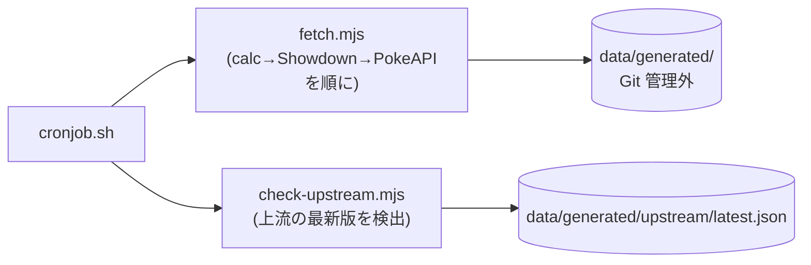

# tools/importer(マスタの取得)

calc(`@smogon/calc`)・Pokémon Showdown・PokeAPI から、マスタデータのスナップショットを取得する Node スクリプト群。
取得元の版は `package.json`(calc)と `data/importer/config.json`(Showdown・PokeAPI のコミット)で固定し、
CronJob(`services/pokedex` の週1回実行)からも同じスクリプトを呼ぶ。



## ファイルの役割

| ファイル | 役割 |
|---|---|
| `fetch.mjs` | `fetch-calc` → `fetch-showdown` → `fetch-pokeapi` を順に呼ぶ入口 |
| `fetch-calc.mjs` | 固定版の `@smogon/calc`(Champions 世代)から抽出 |
| `fetch-showdown.mjs` | Showdown の Champions mod を取得(版は `config.json`) |
| `fetch-pokeapi.mjs` | 日本語名などの補完データを取得 |
| `check-upstream.mjs` | 上流(pinned とは別)の最新版を検出して報告するだけ(取り込みはしない) |
| `cronjob.sh` | CronJob 用の入口。取得 → 上流検出(失敗は警告のみ)→ 照合・投入(Go) |

## よく使うコマンド

```sh
cd "$(git rev-parse --show-toplevel)"
make import-fetch            # 取得(npm ci を含む。ネットワークが要る)
make import-check-upstream   # 上流の最新版の検出だけ(取り込みはしない)
```

## 関連 ADR

[0101](../../docs/adr/0101-importer-fetch-convert-load.md)(取得・変換・投入)・
[0102](../../docs/adr/0102-data-lane-dependency-pins-2026-09.md)(版固定)・
[0103](../../docs/adr/0103-importer-reconcile-report-and-pins.md)(照合・版固定の裁定)・
[0104](../../docs/adr/0104-importer-cronjob-and-make-import.md)(CronJob)。
