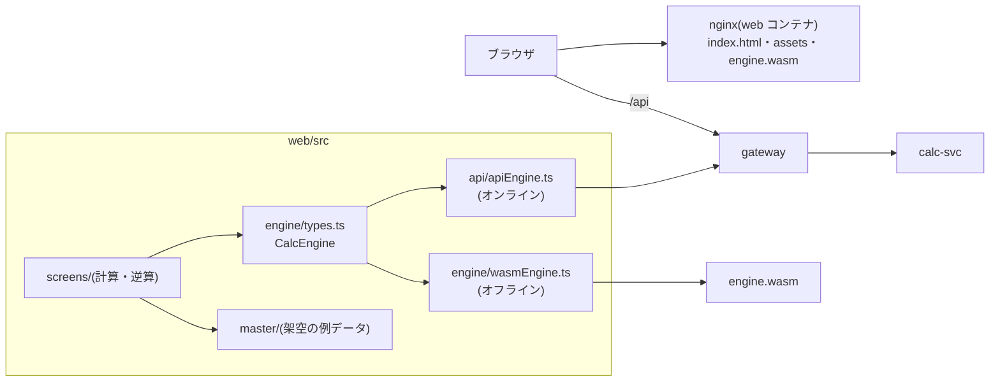

# web

ダメージ計算(一括表示)と逆算のブラウザ画面(Vite + React + TypeScript)。
計算はオフライン(engine.wasm)かオンライン(gateway 経由の calc-svc)で行い、画面は URL(`/calc`・`/reverse`)で切り替える。
本番と k3d では nginx のコンテナで配信し、gateway の後ろに置く。

## ディレクトリ

| パス                       | 役割                                                                               |
| -------------------------- | ---------------------------------------------------------------------------------- |
| `src/app/`                 | ルート表(`routes.ts`)・画面の対応(`screens.tsx`)・計算モードの保存                 |
| `src/screens/`             | 計算画面・逆算画面                                                                 |
| `src/engine/`              | 計算の差し替え口 `CalcEngine` と WASM 実装・ローダー                               |
| `src/api/`                 | API 実装(実体 → ID の写像)・生成型 `openapi.gen.ts`(`make gen-ts`。手で編集しない) |
| `src/domain/`              | リクエストの組み立て・プリセット・候補の抽出・表示の書式(純粋関数)                 |
| `src/master/`              | マスタの型と架空の例データ(実マスタは置かない)                                     |
| `src/i18n/ja.ts`           | 画面の文言                                                                         |
| `src/styles/tokens.css`    | デザイントークン(docs/design.md)                                                   |
| `e2e/`                     | Playwright(オフライン・オンライン・コンテナ)                                       |
| `Dockerfile`・`nginx.conf` | 配信イメージ                                                                       |

画面を足すときは `src/app/routes.ts`・`src/i18n/ja.ts`・`src/app/screens.tsx` に1件ずつ足す(`App.tsx` は触らない)。

## よく使うコマンド(リポジトリのルートで)

| コマンド                                                                                   | すること                                                                                      |
| ------------------------------------------------------------------------------------------ | --------------------------------------------------------------------------------------------- |
| `make web-dev`                                                                             | 開発サーバー(`http://localhost:5173`。WASM で計算)                                            |
| `make web-test` / `make web-lint` / `make web-build`                                       | 単体テスト / 型検査・lint / ビルドと配信サイズ予算(`make test`・`lint`・`build` にも含まれる) |
| `make web-e2e` / `make web-e2e-online` / `make web-e2e-container` / `make web-e2e-balance` | E2E(オフライン / calc-svc 相手 / コンテナ相手 / balance-svc 相手)                             |
| `make web-k3d-deploy` → `make web-k3d-open` → `make web-k3d-smoke`                         | k3d に載せて開き、確かめる                                                                    |
| `make gen-ts`                                                                              | `api/openapi.yaml` から API の型を生成                                                        |

動作確認の手順は [docs/verify-m1.md](../docs/verify-m1.md)。

## 関連 ADR

- [ADR-0300](../docs/adr/0300-web-architecture.md) 構成(計算の差し替え口・架空マスタ・URL で画面を切り替える)
- [ADR-0301](../docs/adr/0301-web-api-wasm-switch.md) API / WASM の切り替え
- [ADR-0302](../docs/adr/0302-web-container.md) コンテナでの配信
- [ADR-0011](../docs/adr/0011-wasm-boundary.md) WASM 境界の JSON 契約
